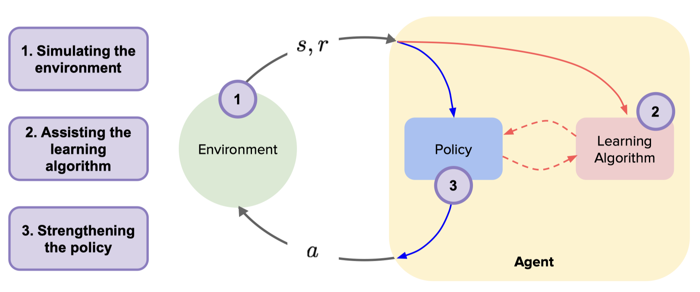

基于模型的强化学习
^^^^^^^^^^^^^^^^^^^

基于模型的强化学习 (Model-Based Reinforcement Learning, Model-Based RL) 是强化学习的一个重要分支，智能体通过与环境交互的信息学习一个环境动力学模型，然后利用该模型生成数据优化行动策略, 或者利用模型进行规划。

研究问题及思路
---------------

Model-Based RL 总得来说是来解决两类问题，一是如何构建精确的环境模型，二是如何利用环境模型做策略优化。

**如何构建精确的环境模型？**
::
模型学习主要突出的是 Model-Based RL 算法对环境模型的构建过程。

**如何利用环境模型做策略优化？**

 模型利用主要强调 Model-Based RL 算法使用环境模型的辅助策略学习。
模型利用

基于模型的规划

基于模型的策略学习

研究方向
---------

对 Model-Based RL 近年论文做了整理，[awesome-model-based-RL](https://github.com/opendilab/awesome-model-based-RL)

MBPO类型拓展 

value expansion

图像高维输入
结合 Representation Learning
适配高维图像输入

结合 迁移学习, Meta RL

结合 Offline RL

展望
-----

基于模型的强化学习需要学习模型, 学到模型后会有较高的样本效率, 但缺陷是对于有些复杂任务, 模型不容易学到。
通用模型

参考资料
----------

Repo: awesome-model-based-RL. https://github.com/opendilab/awesome-model-based-RL
