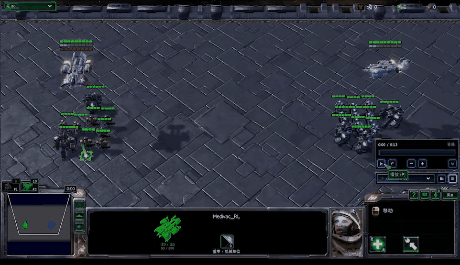
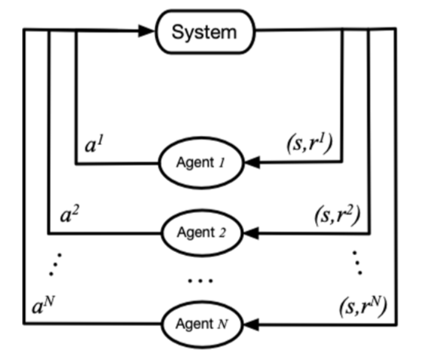
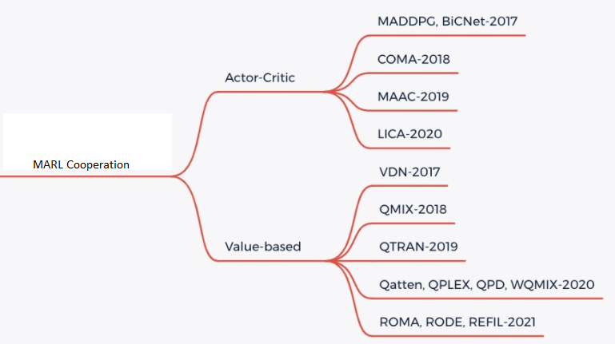

Multi-Agent Reinforcement Learning
=====================================

Problem Definition and Research Motivation
-----------------------------------------------

In many real-world scenarios, people need to control multiple agents that exist at the same time to complete specific tasks, such as traffic control, robot collaboration, autonomous driving, and multiplayer online games. Therefore, the research on reinforcement learning has gradually extended from the field of single agent to multi-agent reinforcement learning (MARL). In recent years, deep reinforcement learning has shown great potential in multi-agent environments and games, such as the sub-environment SMAC of StarCraft II, the football game Gfootball, and autonomous driving environments such as Carla.

In MARL, the policy controls multiple agents to interact with the environment simultaneously, and the goal is still to maximize the cumulative reward that can be obtained. At this time, the transition of the global state of the environment and the reward value are related to the joint action of all agents rather than the action of a single agent. Therefore, in the process of policy learning, the update of each agent's policy needs to consider the current policies of other agents.

In this figure, system represents a multi-agent environment:math:`Agent_i` represents the ith agent,:math:`a_i` represents the action taken by the ith agent,:math:`r_i` represents the local reward obtained by the ith agent.
During the training process, each agent interacts with the environment separately, and the system feeds back a joint reward.

In general, the main difference between multi-agent reinforcement learning and single-agent reinforcement learning lies in the following four points:

  1. The non-stationary of the environment: While the agent is making a decision, other agents are also taking actions, and the change of the environment state is related to the joint action of all the agents. Therefore, the value evaluation of the actions of a single agent will change with the actions of other agents, which will lead to non-stationary in MARL training.

  2. Limitations of information acquisition by agents: In some environments (such as SMAC), each agent may not be able to obtain global state information, but only local observation information. However, it is impossible to know the observation information, actions and other information of other agents.

  3. Individual goal consistency: The goal of each agent may be the optimal global return or the optimal local return.

  4. Scalability: Large-scale multi-agent systems may involve high-dimensional state space and action space, which poses certain challenges for model expression ability, algorithm learning ability and hardware computing power in real scenarios.

Research Direction
-----------------------
For the MARL cooperation task, the simplest idea is to directly apply the single-agent reinforcement learning method to the multi-agent system, that is, each agent regards other agents as factors in the environment, and still learns according to the single agent way to update the policy by interacting with the environment; This is the idea of independent Q-learning, independent PPO methods, but due to the non-stationarity of the environment and the locality of agent observations, these methods are difficult to achieve good results.

At present, MARL cooperation mainly adopts the method of CTDE (centralized training and decentralized execute), and there are two main types of solutions, Valued-based MARL and Actor-Critic MARL. For details, please refer to the following figure:

**Valued-based MARL**

For Valued-based MARL, the main idea is to decompose the global reward value into local reward values that can be learned by each agent, so as to facilitate the training of the agent. There are mainly QMIX, WQMIX, QTRAN and other methods:

- QMIX: The core of QMIX is to learn a monotonic Q-value mixed network, and the Q-value of each agent is summed by nonlinear transformation to generate :math:`Q_tot`. For details, please refer to `QMIX <https://github.com/opendilab/DI-engine-docs/blob/main/source/hands_on/qmix.rst>`_ [2]_

- WQMIX: The core of WQMIX is the same as that of QMIX, and it also learns a Q-value mixed network, but it learns a Q-value mixed network that can break through the monotonicity limit through the weighted projection method. For details, please refer to `WQMIX <https://github.com/opendilab/DI-engine-docs/blob/main/source/hands_on/wqmix.rst>`_ [1]_

- QTRAN: QTRAN breaks through the monotonicity limitation by learning independent action-value networks, hybrid action-value networks, and global state-value networks. For details, please refer to `QTRAN <https://github.com/opendilab/DI-engine-docs/blob/main/source/hands_on/qtran.rst>`_ [4]_

- QPLEX: QPLEX decomposes the joint Q-value :math:`Q_tot` and the Q-value of each agent :math:`Q_i` using a Dueling structure, respectively. The IGM consistency is transformed into an easy-to-implement advantage function value range constraint, which facilitates the learning of value functions with a linear decomposition structure. For details, please refer to `QPLEX <https://arxiv.org/abs/2008.01062>`_ [10]_

**Actor-critic MARL**

For Actor-critic MARL, the main idea is to learn a multi-agent policy network. There are mainly COMA, MAPPO and other methods:

- COMA: COMA uses counterfactual baselines to address the challenge of credit assignment across multiple agents and a critic network to efficiently compute counterfactual baselines. For details, please refer to `COMA <https://github.com/opendilab/DI-engine-docs/blob/main/source/hands_on/coma.rst>`_ [5]_

- MAPPO: The basic idea of MAPPO is the same as that of PPO, but the input to the Actor network is the Local observation of each agent, and the input to the Critic network is the Agent specific global state of each agent. For details, please refer to `MAPPO <https://github.com/opendilab/DI-engine-docs/blob/main/source/best_practice/maac.rst>`_ [6]_

Future Study
------------------
1. For some environments with more agents and more complex environments, such as some sub-environments of Multi-Agent Petting Zoo, there are nearly a hundred agents, and pure MARL cooperation may not be able to achieve good results, which requires real-time communication between agents to share information.

2. For some practical situations, such as automatic driving, the bandwidth pressure required to obtain the real-time global state is too large, especially when the number of vehicles is large, it is almost impossible to obtain the real-time global state, and the CTDE method cannot be used for training.

In the above cases 1 and 2, the method of MARL Communication between multiple agents can be used to further improve the learning efficiency.

In the future, MARL can be combined with Offline RL techniques to further improve sample efficiency. At the same time, MARL can also be applied to many fields such as agent behavior analysis, agent modeling, human-machine collaboration and so on.

References
------------

.. [1] ashid, Tabish, et al. "Weighted qmix: Expanding monotonic value function factorisation for deep multi-agent reinforcement learning." arXiv preprint arXiv:2006.10800 (2020).

.. [2] Tabish Rashid, Mikayel Samvelyan, Christian Schroeder de Witt, Gregory Farquhar, Jakob Foerster, Shimon Whiteson. Qmix: Monotonic value function factorisation for deep multi-agent reinforcement learning. International Conference on Machine Learning. PMLR, 2018.

.. [3] Peter Sunehag, Guy Lever, Audrunas Gruslys, Wojciech Marian Czarnecki, Vinicius Zambaldi, Max Jaderberg, Marc Lanctot, Nicolas Sonnerat, Joel Z. Leibo, Karl Tuyls, Thore Graepel. Value-decomposition networks for cooperative multi-agent learning. arXiv preprint arXiv:1706.05296, 2017.

.. [4] Kyunghwan Son, Daewoo Kim, Wan Ju Kang, David Earl Hostallero, Yung Yi. QTRAN: Learning to Factorize with Transformation for Cooperative Multi-Agent Reinforcement Learning. International Conference on Machine Learning. PMLR, 2019.

.. [5] Jakob Foerster, Gregory Farquhar, Triantafyllos Afouras, Nantas Nardelli, Shimon Whiteson. Counterfactual Multi-Agent Policy Gradients. In Proceedings of the Thirty-Second AAAI Conference on Artificial Intelligence, 2018.

.. [6] Yu, C., Velu, A., Vinitsky, E., Wang, Y., Bayen, A., and Wu, Y. The surprising effectiveness of mappo in cooperative, multi-agent games. arXiv preprint arXiv:2103.01955, 2021.

.. [7] Jayesh K. Gupta, Maxim Egorov, Mykel Kochenderfer. Cooperative multi-agent control using deep reinforcement learning. International Conference on Autonomous Agents and Multiagent Systems, 2017.

.. [8] Ryan Lowe, Yi Wu, Aviv Tamar, Jean Harb, Pieter Abbeel, Igor Mordatch. Multi-agent actor-critic for mixed cooperative-competitive environments. arXiv preprint arXiv:1706.02275, 2017.

.. [9] Mikayel Samvelyan, Tabish Rashid, Christian Schroeder de Witt, Gregory Farquhar, Nantas Nardelli, Tim G. J. Rudner, Chia-Man Hung, Philip H. S. Torr, Jakob Foerster, Shimon Whiteson. The StarCraft Multi-Agent Challenge. arXiv preprint arXiv:1902.04043, 2019.

.. [10] Wang, J., Ren, Z., Liu, T., Yu, Y., and Zhang, C. Qplex: Duplex dueling multi-agent q-learning. arXiv preprint arXiv:2008.01062, 2020.
