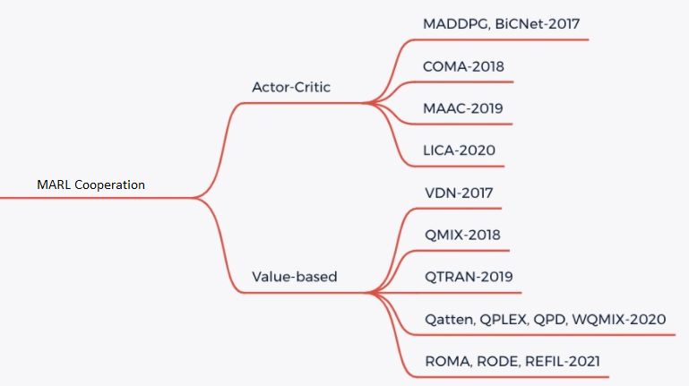

多智能体强化学习
===============================

问题定义与研究动机
-----------------------------

考虑到在现实场景中通常会同时存在多个智能体（agent），对于强化学习的研究逐渐从单智能体领域延伸到多智能体。近年来，深度强化学习在多智能体环境和游戏中取得了巨大的成功，通过与环境进行有效的交互，我们可以得到性能卓著的智能体。例如星际争霸 StarCraftII 的子环境 SMAC ,足球游戏 Gfootball ,以及一些自动驾驶环境。未来，MARL 还可能被更广泛地应用于资源管理、交通系统等各个领域。

在多智能体强化学习（Multi-agent Reinforcement Learning, MARL）中，同时存在多个智能体与环境交互，每个智能体仍然是遵循着强化学习的目标，也就是最大化能够获得的累积回报，而此时环境全局状态（global state）的改变以及奖励值（reward）就和所有智能体的联合动作（joint action）相关了。因此在智能体策略学习的过程中，需要考虑联合动作的影响。

.. image:: images/MARL_summary.png
   :align: center
   :scale: 50 %

在该图中，system表示多智能体环境 :math:`Agent_i` 表示第i个智能体，:math:`a_i` 表示第i个智能体采取的动作，:math:`r_i` 表示第i个智能体获取的局部奖励。
在训练过程中，各个智能体分别与环境进行交互，系统会反馈回联合奖励。

总的来说，多智能体强化学习与单智能体强化学习的主要区别在于以下四点：

环境的非稳定性：智能体在做决策的同时，其他智能体也在采取动作，而环境状态的变化与所有智能体的联合动作相关，这会导致在MARL训练中的非平稳性(non-stationary)

智能体获取信息的局限性：在一些环境中（例如SMAC），对于单个智能体而言其不一定能够获得全局的信息，智能体仅能获取局部的观测信息，但无法得知其他智能体的观测信息、动作和奖励等信息；

个体的目标一致性：各智能体的目标可能是最优的全局回报；也可能是各自局部回报的最优；

可拓展性：在大规模的多智能体系统中，就会涉及到高维度的状态空间和动作空间，对于模型表达能力和真实场景中的硬件算力有一定的要求。

研究方向
------------------------------------
对于 MARL cooperation 任务来说，最简单的思路就是将单智能体强化学习方法直接套用在多智能体系统中，即每个智能体把其他智能体都当做环境中的因素，仍然按照单智能体学习的方式、通过与环境的交互来更新策略；这是 independent Q-learning， independent PPO方法的思想，但是由于环境的非平稳性和智能体观测的局部性，这些方法很难取得不错的效果。

目前 MARL cooperation 主要是采用 CTDE(centralized training and decentralized execute) 的方法，主要有两类解决思路， Valued-based MARL和Actor-Critic MARL。具体可以参考下图：

**Valued-based MARL**

对于 Valued-based MARL， 主要的思路是将全局的 reward 值分解为可以供各个 agent 学习的局部 reward 值，从而便于智能体的训练。主要有 QMIX， WQMIX， QTRAN 等方法。

- QMIX: QMIX 的核心是学习一个单调性的Q值混合网络，每个智能体的Q值经过非线性变换求和生成 :math:`Q_tot`。具体可以参考 `QMIX <https://github.com/opendilab/DI-engine-docs/blob/main/source/hands_on/qmix.rst>`_ [2]_

- WQMIX: WQMIX 的核心与 QMIX 相同，也是学习一个Q值混合网络，但其通过加权投影的方法学到可以突破单调性限制的Q值混合网络。具体可以参考 `WQMIX <https://github.com/opendilab/DI-engine-docs/blob/main/source/hands_on/wqmix.rst>`_ [1]_

- QTRAN: QTRAN 通过学习独立 action-value 网络,混合 action-value 网络，全局 state-value 网络来突破单调性限制。具体可以参考 `QTRAN <https://github.com/opendilab/DI-engine-docs/blob/main/source/hands_on/qtran.rst>`_ [4]_

**Actor-critic MARL**

对于 Actor-critic MARL， 主要的思路是学习一个适用于多智能体的策略网络。主要有 COMA, MAPPO 等方法。

- COMA: COMA 使用反事实基线来解决多个 agent 信用分配的挑战，并使用critic网络来有效地计算反事实基线。具体可以参考 `COMA <https://github.com/opendilab/DI-engine-docs/blob/main/source/hands_on/coma.rst>`_ [5]_

- MAPPO: MAPPO 的基本思路与 PPO 相同， 但它输入Actor网络的为各个agent的 Local observation， 输入 Critic 网络的为各个 agent 的 Agent specific global state。具体可参考 `MAPPO <https://github.com/opendilab/DI-engine-docs/blob/main/source/best_practice/maac.rst>`_ [6]_

未来展望
------------------------------------
1. 对于一些 Agent 数量更多，更加复杂的环境如 Multi-Agent Petting Zoo,单纯的 MARL Communication 可能无法起到很好的效果

2. 对于一些实际情况，比如自动驾驶中，无法获得实时的全局状态，也就无法采用 CTDE 的方法进行训练

在以上 1, 2情况下，可以采用多个智能体之间进行通信 （MARL Communication） 的办法来进一步提高学习效率。

在未来， MARL 可以与 Offline RL 技术结合，从而更进一步提高样本效率。同时， MARL 也可应用于智能体行为分析，智能体建模，人机协作等多个领域。

参考文献
----------

.. [1] ashid, Tabish, et al. "Weighted qmix: Expanding monotonic value function factorisation for deep multi-agent reinforcement learning." arXiv preprint arXiv:2006.10800 (2020).

.. [2] Tabish Rashid, Mikayel Samvelyan, Christian Schroeder de Witt, Gregory Farquhar, Jakob Foerster, Shimon Whiteson. Qmix: Monotonic value function factorisation for deep multi-agent reinforcement learning. International Conference on Machine Learning. PMLR, 2018.

.. [3] Peter Sunehag, Guy Lever, Audrunas Gruslys, Wojciech Marian Czarnecki, Vinicius Zambaldi, Max Jaderberg, Marc Lanctot, Nicolas Sonnerat, Joel Z. Leibo, Karl Tuyls, Thore Graepel. Value-decomposition networks for cooperative multi-agent learning. arXiv preprint arXiv:1706.05296, 2017.

.. [4] Kyunghwan Son, Daewoo Kim, Wan Ju Kang, David Earl Hostallero, Yung Yi. QTRAN: Learning to Factorize with Transformation for Cooperative Multi-Agent Reinforcement Learning. International Conference on Machine Learning. PMLR, 2019.

.. [5] Jakob Foerster, Gregory Farquhar, Triantafyllos Afouras, Nantas Nardelli, Shimon Whiteson. Counterfactual Multi-Agent Policy Gradients. In Proceedings of the Thirty-Second AAAI Conference on Artificial Intelligence, 2018.

.. [6] Yu, C., Velu, A., Vinitsky, E., Wang, Y., Bayen, A., and Wu, Y. The surprising effectiveness of mappo in cooperative, multi-agent games. arXiv preprint arXiv:2103.01955, 2021.

.. [7] Jayesh K. Gupta, Maxim Egorov, Mykel Kochenderfer. Cooperative multi-agent control using deep reinforcement learning. International Conference on Autonomous Agents and Multiagent Systems, 2017.

.. [8] Ryan Lowe, Yi Wu, Aviv Tamar, Jean Harb, Pieter Abbeel, Igor Mordatch. Multi-agent actor-critic for mixed cooperative-competitive environments. arXiv preprint arXiv:1706.02275, 2017.

.. [9] Mikayel Samvelyan, Tabish Rashid, Christian Schroeder de Witt, Gregory Farquhar, Nantas Nardelli, Tim G. J. Rudner, Chia-Man Hung, Philip H. S. Torr, Jakob Foerster, Shimon Whiteson. The StarCraft Multi-Agent Challenge. arXiv preprint arXiv:1902.04043, 2019.