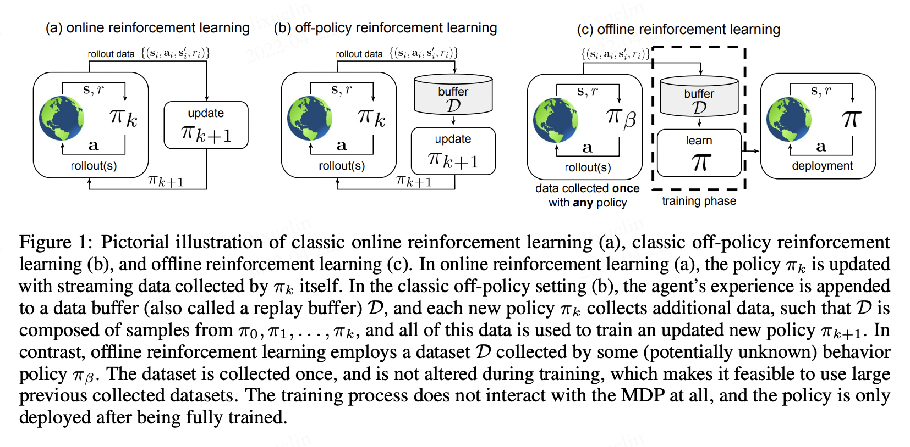

Basic Concepts
===============================

Offline Reinforcement Learning~(RL), also known as Batch Reinforcement Learning, is a variant of RL that effectively leverages large, previously collected datasets for large-scale real-world applications.
See Figure 1 for a pictorial illustration of the relationship among on-policy RL, off-policy RL, and offline RL.

Specifically, offline RL requires the agent to learn effective policies from a fixed batch of data without any additional online exploration. 
Therefore, the problem of offline RL is how to exploit a static dataset maximally? 
The research community has grown interested in offline RL because larger datasets are available that might be used to train policies for real-world applications. 
In addition, the success of machine learning methods across a range of practically relevant problems over the past decade can in large part be attributed to the advent of scalable data-driven learning methods, which become better and better as they are trained with more data.

Recently, deep RL has achieved great success in simulation tasks and games, where agents can obtain remarkable performance by interacting with the environment efficiently and effectively.
However, training RL policies by trial and error in the real environment is costly and even dangerous in most real-world problems, such as autonomous driving and robotic manipulation.
A data-driven approach, offline RL, has been proposed to seek a promising solution to mitigate those limitations by delving into the fixed dataset without any additional exploration.
In addition, since offline RL disentangles exploration from exploitation, it can help provide standardized comparisons of the exploitation capability of RL algorithms.

To have a basic understanding for offline RL, we explain the Reinforcement Learning Preliminaries as following：

- Markov Decision Processes 
- State and action spaces
- Policy
- Return and reward

To understand offline RL better, we further explain the following concepts:

- Dataset (such as D4RL, RL Unplugged, REM, and etc.)
- Behavior policy (behavior policy is the policy that the agent uses to collect dataset through interacting with the environment)

In the end, we will list and answer some common questions raised in the domain of reinforcement learning for reference.

Reinforcement Learning Preliminaries
------------------------------------

The goal of RL is to learn a policy that maximizes the expected episodic discounted reward in a infinite-horizon Markov Decision Process~(DMP) defined by :math:`(\mathcal{S},\mathcal{A}, \mathcal{R}, p, \gamma)`, with the state space :math:`\mathcal{S}`, the action space :math:`\mathcal{A}`, reward function :math:`\mathcal{R}`, transition dynamics :math:`p`, and discount factor :math:`\gamma \in \left(0, 1 \right)`. 
Following a given policy :math:`\pi(\mathbf{a} \mid \mathbf{s})`, the objective of RL is formulated by :math:`\mathbb{E}_{\mathbf{a} \sim \pi(\mathbf{a} \mid \mathbf{s})} \sum_{t=0}^{\infty} \gamma^{t}r_{t+1}`, which is the expected cumulative sum of rewards when following the policy in the MDP, where the importance of the horizon is determined by the discount factor.
Q-Learning methods maintain a Q-function:

.. math::
   Q^{\pi}(\mathbf{s}, \mathbf{a})=\mathbb{E}_{\pi}\left[\sum_{t=0}^{\infty} \gamma^{t} r_{t+1} \mid \mathbf{s}_{0}=\mathbf{s}, \mathbf{a}_{0}=\mathbf{a}\right],

which measures the expected discounted return following a given policy :math:`\pi(\mathbf{a} \mid \mathbf{s})`.

Offline Reinforcement Learning
------------------------------------

Offline RL has a assumption that the agent cannot interact with the environment before the evaluation. 
In the offline RL setting, the agent is trained in a collected dataset :math:`\mathcal{D}` which is sampled from the environment by a behavior policy :math:`\pi_{\beta}(\mathbf{a}\mid \mathbf{s})`. For actor-critic algorithm given a fixed dataset :math:`\mathcal{D} = \left\{ (\mathbf{s}, \mathbf{a}, r, \mathbf{s}^{\prime})\right\}`, we can represent value iteration and policy improvement by:

.. math::
   \hat{Q}^{k+1} \leftarrow \arg\min_{Q} \mathbb{E}_{\mathbf{s}, \mathbf{a} \sim \mathcal{D}} \left[ \left(\hat{\mathcal{B}}^\pi \hat{Q}(\mathbf{s}, \mathbf{a})  - Q(\mathbf{s}, \mathbf{a}) \right)^2 \right],
   \\
   \hat{\pi}^{k+1} \leftarrow \arg\max_{\pi} \mathbb{E}_{\mathbf{s} \sim \mathcal{D}, \mathbf{a} \sim \pi^{k}(\mathbf{a} \mid \mathbf{s})}\left[\hat{Q}^{k+1}(\mathbf{s}, \mathbf{a})\right],

where the :math:`\hat{\mathcal{B}}^\pi` represents the bellman operator on the fixed dataset following the policy :math:`\hat{\pi} \left(\mathbf{a} \mid \mathbf{s}\right)`, :math:`\hat{\mathcal{B}}^\pi \hat{Q}\left(\mathbf{s}, \mathbf{a}\right) = \mathbb{E}_{\mathbf{s}, \mathbf{a}, \mathbf{s}^{\prime} \sim \mathcal{D}}[ r(\mathbf{s}, \mathbf{a})+\gamma \mathbb{E}_{\mathbf{a}^{\prime} \sim \hat{\pi}^{k}\left(\mathbf{a}^{\prime} \mid \mathbf{s}^{\prime}\right)}\left[\hat{Q}^{k}\left(\mathbf{s}^{\prime}, \mathbf{a}^{\prime}\right)\right] ]`

In the offline setting, standard online RL methods fail due to overestimation introduced by out-of-distribution (OOD) actions from the learned policy.
How to alleviate or solve this problem has become a challenge faced by many offline RL researchers.

Q&A
----
Q1: What are the differences between the offline RL and the imitation learning~(IL)?
 - Answer： Offline reinforcement learning, henceforth Offline RL, is closely related to imitation learning (IL) in that the latter also learns from a fixed dataset without exploration. However, there are several key differences.

     - Offline RL algorithms~(so far) have been built on top of standard off-policy Deep Reinforcement Learning (Deep RL) algorithms, which tend to optimize some form of a Bellman equation or TD difference error.
     - Most IL problems assume an optimal, or at least a high-performing, demonstrator which provides data, whereas Offline RL may have to handle highly suboptimal data.
     - Most IL problems do not have a reward function. Offline RL considers rewards, which furthermore can be processed after-the-fact and modified.
     - Some IL problems require the data to be labeled as expert versus non-expert. Offline RL does not make this assumption.

Q2: What is the difference between the off-policy RL and the offline RL?
 - Answer： The term “off-policy reinforcement learning” is typically used as an umbrella term to denote all reinforcement learning algorithms that can employ datasets of transitions :math:`\mathcal{D}` where the corresponding actions in each transition were collected with any policy other than the current policy :math:`\pi(\mathbf{a} \mid \mathbf{s})`.
 Q-learning algorithms, actor-critic algorithms that utilize Q-functions, and many model-based reinforcement learning algorithm are off-policy algorithms. However, off-policy algorithms still often employ additional interaction (i.e., online data collection) during the learning process.

Q3: Why do classic RL algorithms perform poorly in offline settings? What is out-of-distribution(OOD) actions and why does this happen in offline RL?
 - Answer： The root cause is the changing of the stationary distributions of Markov Chains in the training process. Although the model will be trained under the distribution of offline data, the state distribution changes as well as the policy changes.
 Since the estimation of Q-function is reliable only when the distribution of the data to be estimated is the same as that of the offline training data, the estimation of Q-function is likely to be inaccurate for the < state, action > pairs accessed in the actual interaction.
 If the Q-function overestimates the < state, action > pairs that have not been seen in these training data, in the actual interaction, when the agent chooses the action to maximize the expected reward, it may choose the action with very poor actual benefit, resulting in very poor overall performance. We call those actions out-of-distribution (OOD) actions.
 On the other hand, online RL generates new data through interaction with the environment, and the state static distribution of the new data is close to the state distribution of the current policy output, so as to obtain a relatively accurate Q-function estimation.

Reference
----------

1. Offline (Batch) Reinforcement Learning: A Review of Literature and Applications
2. Levine, Sergey, et al. "Offline reinforcement learning: Tutorial, review, and perspectives on open problems." arXiv preprint arXiv:2005.01643 (2020).
3. Agarwal, Rishabh, Dale Schuurmans, and Mohammad Norouzi. "An optimistic perspective on offline reinforcement learning." ICML, 2020.
4. Gulcehre, Caglar, et al. "Rl unplugged: Benchmarks for offline reinforcement learning." Neurips, 2020.
5. Fu, Justin, et al. "D4rl: Datasets for deep data-driven reinforcement learning." arXiv preprint arXiv:2004.07219 (2020).