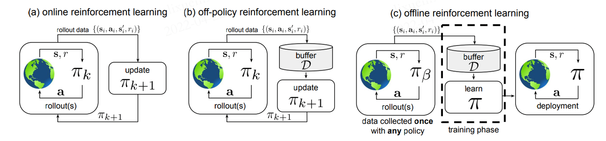
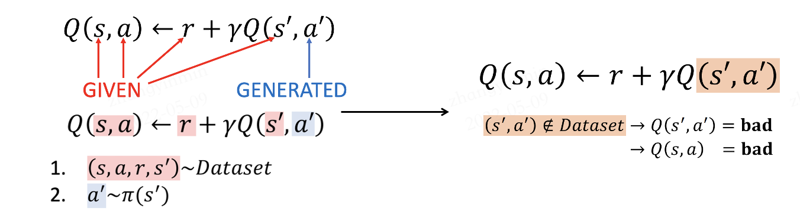
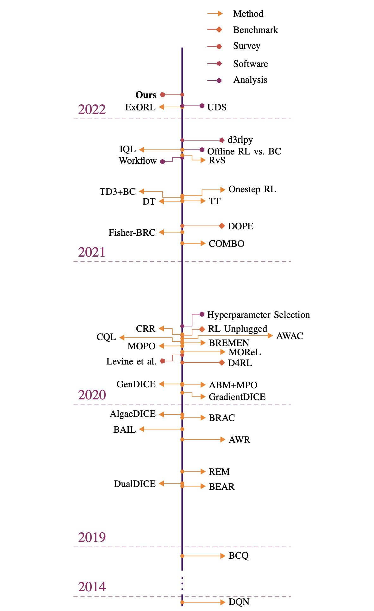

离线强化学习
===============================

问题定义与研究动机
-----------------------

离线强化学习（Offline Reinforcement Learning, Offline RL），又称作批量强化学习（Batch Reinforcement Learning, BRL），是强化学习的一种变体，主要研究的是如何利用预先收集的大规模静态数据集来训练强化学习智能体。
利用静态数据集意味着在智能体的训练过程中，Offline RL 不进行任何形式的在线交互与探索，这也是它和其它常见的强化学习方法最显著的区别。方便起见，在本文后续的阐述中，我们将非离线的强化学习（包含 On-policy 和 Off-policy）称为在线强化学习（Online RL）。

在该图中，(a)是标准的 On-policy RL，智能体采用当前策略 :math:`\pi_k` 与环境进行交互，只使用当前策略产生的数据来更新网络。
(b)是 Off-policy RL，它会将历史所有策略与环境交互的数据存储在经验池 :math:`\mathcal{D}` 中。即 :math:`\mathcal{D}` 中包含了策略 :math:`\pi_0, \pi_1, ..., \pi_k` 在不同时刻与环境交互产生的数据，这些数据都会被用于更新网络 :math:`\pi_{k+1}`。
(c)是 Offline RL，它所使用的数据集 :math:`\mathcal{D}` 中的数据来自某些（可能未知）的行为策略 :math:`\pi_{\beta}` 。该数据集 :math:`\mathcal{D}` 是提前一次性收集好的，不会在训练过程中发生改变。
在训练过程中，智能体不会与环境进行交互，只有在学习完成后才会对策略进行评估与应用。

**为什么选择 Offline RL？**

Offline RL 成为了最近的研究热点，具体原因可以归结为两方面：

第一方面是 Offline RL 本身的优势。深度强化学习在游戏等模拟任务中已经取得了巨大的成功，通过与环境进行有效的交互，我们可以得到性能卓著的智能体。
然而，通过反复探索环境和收集大量数据来训练强化学习智能体，通常需要非常昂贵的代价，甚至在现实世界的很多任务中，探索环境是极度危险的，例如自动驾驶和机器人操作。
而 Offline RL 恰好研究的是如何从固定数据集学习到近似最优的策略。由于其不需要任何额外探索，因此可以显著地减轻潜在风险和成本。
另外，在过去十余年中，数据驱动学习方法在机器学习领域中取得了巨大的成功。一般来说，使用更多数据能够获得更好的训练效果。相比于在线强化学习，能够充分利用好大规模静态数据集也是 Offline RL 的一大优势。

第二方面，在线强化学习算法在离线设定下学习效果往往非常差，学到的策略往往无法在实际部署中取得令人满意的表现（具体原因见后文）。因此，如何将在线强化学习算法中的思想和技巧迁移到离线场景，对研究者来说也是充满挑战的。

**Offline RL 的训练过程**

在训练阶段，根据 Offline RL 的设定，智能体不能和环境进行交互。 
我们先根据行为策略 :math:`\pi_{\beta}(\mathbf{a}\mid \mathbf{s})` 与环境交互得到数据集 :math:`\mathcal{D}`，然后
再利用该数据集训练智能体。以 Actor-Critic 范式为例，给定数据集 :math:`\mathcal{D} = \left\{ (\mathbf{s}, \mathbf{a}, r, \mathbf{s}^{\prime})\right\}`, 
我们可以将价值迭代（value iteration）和策略优化（policy optimization）表示为:

.. math::
   \hat{Q}^{k+1} \leftarrow \arg\min_{Q} \mathbb{E}_{\mathbf{s}, \mathbf{a} \sim \mathcal{D}} \left[ \left(\hat{\mathcal{B}}^\pi \hat{Q}(\mathbf{s}, \mathbf{a})  - Q(\mathbf{s}, \mathbf{a}) \right)^2 \right],
   \\
   \hat{\pi}^{k+1} \leftarrow \arg\max_{\pi} \mathbb{E}_{\mathbf{s} \sim \mathcal{D}, \mathbf{a} \sim \pi^{k}(\mathbf{a} \mid \mathbf{s})}\left[\hat{Q}^{k+1}(\mathbf{s}, \mathbf{a})\right],

其中， :math:`\hat{\mathcal{B}}^\pi` 表示遵循策略 :math:`\hat{\pi} \left(\mathbf{a} \mid \mathbf{s}\right)` 的贝尔曼操作符, :math:`\hat{\mathcal{B}}^\pi \hat{Q}\left(\mathbf{s}, \mathbf{a}\right) = \mathbb{E}_{\mathbf{s}, \mathbf{a}, \mathbf{s}^{\prime} \sim \mathcal{D}}[ r(\mathbf{s}, \mathbf{a})+\gamma \mathbb{E}_{\mathbf{a}^{\prime} \sim \hat{\pi}^{k}\left(\mathbf{a}^{\prime} \mid \mathbf{s}^{\prime}\right)}\left[\hat{Q}^{k}\left(\mathbf{s}^{\prime}, \mathbf{a}^{\prime}\right)\right] ]`。

**Offline RL VS 模仿学习**

模仿学习（Imitation Learning，IL）也使用静态数据进行训练，且在训练过程中不进行探索，这一点上和 Offline RL 是非常相似的。然而，两者也有很多显著的区别：

-  目前为止，绝大多数 Offline RL 算法都建立在标准的 Off-Policy RL 算法之上，这些算法倾向于优化某种形式的贝尔曼方程或时间差分误差；而 IL 更符合普通监督学习的范式。
-  大多数 IL 问题假设有一个最优的或一个高性能的专家来提供数据；而 Offline RL 可能需要从大量次优数据中进行学习。
-  大多数 IL 问题没有奖励（reward）的概念；而 Offline RL 需要显式考虑奖励项。
-  一些 IL 问题要求数据被标记为专家经验和非专家经验，而 Offline RL 不做这样的数据区分。

**Offline RL VS Off-policy RL**

Off-policy RL 指的是能够使用历史策略收集到的数据，来优化当前策略的一类 RL 算法，包括 Q-learning 算法、利用Q-函数的 Actor-Critic 算法，以及许多基于模型的强化学习算法（Model-based RL）等。
然而，Off-policy RL 在学习过程中仍然通过额外的交互来收集数据，这是与 Offline RL 的根本区别。

**在线强化学习算法在离线设定下的问题**

以往，很多研究工作都表明经典强化学习算法在 Offline RL 场景表现不佳，乃至很差。在论文 [6] 中，作者表明这个问题是因为在离线情况下，学到的策略倾向于选择偏离数据集 :math:`\mathcal{D}` 的动作（out-of-distribution, OOD）。
以基于Q-函数的经典算法为例，仅当待预估数据与离线训练数据分布相同时，Q-函数的估计才是准确的，具体的对应关系如下图所示：

当智能体进行在线探索时，数据集随着策略的学习而不断地更新，策略对应的马尔科夫静态状态分布和数据集中实际的状态分布始终是一致或者相似的（取决于 on-policy 还是 off-policy）。
但在 Offline RL 场景下，策略的马尔科夫静态状态分布相比原数据集会产生偏移（distributional shift）。对于数据集中罕见的 :math:`(\mathbf{s}, \mathbf{a})` 训练样本，Q-函数就有可能会输出过高的估计值。在实际交互中，当智能体选择最大化期望奖励的动作时，便可能选到实际收益非常差的动作，导致整体的表现非常差。

研究方向
------------------------------------

根据 Aviral Kumar 与 Sergey Levine 在 NeurIPS 2020 Tutorial [1]_ 中的介绍，现有的（Model-free） Offline RL 主要有以下三种研究方向：

1. 策略约束方法
2. 基于不确定性的方法
3. 值函数的正则化方法

除此以外，还有针对 Model-based RL 在离线设定下的一些研究工作，这里就不再展开，有兴趣的读者可以参考 [7]_ [8]_ 等文献。关于 Offline RL 领域整体的发展，可以参考 [9]_ 中的概述图：

**策略约束方法**

该类方法的核心思想是让待优化策略 :math:`\pi(\mathbf{a} \mid \mathbf{s})` 和行为策略 :math:`\pi_{\beta}(\mathbf{a} \mid \mathbf{s})` 尽可能地接近，从而来保证Q-函数的估计足够有效。
以 :math:`\mathbf{D}(\pi, \pi_{\beta})` 来表示待优化策略和行为策略的距离，可以在策略迭代中直接增加显式的约束条件，使其小于某个给定值 :math:`\mathcal{C}`，即：

.. math::
   \mathbf{D}_f(\pi, \pi_{\beta}) \le \mathcal{C}, \forall \pi.

还有隐式的约束，如通过策略重建等方式，使其与行为策略 :math:`\pi_{\beta}(\mathbf{a} \mid \mathbf{s})` 相似。
在 BCQ [2]_ 中，作者提出训练一个生成模型（VAE）来模拟数据集中的动作。在策略更新过程中，策略从 VAE 扰动产生的动作中选择 Q 值最高的，从而确保被选择的动作和数据集中的动作相近。
在 BCQ 的基础上，选择 TD3 作为网络结构，衍生出了 TD3BC 算法，具体内容可参考 [3]_。

另外，也可以通过惩罚项等方式，将 :math:`\mathbf{D}(\pi, \pi_{\beta})` 加入奖励或者Q值中。

**基于不确定性的方法**

如果说策略约束方法主要是为了从Q-函数的输入源头避免 OOD 动作的出现，那么基于不确定性的方法就是尽可能使Q-函数足够鲁棒，以至于即便输入 OOD 动作后它也能够保持一个相对有效的估计。
这一类方法需要先学习一个关于Q-函数的不确定集合或者不确定分布 :math:`\mathcal{P}(\mathbf{Q}^{\pi})`，具体做法可参考 [4]_ [5]_。然后，将 :math:`\mathcal{P}(\mathbf{Q}^{\pi})` 作为Q-函数的一个惩罚项，

.. math::
   \pi_{k+1} \leftarrow \arg\max_{\pi}\mathbb{E}_{\mathbf{s} \sim \mathcal{D}}[\mathbb{E}_{\mathbf{a} \sim \pi(\mathbf{a} \mid \mathbf{s})}[\mathbb{E}_{\mathbf{Q}_{k+1}^{\pi} \sim \mathcal{P}(\mathbf{Q}^{\pi})}[\mathbf{Q}_{k+1}^{\pi}(\mathbf{s}, \mathbf{a})] - \alpha \mathbf{Unc}(\mathcal{P}(\mathbf{Q}^{\pi}))]],

其中 :math:`\mathbf{Unc}(\cdot)` 表示对不确定分布的度量。由此，我们得到了一个对Q-函数的保守估计，在一定程度上能够减少或避免策略选择 OOD 动作。

**值函数的正则化方法**

该方法顾名思义，就是在Q-函数上增加正则项，代表性工作有 Conservative Q-learning（简称CQL） [6]_。相比于前两种方法，其优势是不必显式地计算行为策略的分布，且可以适用于绝大多数基于 Actor-Critic 或Q-函数架构的强化学习算法。

与基于不确定性的方法类似，CQL 也是为了得到保守的Q-函数估计，但采用的方式为关于Q值的正则化。其目标为：

.. math::
   \hat{\mathcal{E}}(\mathcal{B}, \mathcal{\phi}) = \alpha\mathcal{C}(\mathcal{B}, \mathcal{\phi}) + \mathcal{E}(\mathcal{B}, \mathbf{\phi}),

其中，:math:`\mathcal{E}(\mathcal{B}, \mathcal{\phi})` 表示贝尔曼误差，也就是一般 DQN 的目标，:math:`\mathcal{C}(\mathcal{B}, \mathcal{\phi})` 表示额外添加的惩罚项。
选择不同类型的惩罚项可能会导致算法具有不同的特性。例如：

.. math::
   \mathcal{C}_{CQL_0}(\mathcal{B}, \mathbf{\phi}) = \mathbb{E}_{\mathbf{s} \sim \mathcal{D}}\mathbb{E}_{\mathbf{a} \sim \mu(\mathbf{a} \mid \mathbf{s})}[\mathbf{Q}_{\phi}(\mathbf{s}, \mathbf{a})],

其作用是压低某个特殊分布 :math:`\mu(\mathbf{a} \mid \mathbf{s})` 中过高的Q值。对于 :math:`\mu(\mathbf{a} \mid \mathbf{s})`，一个简单实用的选择是：

.. math::
   \mu = \arg\max_{\mu} \mathbb{E}_{\mathbf{s} \sim \mathcal{D}}[\mathbb{E}_{\mathbf{a} \sim \mu(\mathbf{a} \mid \mathbf{s})}[\mathbf{Q}_{\phi}(\mathbf{s}, \mathbf{a})] + \mathcal{H}(\mu(\cdot \mid \mathbf{s}))],

其意义为使得当前数据集Q值期望最高的策略。这样一来，OOD 动作对应的Q值会因为 :math:`\mathcal{C}_{CQL_0}(\mathcal{B}, \mathbf{\phi})` 的存在而降低，正常动作的Q值则根据贝尔曼误差来学习，当我们选取一个合适的 :math:`\alpha` 比例就能够得到一个表现良好Q-函数。

另外，在某些情况下，:math:`\mathcal{C}_{CQL_0}(\mathcal{B}, \mathbf{\phi})` 会使得Q-函数的估计过于保守。当面临这种问题时，我们还可以选择：

.. math::
   \mathcal{C}_{CQL_1}(\mathcal{B}, \mathbf{\phi}) = \mathbb{E}_{\mathbf{s} \sim \mathcal{D}}\mathbb{E}_{\mathbf{a} \sim \mu(\mathbf{a} \mid \mathbf{s})}[\mathbf{Q}_{\phi}(\mathbf{s}, \mathbf{a})] - \mathbb{E}_{(\mathbf{s}, \mathbf{a}) \sim \mathcal{D}}[\mathbf{Q}_{\phi}(\mathbf{s}, \mathbf{a})].

未来展望
------------------------------------

当强化学习由 On-policy 转向 Off-policy 时，动态规划和重要性采样等方法起到了关键作用。但延伸到完全离线的场景时，这些方法就不再奏效。
在 Offline RL 领域，研究者们提出了很多诸如策略约束、不确定性估计之类的方法，来解决分布偏移的问题。
更普遍地说，这些方法揭示了离线强化学习的核心是一个反事实推理问题：给定一组某未知决策产生的数据，推断出一组不同于前者分布的结果。
在常规机器学习中，我们通常假设训练和测试数据是独立同分布的（i.i.d.）。而 Offline RL 要求我们放弃这一假设，无疑是充满挑战的。
要使这成为可能，需要突破性的创新来实现复杂的统计方法，并将它们与在线强化学习中序列决策的基础相结合。
解决分布偏移，限制动作分布，对分布下边界的评估等等方法，都有可能在当前的 Offline RL 研究水平上得到突破。

在机器学习领域，过去十余年的惊人成就很大一部分需要归功于数据驱动的学习范式。
在计算机视觉和自然语言领域，尽管架构和模型的改进推动了性能的快速提升，但数据集的规模和多样性不断增加一直都是进步的重要推动力。尤其是在现实世界的应用中。
在线强化学习通常被理解为“行动——学习”这一范式，而 Offline RL 有希望将其转化为数据驱动的学习范式，同时有机会享受到数据驱动的宏利。
然而在大多数在线强化学习方法的标准设定中，收集大型和多样化的数据集通常是不切实际的，并且在许多应用中，如自动驾驶和人机交互领域，风险与成本是巨大的。
因此，我们期待在未来能够见证新一代数据驱动的强化学习。使得强化学习既能够解决此前无法解决的一系列现实问题，又能够在现有应用（驾驶，机器人等）中充分利用更大量，更多元，更具有表现力的数据集。

参考文献
----------

.. [1] Levine, S., A. Kumar, G. Tucker, and J. Fu (2020). Offline reinforcement learning: Tutorial, review, and perspectives on open problems. arXiv preprint arXiv:2005.01643.
.. [2] Fujimoto, S., Meger, D., and Precup, D. (2018). Off-policy deep reinforcement learning without exploration. arXiv preprint arXiv:1812.02900.
.. [3] Fujimoto, S., Gu, S. S. (2021). A Minimalist Approach to Offline Reinforcement Learning. arXiv preprint arXiv:2106.06860.
.. [4] Jaksch, T., Ortner, R., and Auer, P. (2010). Near-optimal regret bounds for reinforcement learning. Journal of Machine Learning Research, 11(Apr):1563–1600.
.. [5] O’Donoghue, B., Osband, I., Munos, R., and Mnih, V. (2018). The uncertainty bellman equation and exploration. In International Conference on Machine Learning, pages 3836–3845.
.. [6] Kumar, A., Zhou, A., Tucker, G., and Levine, S. (2020b). Conservative q-learning for offline reinforcement learning. In Neural Information Processing Systems (NeurIPS).
.. [7] Lerer, A., Gross, S., and Fergus, R. (2016). Learning physical intuition of block towers by example. arXiv preprint arXiv:1603.01312.
.. [8] Battaglia, P., Pascanu, R., Lai, M., Rezende, D. J., et al. (2016). Interaction networks for learning about objects, relations and physics. In Advances in neural information processing systems, pages 4502–4510.
.. [9] Rafael Figueiredo Prudencio, Marcos R. O. A. Maximo, Esther Luna Colombini. A Survey on Offline Reinforcement Learning: Taxonomy, Review, and Open Problems. CoRR abs/2203.01387 (2022)
