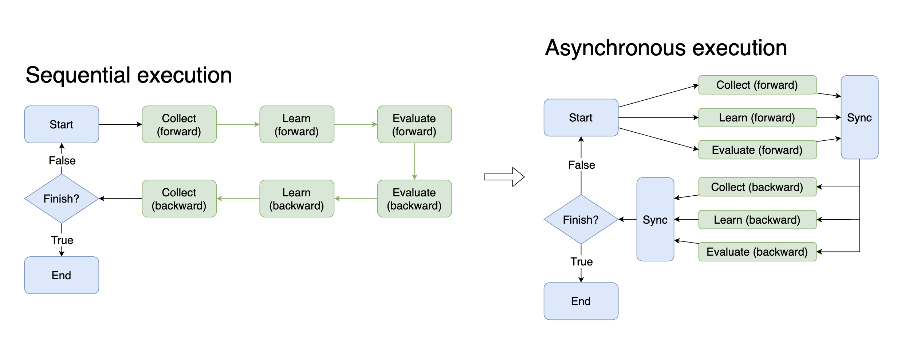

新旧pipeline的异同
===============================

旧pipeline
-------------------------------

**是什么**

`最旧版本 <https://github.com/opendilab/DI-engine/blob/main/dizoo/atari/entry/atari_dqn_main.py>`_
与 `次旧版本 <https://github.com/opendilab/DI-engine/blob/main/dizoo/atari/config/serial/pong/pong_dqn_config.py>`_ 在实质上是一致的，稍微改变代码位置就完全一致。
这两个版本的运行逻辑都是‘线性’的，在main函数中，包含了模型训练、测试、保存以及中间数据记录的直观表达。

ps：这里所谓的‘线性’是指在进行代码阅读时，阅读到哪一行，程序就运行到哪一行，当前文件里没有的代码也可以通过跳转来阅读，可以说是‘所读即所得’。
数据流的传递是非常直观的，需要什么就定义什么，定义什么就使用什么。

基本都可以规范为如下流程：

config -> 

env(include collect_env and eval_env) init -> policy and model init (model init may in policy) -> logger init -> 

trainer(or learner) init -> collect and evaluator init -> replay buffer(only for online rl) create -> 

start train loop(omitted)

**为什么**

这一版本的代码阅读上并不困难，跟着流程逐步理清后，如何仿写或改写一个算法是非常直观且方便的。任何地方出现错误或有迷惑之处，参考原paper或其他开源库也很容易理清。

在这一流程中，给予开发者的自由度是非常高的，在仿写、改写、debug过程中并不需要考虑太多的接口及调用，仅处理好代码中用到的调用（如policy、model初始化时调用所需参数）即可。

但是对于单个算法而言简单、顺畅的流程于整体而言未必是一件好事，同时较高的自由度也必定会带来混乱，导致我们这一版本逐渐庞大，代码上有很多冗余，在强化学习算法中一些较为统一的流程上并未进行抽象，每个算法实现都要重复编写。比如在train loop中，几乎所有算法都依照环境交互、模型交互、模型训练、记录保存（模型保存）等固定流程进行，很明显这些流程是可以被抽象出来的。

进一步来说，如果每个算法都有自己单独的流程，统一的、高效的并行就无从谈起了。

这一版本的优势在于有rl经验的同学开发较快、理解简单、学习成本低，但是对于不熟悉强化学习的同学来说就略显痛苦了，需要对强化学习相关知识进行学习后才能较快上手代码。

总结来说，这一版本要求的强化学习背景知识门槛高，自由度高，开发背景知识门槛低，代码耦合程度高。

新pipeline
-------------------------------

**是什么**

新版本下，我们添加了重要组件 **framework-middleware** ，即 **框架中间件**，通过中间件将之前零散的算法统一到框架的管理之中，能很好地实现未来并行化的需求，同时尽量降低对于强化学习知识的门槛，让更多的开发者在具有一定的相关知识后就能使用此工具实现强化学习智能体的开发。

由于框架的抽象，在初步接触新版本时，可能会觉得开发的自由受到了限制，但这是一种错觉！我们在新版本的实现中以另一种方式保留了开发的自由，参照下图：

.. image::
    ../03_system/images/pipeline.png
    :align: center

仅将一些流程（如stepcollect、train、ckptsave）抽象为一个个模块（图中不同颜色的方块），而在如何使用这些模块，以及使用什么模块等方面仍保有极大的自由。

换句话说，新版本中将算法的各种流程抽象为新的函数，以期望新版本中出现更多的‘函数调用’而不是流程编写。

新版本下数据流的传递有了很大变化，由于流程化的方式变更为模块化，直观的变量定义并不能满足需要，我们使用context来实现各模块间的数据传递，context挂载在我们的中央管理模块task上，task中调用的所有模块都可以使用context来获取自己想要的数据。

task的管理方式如下图：

新的版本可以规范为以下流程：

config -> task start ->

env(include collect_env and eval_env) init -> policy and model init (model init may in policy) -> logger init -> 

Eval call -> Collector call -> Learner call -> logger call -> CkptSaver call (all in this line can be customized) ->

task.run()

**为什么**

这一版本并没有将老版本的优点抹杀，仿写、改写仍是直观且方便的，开发过程中也是十分自由的。另外新版本在需要用户编写的代码量上明显降低，特别是在一些经典算法上，所有模块都已经完成了抽象工作并已经包含在middleware中。

新的版本也能更好地支持并行化的工作，为以后的并行版本做好准备。

那么代价是什么呢？

更难理解。虽然新版本的代码目标是同时降低强化学习知识和开发知识的门槛，但当前版本对照旧版本而言仅降低了强化学习知识的门槛，但提高了开发知识的门槛，想要逐行地了解文件中每一句话都在做什么更困难了。当然，后面会考虑对这点进行优化。

在调试中也稍微添加了一些阻碍，因为总体流程上是由task管理而不能按代码序列执行，所以需要先阅读上一小节或官方文档中 `关于系统设计的部分 <https://di-engine-docs.readthedocs.io/en/latest/03_system/index.html>`_，理解了task的机制后对于代码如何运行以及应当如何修改等都会得心应手了。

这一版本的优势在于降低了对于强化学习背景知识的门槛，同时保留了开发较快的优点，但在理解难易程度和学习成本上稍有不足。

总的来说，新版本的强化学习背景知识门槛有所降低，开发自由度高，开发背景知识门槛略有提高，代码耦合程度低。

新旧pipeline特点对照表
^^^^^^^^^^^^^^^^^^^^^^^^^^^^^^
.. list-table::
   :widths: 55 80 60 35 35 35 30
   :header-rows: 1

   * - 新旧版本对比表
     - 强化学习背景知识要求
     - 开发背景知识要求
     - 代码耦合度
     - 开发自由度
     - 上手难易度
     - 并行潜力
   * - 新
     - **低**
     - 中
     - **低**
     - **高**
     - 中
     - **高**
   * - 旧
     - 高
     - **低**
     - 高
     - 高
     - **低**
     - 低
