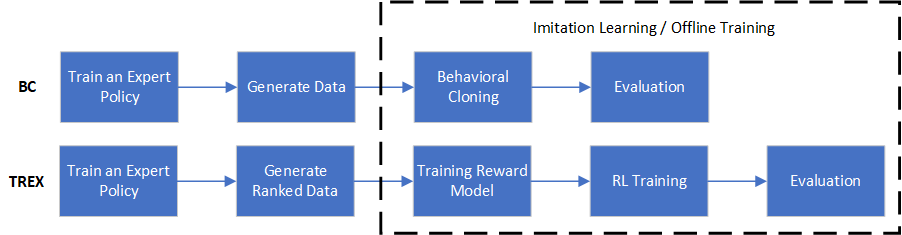

How to construct a data pipeline for Imitation Learning / Offline Training
==============================================================

Overview
~~~~~~~~~~~~~~

Generally speaking, data pipeline for Imitation Learning or Offline Training mainly contains three steps:

- Train an expert policy.
- Generate data. In this step, the previous expert is used to generate demonstration data.
- Imitation Learning / Offline Training. Finally, given generated expert data, we can conduct corresponding Imitation Learning or Offline Training.

For better illustrating this pipeline, we take two examples: `Behavioral Cloning (BC) <http://www.cse.unsw.edu.au/~claude/papers/MI15.pdf>`_ and `Extrapolating Beyond Suboptimal Demonstrations via Inverse Reinforcement Learning from Observations (TREX) <https://arxiv.org/abs/1904.06387>`_ . The pipline of these two algorithms are shown as below.

Next, we will introduce details about how to implement the pipeline of these two algorithms.

``Train an expert policy``
~~~~~~~~~~~~~~

In this step, we will train an expert policy, which has no difference with standard RL process. For example, to perform PPO on cartpole, we can use:

   .. code:: python

      from copy import deepcopy
      from easydict import EasyDict
      from dizoo.classic_control.cartpole.config.cartpole_offppo_config import cartpole_offppo_config,\
      cartpole_offppo_create_config
      from ding.entry import serial_pipeline_bc, collect_demo_data, serial_pipeline

      config = [deepcopy(cartpole_offppo_config), deepcopy(cartpole_offppo_create_config)]
      config[0].policy.learn.learner.hook.save_ckpt_after_iter = 100
      expert_policy = serial_pipeline(config, seed=0)

``Generate data``
~~~~~~~~~~~~~~

In this step, the expert policy will generate demonstration data.

For different Imitation Learning or Offline Training algorithms, formats of demonstration data may be different. If we only require state-action pair (e.g. BC), the demonstration data can be easily generated like:

   .. code:: python

      collect_count = 10000  # number of transitions to collect
      expert_data_path = 'expert_data_ppo_bc.pkl'  # data path to be saved
      state_dict = expert_policy.collect_mode.state_dict()
      collect_config = [deepcopy(cartpole_offppo_config), deepcopy(cartpole_offppo_create_config)]
      collect_config[0].exp_name = 'test_serial_pipeline_bc_ppo_collect'
      collect_demo_data(
          collect_config, seed=0, state_dict=state_dict, expert_data_path=expert_data_path, collect_count=collect_count
      )

Because the collect config is almost the same compared to the expert config, we directly modify the original config.

If we requires demonstration data sorted according to quality ranking (e.g. TREX), we should use another function to collect demonstration data:

   .. code:: python

      from ding.entry.application_entry_trex_collect_data import trex_collecting_data
      from dizoo.classic_control.cartpole.config.cartpole_trex_offppo_config import cartpole_trex_offppo_config,\
      cartpole_trex_offppo_create_config
      exp_name = 'test_serial_pipeline_trex_collect'
      collect_config = [deepcopy(cartpole_trex_offppo_config), deepcopy(cartpole_trex_offppo_create_config)]
      collect_config[0].exp_name = exp_name
      collect_config[0].reward_model.data_path = exp_name
      collect_config[0].reward_model.reward_model_path = exp_name + '/cartpole.params'  # path for saving TREX reward model
      collect_config[0].reward_model.expert_model_path = config[0].exp_name
      collect_config[0].reward_model.checkpoint_max = 100  # specifying ckpt for generating demonstration data.
      collect_config[0].reward_model.checkpoint_step = 100
      collect_config[0].reward_model.num_snippets = 100  # number of sampled pieces from the total episode.
      args = EasyDict({'cfg': deepcopy(collect_config), 'seed': 0, 'device': 'cpu'})
      trex_collecting_data(args=args)

``Imitation Learning / Offline Training``
~~~~~~~~~~~~~~

Finally in this step, we will use the generated demonstration data for Imitation Learning / Offline Training. For BC, we can use:

   .. code:: python

      il_config = [deepcopy(cartpole_offppo_config), deepcopy(cartpole_offppo_create_config)]
      il_config[0].policy.learn.train_epoch = 20  # train epoch
      il_config[1].policy.type = 'bc'  # modify the policy type to be BC
      il_config[0].policy.model.pop('critic_head_hidden_size')
      il_config[0].policy.model.pop('actor_head_hidden_size')
      il_config[0].policy.model.pop('action_space')
      il_config[0].policy.learn.learning_rate = 1e-2
      il_config[0].policy.continuous = False  # use discrete BC
      il_config[0].exp_name = 'test_serial_pipeline_bc_ppo_il'
      _, converge_stop_flag = serial_pipeline_bc(il_config, seed=0, data_path=expert_data_path)
      assert converge_stop_flag

For TREX, we can use:

   .. code:: python

      from ding.entry import serial_pipeline_preference_based_irl
      serial_pipeline_preference_based_irl(collect_config, seed=0, max_train_iter=1)

Notably, we integrate all the algorithm-specific code into each ``serial_pipeline``.
