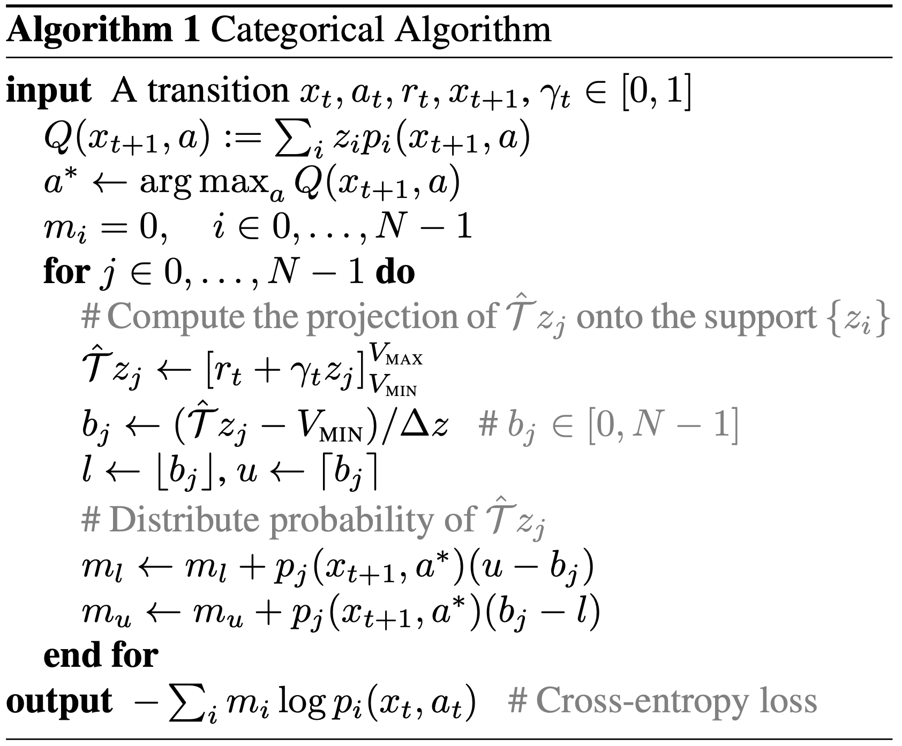

C51
======

概述
--------

C51最初是在
`A Distributional Perspective on Reinforcement Learning <https://arxiv.org/abs/1707.06887>`__ 中提出的，与以往的研究不同，C51评估了q值的完整分布，而不仅仅是期望值。作者设计了一个分布式Bellman算子，它保留了值分布中的多峰性，被认为能够实现更稳定的学习，并减轻从非稳态策略学习的负面影响。

核心要点
-----------

1. C51是一种无模型和基于值的强化学习算法。

2. C51仅支持离散动作空间。

3. C51是一种离线策略算法。

4. 通常, C51使用eps-greedy或多项式采样进行探索。

5. C51可以配备RNN。

伪代码
------------

.. note::
    C51使用离散分布来建模值分布, 其支持集合为N个原子: :math:`z_i = V_\min + i * delta, i = 0,1,...,N-1` 和　:math:`delta = (V_\max - V_\min) / N` 。每个原子　:math:`z_i` 都有一个参数化的概率 :math:`p_i` 。 C51的贝尔曼更新将 :math:`r + \gamma * z_j^{\left(t+1\right)}` 的分布投影到分布 :math:`z_i^t` 上。

关键方程或关键框图
---------------------------

C51的贝尔曼方程是通过将返回分布 :math:`r + \gamma * z_j` 投影到当前分布 :math:`z_i`. 给定一个样本转移 :math:`(x, a, r, x')`, 我们为每个原子　:math:`z_j`计算贝尔曼更新 :math:`Tˆz_j := r + \gamma z_j` 然后将其概率 :math:`p_{j}(x', \pi(x'))` 分配给其相邻的原子 :math:`p_{i}(x, \pi(x))`:

.. math::

   \left(\Phi \hat{T} Z_{\theta}(x, a)\right)_{i}=\sum_{j=0}^{N-1}\left[1-\frac{\left|\left[\hat{\mathcal{T}} z_{j}\right]_{V_{\mathrm{MIN}}}^{V_{\mathrm{MAX}}}-z_{i}\right|}{\Delta z}\right]_{0}^{1} p_{j}\left(x^{\prime}, \pi\left(x^{\prime}\right)\right)

扩展
-----------
- C51s 可以和以下模块结合:
   - PER (Prioritized Experience Replay)
   - Multi-step TD-loss
   - Double (target) network
   - Dueling head
   - RNN

实现
-----------------

.. tip::
      我们对C51的基准结果使用了与DQN相同的超参数, (除了C51的独有参数 `n_atom`) , 经验上这种方法是配置C51的通用方法。

C51的默认配置如下:

.. autoclass:: ding.policy.c51.C51Policy
   :noindex:

C51使用的网络接口定义如下:

.. autoclass:: ding.model.template.q_learning.C51DQN
   :members: forward
   :noindex:

基准测试
---------------------

.. list-table:: Benchmark and comparison of c51 algorithm
   :widths: 25 15 30 15 15
   :header-rows: 1

   * - environment
     - best mean reward
     - evaluation results
     - config link
     - comparison
   * - | Pong
       | (PongNoFrameskip-v4)
     - 20.6
     - .. image:: images/benchmark/c51_pong.png
     - `config_link_p <https://github.com/opendilab/DI-engine/blob/main/dizoo/atari/config/serial/pong/pong_c51_config.py>`_
     - | Tianshou(20)
   * - | Qbert
       | (QbertNoFrameskip-v4)
     - 20006
     - .. image:: images/benchmark/c51_qbert.png
     - `config_link_q <https://github.com/opendilab/DI-engine/blob/main/dizoo/atari/config/serial/qbert/qbert_c51_config.py>`_
     - | Tianshou(16245)
   * - | SpaceInvaders
       | (SpaceInvadersNoFrame skip-v4)
     - 2766
     - .. image:: images/benchmark/c51_spaceinvaders.png
     - `config_link_s <https://github.com/opendilab/DI-engine/blob/main/dizoo/atari/config/serial/spaceinvaders/spaceinvaders_c51_config.py>`_
     - | Tianshou(988.5)

其他开源实现
-----------------------------
 - `Tianshou <https://github.com/thu-ml/tianshou/blob/master/tianshou/policy/modelfree/c51.py>`_

