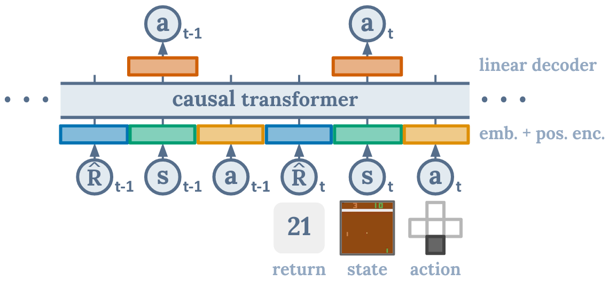
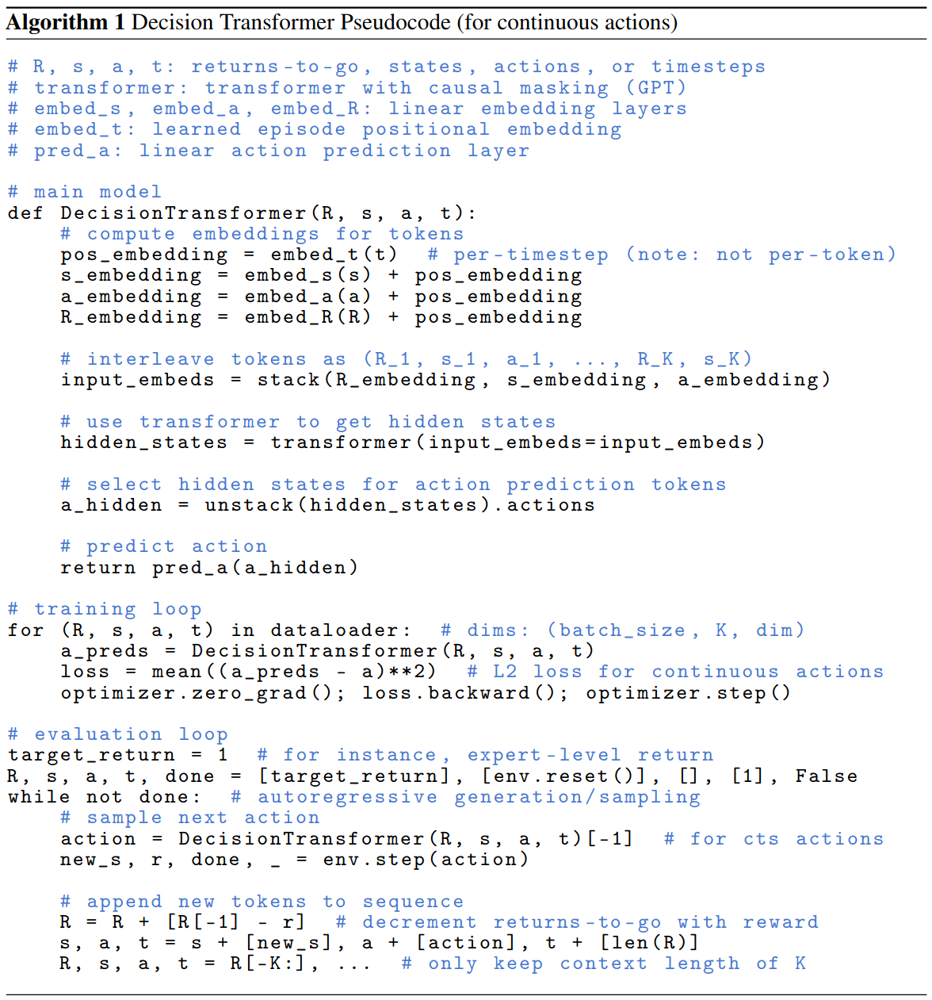

DT
^^^^^^^

综述
---------
DT 算法将 RL 任务抽象为一个有条件的序列预测问题，将 transformer 结构应用在RL任务上，同时与语言模型，如 GPT-x 和 BERT 等联系起来。不像传统 RL 中计算 value 函数或计算 policy 梯度， DT 通过一个屏蔽后序的 transformer 直接输出最有动作选择。通过指定期望模型达到的reward，同时借助 states 和 actions 信息，就可以给出下一动作并达到期望的 reward。 DT 的达到并超过了 SOTA model-free offline RL 算法在 atari， gym 等环境上的效果。

快速了解
-------------
1. DT 是一个 **offline** 强化学习算法。

2. DT 支持 **离散（discrete）** 和 **连续（continuous）** 动作空间。

3. DT 使用 transformer 进行动作预测，但是对 self-attention 的结构进行了修改。

4. DT 的数据集结构是由算法特点决定的，在进行模型训练和测试中都要符合其要求。

重要公示/重要图示
---------------------------
DT 的结构图如下：

图示说明 DT 算法在进行动作 a\ :sub:`t`\  的预测时，仅与当前时间步的 r\ :sub:`t`\  和 s\ :sub:`t`\  以及之前的 r\ :sub:`t-n`\ , s\ :sub:`t-n`\ , a\ :sub:`t-n`\  相关，与之后的无关， causal transformer 就是用来实现这一效果的模块。

伪代码
---------------

实现
----------------
DQNPolicy 的默认 config 如下所示：

.. autoclass:: ding.policy.dt.DTPolicy
   :noindex:

其中使用的神经网络接口如下所示：

.. autoclass:: ding.model.template.DT.DecisionTransformer
   :members: forward
   :noindex:

实验 Benchmark
------------------
.. list-table:: Benchmark and comparison of DT algorithm
   :widths: 25 15 30 15 15
   :header-rows: 1

   * - environment
     - best mean reward (normalized)
     - evaluation results
     - config link
     - comparison
   * - | Hopper 
       | (Hopper-medium)
     - 0.753
     - .. image:: images/benchmark/hopper_medium_dt.png
     - `link_2_Hopper-medium <https://github.com/opendilab/DI-engine/blob/main/dizoo/d4rl/config/hopper_medium_dt_config.py>`_
     - DT paper 
   * - | Hopper 
       | (Hopper-expert)
     - 1.120
     - .. image:: images/benchmark/hopper_expert_dt.png
     - `link_2_Hopper-expert <https://github.com/opendilab/DI-engine/blob/main/dizoo/d4rl/config/hopper_medium_expert_dt_config.py>`_
     - DT paper 
   * - | Hopper 
       | (Hopper-medium-replay)
     - 0.747
     - .. image:: images/benchmark/hopper_medium_replay_dt.png
     - `link_2_Hopper-medium-replay <https://github.com/opendilab/DI-engine/blob/main/dizoo/d4rl/config/hopper_medium_replay_dt_config.py>`_
     - DT paper 
   * - | Hopper 
       | (Hopper-medium-expert)
     - 1.118
     - .. image:: images/benchmark/hopper_medium_expert_dt.png
     - `link_2_Hopper-medium-expert <https://github.com/opendilab/DI-engine/blob/main/dizoo/d4rl/config/hopper_medium_expert_dt_config.py>`_
     - DT paper 
   * - | Walker2d 
       | (Walker2d-medium)
     - 0.835
     - .. image:: images/benchmark/walker2d_medium_dt.png
     - `link_2_Walker2d-medium <https://github.com/opendilab/DI-engine/blob/main/dizoo/d4rl/config/walker2d_medium_dt_config.py>`_
     - DT paper 
   * - | Walker2d 
       | (Walker2d-expert)
     - 1.100
     - .. image:: images/benchmark/walker2d_expert_dt.png
     - `link_2_Walker2d-expert <https://github.com/opendilab/DI-engine/blob/main/dizoo/d4rl/config/walker2d_expert_dt_config.py>`_
     - DT paper 
   * - | Walker2d 
       | (Walker2d-medium-replay)
     - 0.621
     - .. image:: images/benchmark/walker2d_medium_replay_dt.png
     - `link_2_Walker2d-medium-replay <https://github.com/opendilab/DI-engine/blob/main/dizoo/d4rl/config/walker2d_medium_replay_dt_config.py>`_
     - DT paper 
   * - | Walker2d 
       | (Walker2d-medium-expert)
     - 1.095
     - .. image:: images/benchmark/walker2d_medium_expert_dt.png
     - `link_2_Walker2d-medium-expert <https://github.com/opendilab/DI-engine/blob/main/dizoo/d4rl/config/walker2d_medium_expert_dt_config.py>`_
     - DT paper 
   * - | HalfCheetah 
       | (HalfCheetah-medium)
     - 0.435
     - .. image:: images/benchmark/halfcheetah_medium_dt.png
     - `link_2_HalfCheetah-medium <https://github.com/opendilab/DI-engine/blob/main/dizoo/d4rl/config/halfcheetah_medium_dt_config.py>`_
     - DT paper 
   * - | HalfCheetah 
       | (HalfCheetah-expert)
     - 0.723
     - .. image:: images/benchmark/halfcheetah_expert_dt.png
     - `link_2_HalfCheetah-expert <https://github.com/opendilab/DI-engine/blob/main/dizoo/d4rl/config/halfcheetah_expert_dt_config.py>`_
     - DT paper 
   * - | HalfCheetah 
       | (HalfCheetah-medium-replay)
     - 0.413
     - .. image:: images/benchmark/halfcheetah_medium_replay_dt.png
     - `link_2_HalfCheetah-medium-replay <https://github.com/opendilab/DI-engine/blob/main/dizoo/d4rl/config/halfcheetah_medium_replay_dt_config.py>`_
     - DT paper 
   * - | HalfCheetah 
       | (HalfCheetah-medium-expert)
     - 0.561
     - .. image:: images/benchmark/halfcheetah_medium_expert_dt.png
     - `link_2_HalfCheetah-medium-expert <https://github.com/opendilab/DI-engine/blob/main/dizoo/d4rl/config/halfcheetah_medium_expert_dt_config.py>`_
     - DT paper 
   * - | Pong 
       | (PongNoFrameskip-v4)
     - 19.85
     - .. image:: images/benchmark/pong_dt.png
     - `link_2_Pong <https://github.com/opendilab/DI-engine/blob/main/dizoo/atari/config/serial/qbert/qbert_dqn_config.py>`_
     - DT paper 
   * - | Breakout
       | (BreakoutNoFrameskip-v4)
     - 127.6
     - .. image:: images/benchmark/breakout_dt.png
     - `link_2_Breakout <https://github.com/opendilab/DI-engine/blob/main/dizoo/atari/config/breakout_dt_config.py>`_
     - DT paper 

注：

以上结果是在3个不同的随机种子（即123， 213， 321）运行相同的配置得到

参考文献
----------

- Zheng, Q., Zhang, A., & Grover, A. (2022, June). Online decision transformer. In international conference on machine learning (pp. 27042-27059). PMLR.
