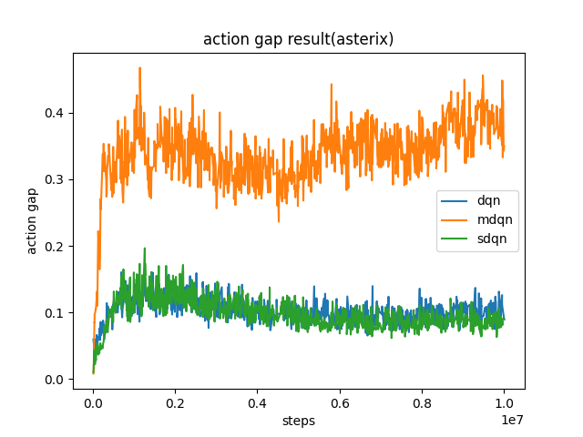
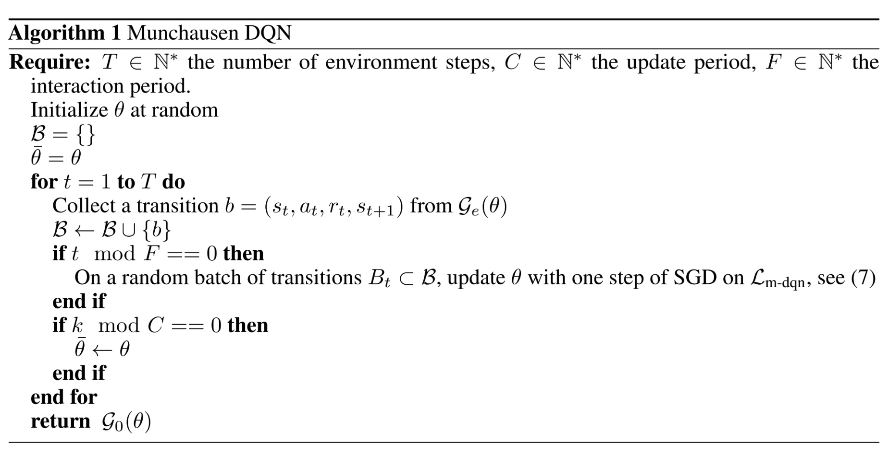

MDQN
^^^^^^^

Overview
---------
MDQN was proposed in `Munchausen Reinforcement Learning <https://arxiv.org/abs/2007.14430>`_. They call this general approach “Munchausen Reinforcement Learning”
(M-RL), as a reference to a famous passage of The Surprising Adventures of Baron Munchausen by Raspe, where the Baron pulls himself out of a swamp by pulling on his own hair.
From a practical point of view, the key difference between MDQN and DQN is that MDQN adding a scaled log-policy to the immediate reward on the Soft-DQN which is is an extension of the traditional DQN algorithm with max entropy.

Quick Facts
-------------
1. MDQN is a **model-free** and **value-based** RL algorithm.

2. MDQN only support **discrete** action spaces.

3. MDQN is an **off-policy** algorithm.

4. MDQN uses **eps-greedy** for exploration.

5. MDQN increased the action gap, and has implicit KL regularization.

Key Equations or Key Graphs
---------------------------
The target Q value used in MDQN is:

.. math::

   \hat{q}_{\mathrm{m} \text {-dqn }}\left(r_t, s_{t+1}\right)=r_t+\alpha \tau \ln \pi_{\bar{\theta}}\left(a_t \mid s_t\right)+\gamma \sum_{a^{\prime} \in A} \pi_{\bar{\theta}}\left(a^{\prime} \mid s_{t+1}\right)\left(q_{\bar{\theta}}\left(s_{t+1}, a^{\prime}\right)-\tau \ln \pi_{\bar{\theta}}\left(a^{\prime} \mid s_{t+1}\right)\right)
   

For the log policy  :math:`\alpha \tau \ln \pi_{\bar{\theta}}\left(a_t \mid s_t\right)`  we used the following formula to calculate 

.. math::

   \tau \ln \pi_{k}=q_k-v_k-\tau \ln \left\langle 1, \exp \frac{q_k-v_k}{\tau}\right\rangle

where  :math:`q_k`  is the  `target_q_current` in our code. For the max entropy part  :math:`\tau \ln \pi_{\bar{\theta}}\left(a^{\prime} \mid s_{t+1}\right)` , we use the same formula to calculate where the  where  :math:`q_{k+1}` is the  `target_q`  in our code

And we replace  :math:`\tau \ln \pi(a \mid s)` by :math:`[\tau \ln \pi(a \mid s)]_{l_0}^0`` because log-policy term is not bounded, and can cause numerical issues if the policy becomes too close to
deterministic. 

And we replace  :math:`\pi_{\bar{\theta}}\left(a^{\prime} \mid s_{t+1}\right)` by :math:`softmax(q-v)` which official implementations used but not mentationed in their paper.

And we test action at asterix and get the same result as paper that MDQN could increase the action gap.

.. note::

Pseudo-code
---------------

.. note::

Extension
---------------

Implementations
----------------
The default config of MDQNPolicy is defined as follows:

.. autoclass:: ding.policy.mdqn.MDQNPolicy
   :noindex:

The td error interface MDQN used is defined as follows:

.. autoclass:: ding.rl_utils.td.m_q_1step_td_error
   :members: forward
   :noindex:

Benchmark
-----------

+---------------------+-----------------+-----------------------------------------------------+--------------------------+----------------------+
| environment         |best mean reward | evaluation results                                  | config link              | comparison           |
+=====================+=================+=====================================================+==========================+======================+
|                     |                 |                                                     |`config_link_p <https://  |                      |
|                     |                 |                                                     |github.com/opendilab/     |  sdqn(3513)          |
|                     |                 |                                                     |DI-engine/tree/main/dizoo/|                      |
|Asterix              |  8963           |.. image:: images/benchmark/mdqn_asterix.png         |atari/config/serial/      |  paper(1718)         |
|                     |                 |                                                     |asterix/asterix_mdqn_confi|                      |
|(Asterix-v0)         |                 |                                                     |g.py>`_                   |  dqn(3444)           |
+---------------------+-----------------+-----------------------------------------------------+--------------------------+----------------------+
|                     |                 |                                                     |`config_link_q <https://  |                      |
|                     |                 |                                                     |github.com/opendilab/     |  sdqn(1804)          |
|SpaceInvaders        |                 |                                                     |DI-engine/tree/main/dizoo/|                      |
|                     |  2211           |.. image:: images/benchmark/mdqn_spaceinvaders.png   |atari/config/serial/      |  paper(2045)         |
|(spaceInvaders-v0)   |                 |                                                     |spaceinvaders/spaceinvader|                      |
|                     |                 |                                                     |s_dqn_config.py>`_        |  dqn(1228)           |
+---------------------+-----------------+-----------------------------------------------------+--------------------------+----------------------+
|                     |                 |                                                     |`config_link_s <https://  |                      |
|                     |                 |                                                     |github.com/opendilab/     |  sdqn(986.1)         |
|Enduro               |                 |                                                     |DI-engine/tree/main/dizoo/|                      |
|                     |  1003           |.. image:: images/benchmark/mdqn_enduro.png          |atari/config/serial/      |  paper(1171)         |
|(Enduro-v4)          |                 |                                                     |endruo/space              |                      |
|                     |                 |                                                     |enduro_mdqn_config.py>`_  |  dqn(986.4)          |
+---------------------+-----------------+-----------------------------------------------------+--------------------------+----------------------+

P.S.：

1. The above results are obtained by running the same configuration on seed 0
2. For the discrete action space algorithm like DQN, the Atari environment set is generally used for testing (including sub-environments Pong), and Atari environment is generally evaluated by the highest mean reward training 10M ``env_step``. For more details about Atari, please refer to `Atari Env Tutorial <../env_tutorial/atari.html>`_ .

Reference
----------

- Vieillard, Nino, Olivier Pietquin, and Matthieu Geist. "Munchausen reinforcement learning." Advances in Neural Information Processing Systems 33 (2020): 4235-4246.

