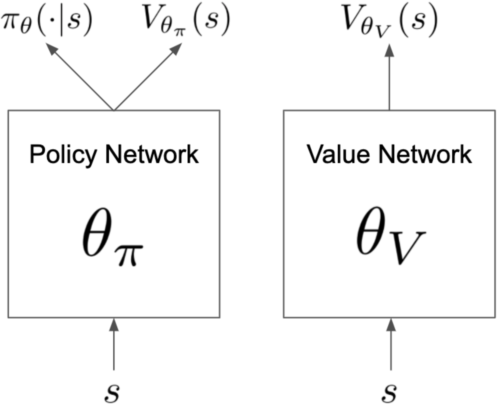

PPG
^^^^^^^

概述
---------
PPG 是在 `Phasic Policy Gradient <https://arxiv.org/abs/2009.04416>`_ 中提出的。在以前的方法中，人们需要选择表示策略和价值函数是否需要分开训练还是共享全局信息。分开训练可以避免目标之间的干扰，而使用共享全局信息可以实现有用特征的共享。PPG 能够兼顾两者的优点，通过将优化分为两个阶段，一个用于推进训练，另一个用于提取特征。

核心要点
-----------
1. PPG is a **model-free** and **policy-based** RL algorithm.

2. PPG supports both **discrete** and **continuous action spaces**.

3. PPG supports **off-policy** mode and **on-policy** mode.

4. There are two value networks in PPG.

5. In the implementation of DI-engine, we use two buffers for off-policy PPG, which are only different from maximum data usage limit (data ``max_use`` ).

1. PPG是一种无模型、基于策略的强化学习算法。

2. PPG支持离散动作空间和连续动作空间。

3. PPG支持离策略模式和在策略模式。

4. PPG中有两个值网络。

5. 在DI-engine的实现中，我们对离策略PPG使用了两个缓冲区，它们仅在数据使用上限（数据 "max_use" ）上有所不同。

重要图示
----------
PPG utilizes disjoint policy and value networks to reduce interference between objectives. The policy network includes an auxiliary value head which is used to distill the knowledge of value into the policy network, the concrete network architecture is shown as follows:
PPG 利用分开的策略和价值网络来减少目标之间的干扰。策略网络包括一个辅助价值头部，用于将价值的知识提取到策略网络中，具体的网络结构如下所示：

重要公式
-------------
The optimization of PPG alternates between two phases, a policy phase and an auxiliary phase. During the policy phase, the policy network and the value network are updated similar to PPO. During the auxiliary phase, the value knowledge is distilled into the policy network with the joint loss:
PPG 的优化分为两个阶段，策略阶段和辅助阶段。在策略阶段，策略网络和价值网络的更新方式类似于 PPO。在辅助阶段，使用联合损失将价值知识提取到策略网络中：

.. math::

    L^{j o i n t}=L^{a u x}+\beta_{c l o n e} \cdot \hat{\mathbb{E}}_{t}\left[K L\left[\pi_{\theta_{o l d}}\left(\cdot \mid s_{t}\right), \pi_{\theta}\left(\cdot \mid s_{t}\right)\right]\right]

The joint loss optimizes the auxiliary objective (distillation) while preserves the original policy with the KL-divergence restriction (i.e. the second item). And the auxiliary loss is defined as:
联合损失函数优化辅助目标（蒸馏），同时通过 KL 散度限制（即第二项）保留原始策略。辅助损失定义如下：

.. math::

    L^{a u x}=\frac{1}{2} \cdot \hat{\mathbb{E}}_{t}\left[\left(V_{\theta_{\pi}}\left(s_{t}\right)-\hat{V}_{t}^{\mathrm{targ}}\right)^{2}\right]

伪代码
-----------

on-policy training procedure
==============================

The following flow charts show how PPG alternates between the policy phase and the auxiliary phase
以下流程图展示了 PPG 如何在策略阶段和辅助阶段之间进行交替

.. note::

   During the auxiliary phase, PPG also takes the opportunity to perform additional training on the value network.
   在辅助阶段，PPG 还利用机会对值网络进行额外的训练。

off-policy training procedure
==============================
DI-engine also implements off-policy PPG with two buffers with different data use constraint (``max_use``), which policy buffer offers data for policy phase while value buffer provides auxiliary phase's data. The whole training procedure is similar to off-policy PPO but execute additional auxiliary phase with a fixed frequency.
DI-engine 还实现了具有两个具有不同数据使用约束（"max_use"）的缓冲区的离策略 PPG。其中，策略缓冲区提供策略阶段的数据，而值缓冲区提供辅助阶段的数据。整个训练过程类似于离策略 PPO，但会以固定频率执行额外的辅助阶段。

扩展
-----------
- PPG can be combined with:

    * GAE or other advantage estimation method
    * Multi-buffer, different ``max_use``

- PPO (or PPG) + UCB-DrAC + PLR is one of the most powerful methods in procgen environment.

    * `PLR github repo <https://github.com/facebookresearch/level-replay>`_
    * `UCB-DrAC repo <https://github.com/rraileanu/auto-drac>`_

- PPG 可以与以下方法结合使用：

  * GAE 或其他优势估计方法
  * 多个缓冲区，具有不同的 "max_use" 约束

- 在 procgen 环境中，PPO（或 PPG）+ UCB-DrAC + PLR 是最好的方法之一。

实现
---------------
The default config is defined as follows:
默认配置如下所示：

.. autoclass:: ding.policy.ppg.PPGPolicy
    :noindex:

The network interface PPG used is defined as follows:
PPG 使用的网络接口定义如下：

.. autoclass:: ding.model.template.ppg.PPG
   :members: compute_actor_critic, compute_actor, compute_critic
   :noindex:

Benchmark
--------------

.. list-table:: Benchmark and comparison of PPG algorithm
   :widths: 25 15 30 15 15
   :header-rows: 1

   * - environment
     - best mean reward
     - evaluation results
     - config link
     - comparison
   * - | Pong
       | (PongNoFrameskip-v4)
     - 20
     - .. image:: images/benchmark/ppg_pong.png
     - `config_link_p <https://github.com/opendilab/DI-engine/blob/main/dizoo/atari/config/serial/pong/pong_ppg_config.py>`_
     - | DI-engine PPO off-policy(20)
   * - | Qbert
       | (QbertNoFrameskip-v4)
     - 17775
     - .. image:: images/benchmark/ppg_qbert.png
     - `config_link_q <https://github.com/opendilab/DI-engine/blob/main/dizoo/atari/config/serial/qbert/qbert_ppg_config.py>`_
     - | DI-engine PPO off-policy(16400)
   * - | SpaceInvaders
       | (SpaceInvadersNoFrame skip-v4)
     - 1213
     - .. image:: images/benchmark/ppg_spaceinvaders.png
     - `config_link_s <https://github.com/opendilab/DI-engine/blob/main/dizoo/atari/config/serial/spaceinvaders/spaceinvaders_ppg_config.py>`_
     - | DI-engine PPO off-policy(1200)

引用
-----------

Karl Cobbe, Jacob Hilton, Oleg Klimov, John Schulman: “Phasic Policy Gradient”, 2020; arXiv:2009.04416.

其他开源实现
------------------------------

- [openai](https://github.com/openai/phasic-policy-gradient)
