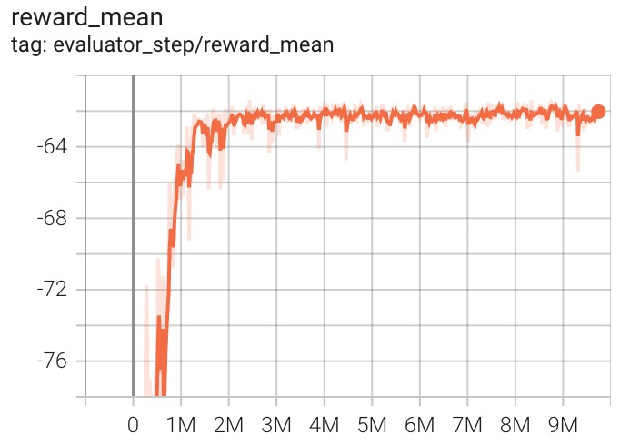

Acrobot
~~~~~~~~~~~~~~~~~~

概述
=======
Acrobot机器人系统是强化学习中的经典控制问题。该系统包括两个关节和两个连杆，其中两个连杆之间的关节可以被驱动。系统的初始状态是向下悬挂的。目标是在驱动关节上施加力矩，使连杆的自由端摆动到指定高度。如下图所示。

.. image:: ./images/acrobot.gif
   :align: center
   :scale: 80%
安装
====

安装方法
--------

Acrobot 环境内置在 gym 中，直接安装 gym 即可。其环境 id 是\ ``Acrobot-v1`` \。

.. code:: shell

    pip install gym
    
验证安装
--------

在 Python 命令行中运行如下命令验证安装成功。

.. code:: shell 

    import gym
    env = gym.make('Acrobot-v1')
    obs = env.reset()
    print(obs)  

环境介绍
=========

动作空间
----------

Acrobot 的动作空间属于离散动作空间，有 3 个离散动作，分别是施加+1力矩, -1力矩和不施加力矩。

-  \ ``-1的力矩`` \: 0 表示向关节施加-1的力矩。

-  \ ``0的力矩`` \: 1 表示向关节施加0的力矩。

-  \ ``+1的力矩`` \: 2 表示向关节施加+1的力矩。

使用 gym 环境空间定义则可表示为：

.. code:: python
    
    action_space = spaces.Discrete(3)

状态空间
----------

Acrobot 的状态空间有 6 个元素，分别是：

- \ ``Cosine of theta1`` \：第一个连杆和竖直方向角度的cos值，范围是 \ ``[-1, 1]`` \。
  
- \ ``Sine of theta1`` \：第一个连杆和竖直方向角度的sin值，范围是 \ ``[-1, 1]`` \。

- \ ``Cosine of theta2`` \：第二个连杆相对于第一个连杆的角度的cos值，范围是 \ ``[-1, 1]`` \。

- \ ``Sine of theta2`` \：第二个连杆相对于第一个连杆的角度的sin值，范围是 \ ``[-1, 1]`` \。

- \ ``Angular velocity of theta1`` \：第一个连杆相对于竖直方向的角速度，范围是 \ ``[-4 * pi, 4 * pi]`` \。

- \ ``Angular velocity of theta2`` \：第二个连杆相对于第一个连杆的角速度，范围是 \ ``[-9 * pi, 9 * pi]`` \。

theta1 是第一个关节的角度，其中角度 0 表示第一个链接直接指向下方。

theta2 是相对于第一个连杆的角度。 角度 0 对应于两个链接之间具有相同的角度。

奖励空间
-----------
目标是让自由端以尽可能少的步数达到指定的目标高度，因此所有未达到目标的步数都会产生 -1 的奖励。 达到目标高度会导致终止，奖励为 0。

终止条件
------------
Cartpole 环境每个 episode 的终止条件是遇到以下任何一种情况：

- 自由端达到目标高度，构造形式是 \ :math:`-cos(\theta_1) - cos(\theta_1 + \theta_2) > 1.0`\ 。

- 达到 episode 的最大 step，默认为 500。
  

DI-zoo 可运行代码示例
=====================

下面提供一个完整的 acrobot 环境 config，采用 DQN 算法作为 policy。

.. code:: python
    import gym
    from ditk import logging
    from ding.model import DQN
    from ding.policy import DQNPolicy
    from ding.data import DequeBuffer
    from ding.envs import DingEnvWrapper, BaseEnvManagerV2, SubprocessEnvManagerV2
    from ding.config import compile_config
    from ding.framework import task, ding_init
    from ding.framework.context import OnlineRLContext
    from ding.framework.middleware import OffPolicyLearner, StepCollector, interaction_evaluator, data_pusher, \
    eps_greedy_handler, CkptSaver, online_logger, nstep_reward_enhancer
    from ding.utils import set_pkg_seed
    from dizoo.classic_control.acrobot.config.acrobot_dqn_config import main_config, create_config

    def main():
        logging.getLogger().setLevel(logging.INFO)
        cfg = compile_config(main_config, create_cfg=create_config, auto=True)
        ding_init(cfg)

        with task.start(async_mode=False, ctx=OnlineRLContext()):
            collector_env = SubprocessEnvManagerV2(
                env_fn= [lambda: DingEnvWrapper(gym.make(cfg.env.env_id)) for _ in range(cfg.env.collector_env_num)],
                cfg=cfg.env.manager
            )

            evaluator_env = SubprocessEnvManagerV2(
                env_fn=[lambda: DingEnvWrapper(gym.make(cfg.env.env_id)) for _ in range(cfg.env.evaluator_env_num)],
                cfg=cfg.env.manager
            )

            set_pkg_seed(cfg.seed, use_cuda=cfg.policy.cuda)

            model = DQN(**cfg.policy.model)
            buffer_ = DequeBuffer(size=cfg.policy.other.replay_buffer.replay_buffer_size)
            policy = DQNPolicy(cfg.policy, model=model)

            task.use(interaction_evaluator(cfg, policy.eval_mode, evaluator_env))
            task.use(eps_greedy_handler(cfg))
            task.use(StepCollector(cfg, policy.collect_mode, collector_env))
            task.use(nstep_reward_enhancer(cfg))
            task.use(data_pusher(cfg, buffer_))
            task.use(OffPolicyLearner(cfg, policy.learn_mode, buffer_))
            task.use(online_logger(train_show_freq=10))
            task.use(CkptSaver(policy,save_dir='/Your_path/acrobot_logs', train_freq=100))
            task.run()

    if __name__ == "__main__":
        main()

实验结果
=================
使用 DQN 算法的实验结果如下。横坐标是\ ``step`` \，纵坐标是\ ``reward_mean`` \。

参考资料
=====================
- Cartpole `源码 <https://github.com/openai/gym/blob/master/gym/envs/classic_control/acrobot.py>`__

