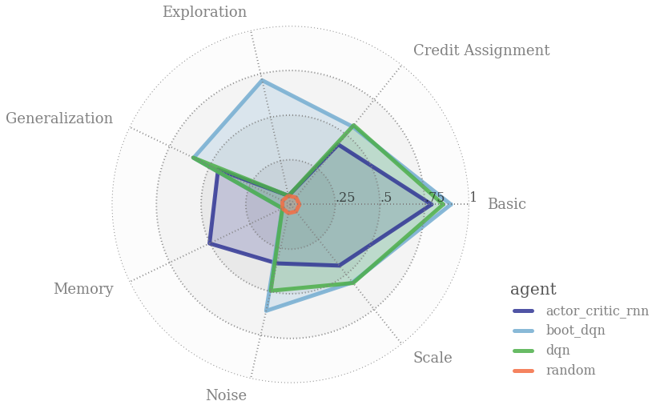
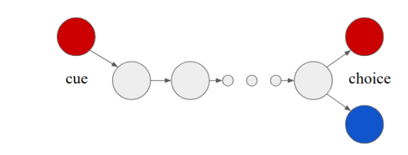
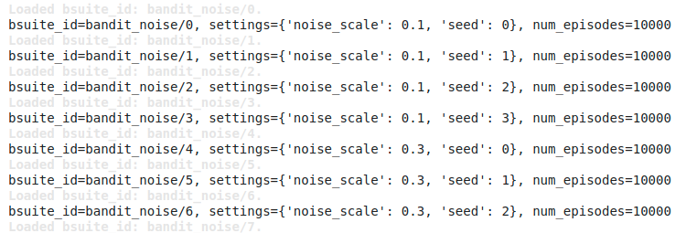

Bsuite
~~~~~~~

概述
============

``bsuite``  是一个精心设计的实验集合，研究强化学习代理的核心能力。其主要有两个目标：

    1. 收集明确的、信息量大的、可扩展的问题，抓住高效和通用学习算法设计中的关键问题。
    2. 通过他们在这些共享基准上的表现来研究代理行为。

   图片选自: https://github.com/deepmind/bsuite

这里我们以 *Memory Length* 为例环境来说明如下。 它的目的是测试一个代理人能够记住一个比特的连续步骤的数量。底层环境是基于一个风格化的 `T-maze <https://en.wikipedia.org/wiki/T-maze>`__ 问题， a length :math:`N \in \mathbb{N}`. 
Each episode lasts N steps with observation :math:`o_t=\left(c_t, t / N\right)` and 
action space :math:`\mathcal{A}=\{-1,+1\}`。

   - At the beginning of the episode the agent is provided a context of +1 or -1, which means :math:`c_1 \sim {Unif}(\mathcal{A})`.
   - At all future timesteps the context is equal to zero and a countdown until the end of the episode, which means :math:`c_t=0` for all :math:`t>2`.
   - At the end of the episode the agent must select the correct action corresponding to the context to reward. The reward :math:`r_t=0` for all :math:`t<N`, and :math:`r_N={Sign}\left(a_N=c_1\right)`

   图片选自 `Behaviour Suite for Reinforcement Learning <https://arxiv.org/abs/1908.03568>`__ 一文

安装
=============

安装方法
-----------------

你只需要使用 ``pip`` 命令来安装bsuite，然而在安装DI-engine时它会自动安装。

.. code:: shell

   # Method1: Install Directly
   pip install bsuite
   # Method2: Install with DI-engine requirements
   cd DI-engine
   pip install ".[common_env]"

验证安装
--------------------

一旦安装完毕，你可以通过在Python命令行上运行以下命令来验证安装是否成功。

.. code:: python

   import bsuite
   env = bsuite.load_from_id('memory_len/0') # this environment configuration is 'memory steps' long
   timestep = env.reset()
   print(timestep)

原始环境空间
===========================

观察空间
-------------------

-  The observation of agent is a 3-dimensional vector. Data type is ``float32``. Their specific meaning is as below:

  -  obs[0] shows the current time, ranging from [0, 1]. 
  -  obs[1] shows the query as an integer number between 0 and num of bit at the last step. It's always 0 in memory length experiment because there is only a single bit. (It's useful in memory size experiment.)
  -  obs[2] shows the context of +1 or -1 at the first step. At all future timesteps the context is equal to 0 and a countdown until the end of the episode

动作空间
---------------

-  The action space is a discrete space of size 2, which is {-1,1}. Data type is ``int``.

奖励空间
-------------

-  The reward space is a discrete space of size 3, which is a ``float`` value.

  -  If it isn't the last step (t<N), the reward is 0.
  -  If it's the last step and the agent select the correct action, the reward is 1.
  -  If it's the last step andthe agent select a wrong action, the reward is -1.

其他
-------

-  环境一旦达到其最大步数N，就会终止。

关键事实
==========

1. 我们可以改变记忆的长度N，使其逐渐变得更具挑战性。

2. 离散行动空间。

3. 每个环境都被设计用来测试RL策略的一个特定的适当性，包括：概括、探索、信用分配、缩放、噪音、记忆。

其他
=======

以”OpenAI Gym“ 格式使用 bsuite 
------------------------------------

我们的实现使用bsuite Gym包装器来使bsuite代码库在OpenAI Gym接口下运行。因此，需要安装 ``gym`` 来使bsuite正常工作。

.. code:: python

   import bsuite
   from bsuite.utils import gym_wrapper
   env = bsuite.load_and_record_to_csv('memory_len/0', results_dir='/path/to/results')
   gym_env = gym_wrapper.GymFromDMEnv(env)

配置
-----------------------

配置的设计是为了提高环境的难度水平。例如，在一个五臂匪徒的环境中，配置被用来调节噪音水平以扰乱奖励。给定一个特定的环境，所有可能的配置都可以通过下面的代码片断进行可视化。

.. code:: python

   from bsuite import sweep  # this module contains information about all the environments
   for bsuite_id in sweep.BANDIT_NOISE:
   env = bsuite.load_from_id(bsuite_id)
   print('bsuite_id={}, settings={}, num_episodes={}' .format(bsuite_id, sweep.SETTINGS[bsuite_id], env.bsuite_num_episodes))

使用DI-engine，你可以简单地用你想要的配置的名字来创建一个bsuite环境。

.. code:: python

   from easydict import EasyDict
   from dizoo.bsuite.envs import BSuiteEnv
   cfg = {'env': 'memory_len/15'}
   cfg = EasyDict(cfg)
   memory_len_env = BSuiteEnv(cfg)

DI-zoo 可运行代码示例
=======================
完整的训练配置可以在 `github
链接 <https://github.com/opendilab/DI-engine/tree/main/dizoo/bsuite/config/serial>`__ 中找到。
在下面的部门，我们展示了一个配置文件的例子，``memory_len_0_dqn_config.py``\ ，你可以用下面的代码来运行这个演示：

.. code:: python

    from easydict import EasyDict

    memory_len_0_dqn_config = dict(
        exp_name='memory_len_0_dqn',
        env=dict(
            collector_env_num=8,
            evaluator_env_num=1,
            n_evaluator_episode=10,
            env_id='memory_len/0',
            stop_value=1.,
        ),
        policy=dict(
            load_path='',
            cuda=True,
            model=dict(
                obs_shape=3,
                action_shape=2,
                encoder_hidden_size_list=[128, 128, 64],
                dueling=True,
            ),
            nstep=1,
            discount_factor=0.97,
            learn=dict(
                batch_size=64,
                learning_rate=0.001,
            ),
            collect=dict(n_sample=8),
            eval=dict(evaluator=dict(eval_freq=20, )),
            other=dict(
                eps=dict(
                    type='exp',
                    start=0.95,
                    end=0.1,
                    decay=10000,
                ),
                replay_buffer=dict(replay_buffer_size=20000, ),
            ),
        ),
    )
    memory_len_0_dqn_config = EasyDict(memory_len_0_dqn_config)
    main_config = memory_len_0_dqn_config
    memory_len_0_dqn_create_config = dict(
        env=dict(
            type='bsuite',
            import_names=['dizoo.bsuite.envs.bsuite_env'],
        ),
        env_manager=dict(type='base'),
        policy=dict(type='dqn'),
    )
    memory_len_0_dqn_create_config = EasyDict(memory_len_0_dqn_create_config)
    create_config = memory_len_0_dqn_create_config

    if __name__ == '__main__':
        from ding.entry import serial_pipeline
        serial_pipeline((main_config, create_config), seed=0)

基准算法性能
===============================

   - memory_len/15 + R2D2

   .. figure:: ./images/bsuite_momery_len_15_r2d2.png
      :align: center
      :scale: 70%
