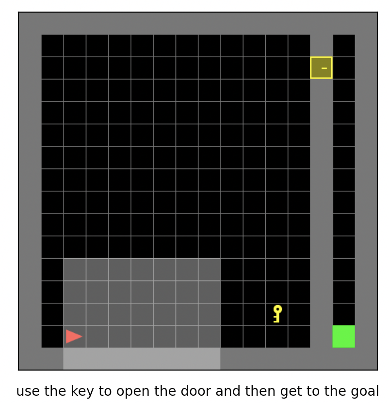

MiniGrid
~~~~~~~

概述
=======

MiniGrid,即最小化的格子世界环境，是经典的离散动作空间稀疏奖励的强化学习环境，常来作为离散动作空间条件下稀疏强化学习算法的基准测试环境。它有许多不同的实现版本，这里主要介绍
\ `MiniGrid <https://github.com/maximecb/gym-minigrid>`__, 因为实现设计简单、轻量快速，代码依赖少，容易安装。
它包括一系列环境的集合（共有57个子环境），常用的子环境有MiniGrid-Empty-8x8-v0，MiniGrid-FourRooms-v0，MiniGrid-DoorKey-16x16-v0, MiniGrid-KeyCorridorS3R3-v0,
MiniGrid-ObstructedMaze-2Dlh-v0, MiniGrid-ObstructedMaze-Full-v0等等，下图所示为其中的MiniGrid-DoorKey-16x16-v0游戏。

安装
====

安装方法
--------

安装十分简单，可以通过pip一键安装或git clone后本地安装

注：如果用户没有root权限，在install的命令后面加上--user

.. code:: shell

   # Method1: Install Directly
   pip install gym-minigrid
   # Method2: First clone this repository and install the dependencies with pip
   git clone https://github.com/maximecb/gym-minigrid.git
   cd gym-minigrid
   pip install -e .

验证安装
--------

安装完成后，可以通过在Python命令行中运行如下命令, 如果显示出游戏的交互界面，则验证安装成功：

.. code:: python
    cd gym-minigrid
   ./manual_control.py --env MiniGrid-Empty-8x8-v0

.. _变换前的空间原始环境）:

变换前的空间（原始环境）
========================

.. _观察空间-1:

观察空间
--------

-  实际的游戏画面，RGB三通道图片，具体尺寸为\ ``(210, 160, 3)``\ ，数据类型为\ ``uint8``
以MiniGrid-Empty-8x8-v0为例，

.. code:: python
   env = gym.make('MiniGrid-Empty-8x8-v0')
   obs1 = env.reset()  # obs: {'image': numpy.ndarray (7, 7, 3),'direction': ,'mission':,}
   env = RGBImgPartialObsWrapper(env) # Get pixel observations
   obs2 = env.reset()  # obs: {'mission': ,'image': numpy.ndarray (56, 56, 3)}
   env = ImgObsWrapper(env) # Get rid of the 'mission' field
   obs3 = env.reset()  # obs: numpy.ndarray (56, 56, 3)

   # 不能在使用上述Wrapper后再使用此wrapper，应该单独使用
   env = gym.make('MiniGrid-Empty-8x8-v0')
   env = FlatObsWrapper(env)
   obs4 = env.reset()  # obs: numpy.ndarray  (56, 56, 3)

- obs1为一个dict，包含'image', 'direction','mission',这3个字段,其中'image'字段是一个shape为(7, 7, 3)的numpy.ndarray，数据类型为\ ``uint8``
  7，7是因为环境是部分可观测的，3表示，每个小格对应一个3维的描述向量，注意这里不是真正的图像；'direction'字段可用作可选的指南针。
  带有'mission'字段是一个文本字符串，描述了智能体应该达到什么样的目标以获得奖励.
- 用户如果想使用真正的像素图像，需要通过RGBImgPartialObsWrapper对env进行封装，
  obs2为一个dict，包含'mission','image',2个字段，其中'image'字段是一个shape为(56, 56, 3)的numpy.ndarray，数据类型为\ ``uint8``
  是环境是部分可观测的真正的图像；
-  再通过ImgObsWrapper后，obs3是一个numpy.ndarray，shape为(56, 56, 3)，数据类型为\ ``uint8``
- 我们的代码库使用第4种FlatObsWrapper方式，这种方式将'mission'字段中的任务字符串用one-hot的方式编码，
  并将其与'image'字段内容拼接成一个numpy.ndarray，其shape为(2739，)，数据类型为\ ``float32``

.. _动作空间-1:

动作空间
--------

-  游戏操作按键空间，一般是大小为7的离散动作空间，数据类型为\ ``int``\ ，需要传入python数值（或是0维np数组，例如动作3为\ ``np.array(3)``\ ）

-  动作在0-6中取值，具体的含义是：

   -  0：left

   -  1：right

   -  2：up

   -  3：toggle

   -  4：pickup

   -  5： drop

   -  6： done/noop

动作[0,7)

参考\ `MiniGrid manual_control.py <https://github.com/maximecb/gym-minigrid/blob/master/manual_control.py>`__，键盘按键-动作对应关系为
 - 'arrow left':left,
 - 'arrow right':right,
 - 'arrow up':up
 - ‘ ’:  toggle,
 - ‘pageup’: pickup
 - ‘pagedown’: drop
 - ‘enter’: done/noop

.. _奖励空间-1:

奖励空间
--------

-  游戏得分，根据具体游戏内容不同会有比较大的差异，一般是一个\ ``float``\ 数值，由于是稀疏奖励环境，只有在agent(显示为红色的点)到达goal(显示为绿色的点)时才有一个大于零的奖励，具体的数值由不同环境和达到goal所用的总步数决定，没有达到goal之前的奖励都是0。

.. _其他-1:

其他
----

-  当智能体到达绿色的goal或者达到环境的最大步数限制时，游戏结束。

关键事实
========

1. 观测输入可以选择像素形式的图像或者含有具体语义的"图像", 还可以选用描述智能体应该达到何种目标以获得奖励的文本形式的字符串。

2. 离散动作空间

3. 稀疏奖励

4. 奖励取值尺度变化较小，最大为1

.. _变换后的空间rl环境）:

变换后的空间（RL环境）
======================

.. _观察空间-2:

观察空间
--------

-  变换内容：我们的代码库使用第4种FlatObsWrapper方式，这种方式将'mission'字段中的任务字符串用one-hot的方式编码，并将其与'image'字段内容拼接成一个长数组

-  变换结果：一维np数组，尺寸为\ ``(2739，)``\ ，数据类型为\ ``np.float32``\ ，取值为 ``[0., 7.]``

.. _动作空间-2:

动作空间
--------

-  基本无变换，依然是大小为N=7的离散动作空间，但一般为一维np数组，尺寸为\ ``(1, )``\ ，数据类型为\ ``np.int64``

.. _奖励空间-2:

奖励空间
--------

-  变换内容：奖励缩放和截断

-  变换结果：一维np数组，尺寸为\ ``(1, )``\ ，数据类型为\ ``np.float32``\ ，取值为 ``[-1, 1]``

上述空间使用gym环境空间定义则可表示为：

.. code:: python

   import gym

   obs_space = gym.spaces.Box(low=0, high=5, shape=(2739,), dtype=np.float32)
   act_space = gym.spaces.Discrete(7)
   rew_space = gym.spaces.Box(low=0, high=1, shape=(1, ), dtype=np.float32)

.. _其他-2:

其他
----

-  环境\ ``step``\ 方法返回的\ ``info``\ 必须包含\ ``final_eval_reward``\ 键值对，表示整个episode的评测指标，在minigrid中为整个episode的奖励累加和

.. _其他-3:

其他
====

惰性初始化
----------

为了便于支持环境向量化等并行操作，环境实例一般实现惰性初始化，即\ ``__init__``\ 方法不初始化真正的原始环境实例，只是设置相关参数和配置值，在第一次调用\ ``reset``\ 方法时初始化具体的原始环境实例。

随机种子
--------

-  环境中有两部分随机种子需要设置，一是原始环境的随机种子，二是各种环境变换使用到的随机库的随机种子（例如\ ``random``\ ，\ ``np.random``\ ）

-  对于环境调用者，只需通过环境的\ ``seed``\ 方法进行设置这两个种子，无需关心具体实现细节

-  环境内部的具体实现：对于随机库种子，则在环境的\ ``seed``\ 方法中直接设置该值; 对于原始环境的种子，在调用环境的\ ``reset``\ 方法内部，具体的原始环境\ ``reset``\ 之前设置为seed + np_seed, 其中seed为前述的随机库种子的值,
   np_seed = 100 * np.random.randint(1, 1000)。

训练和测试环境的区别
--------------------

-  训练环境使用动态随机种子，即每个episode的随机种子都不同，都是由一个随机数发生器产生，但这个随机数发生器的种子是通过环境的\ ``seed``\ 方法固定的；测试环境使用静态随机种子，即每个episode的随机种子相同，通过\ ``seed``\ 方法指定。

存储录像
--------

在环境创建之后，重置之前，调用\ ``enable_save_replay``\ 方法，指定游戏录像保存的路径。环境会在每个episode结束之后自动保存本局的录像文件。（默认调用\ ``gym.wrapper.Monitor``\ 实现，依赖\ ``ffmpeg``\ ），下面所示的代码将运行一个环境episode，并将这个episode的结果保存在形如\ ``./video/xxx.mp4``\ 这样的文件中：

.. code:: python

  from easydict import EasyDict
  import numpy as np
  from dizoo.minigrid.envs import MiniGridEnv
  env = MiniGridEnv(EasyDict({'env_id': 'MiniGrid-Empty-8x8-v0', 'flat_obs': True}))

  env.enable_save_replay(replay_path='./video')
  obs = env.reset()

  while True:
      act_val = env.info().act_space.value
      min_val, max_val = act_val['min'], act_val['max']
      random_action = np.random.randint(min_val, max_val, size=(1,))
      timestep = env.step(random_action)
      if timestep.done:
          print('Episode is over, final eval reward is: {}'.format(timestep.info['final_eval_reward']))
          break

DI-zoo可运行代码示例
====================

完整的训练配置文件在 `github
link <https://github.com/opendilab/DI-engine/tree/main/dizoo/minigrid/config>`__
内，对于具体的配置文件，例如\ ``minigrid_ppo_config.py``\ ，使用如下的demo即可运行：

.. code:: python

    from easydict import EasyDict
    from ding.entry import serial_pipeline

    minigrid_ppo_config = dict(
        exp_name="minigrid_empty8_ppo",
        env=dict(
            collector_env_num=8,
            evaluator_env_num=5,
            env_id='MiniGrid-Empty-8x8-v0',
            n_evaluator_episode=5,
            stop_value=0.96,
        ),
        policy=dict(
            cuda=True,
            model=dict(
                obs_shape=2739,
                action_shape=7,
                encoder_hidden_size_list=[256, 128, 64, 64],
            ),
            learn=dict(
                update_per_collect=4,
                batch_size=64,
                learning_rate=0.0003,
                value_weight=0.5,
                entropy_weight=0.001,
                clip_ratio=0.2,
                adv_norm=False,
            ),
            collect=dict(
                n_sample=128,
                unroll_len=1,
                discount_factor=0.99,
                gae_lambda=0.95,
            ),
        ),
    )
    minigrid_ppo_config = EasyDict(minigrid_ppo_config)
    main_config = minigrid_ppo_config
    minigrid_ppo_create_config = dict(
        env=dict(
            type='minigrid',
            import_names=['dizoo.minigrid.envs.minigrid_env'],
        ),
        env_manager=dict(type='base'),
        policy=dict(type='ppo_offpolicy'),
    )
    minigrid_ppo_create_config = EasyDict(minigrid_ppo_create_config)
    create_config = minigrid_ppo_create_config

    if __name__ == "__main__":
        serial_pipeline([main_config, create_config], seed=0)

基准算法性能
============

-  MiniGrid-Empty-8x8-v0（0.5M env step下，平均奖励大于0.95）

   - MiniGrid-Empty-8x8-v0 + R2D2
   .. image:: images/empty8_r2d2.png
     :align: center

-  MiniGrid-FourRooms-v0（10M env step下，平均奖励大于0.6）

   - MiniGrid-FourRooms-v0 + R2D2
   .. image:: images/fourrooms_r2d2.png
     :align: center

-  MiniGrid-DoorKey-16x16-v0（20M env step下，平均奖励大于0.2）

   - MiniGrid-DoorKey-16x16-v0 + R2D2
   .. image:: images/doorkey_r2d2.png
     :align: center
