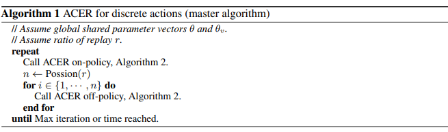
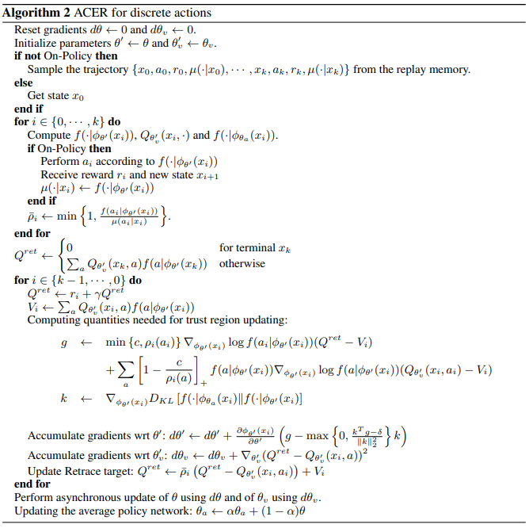
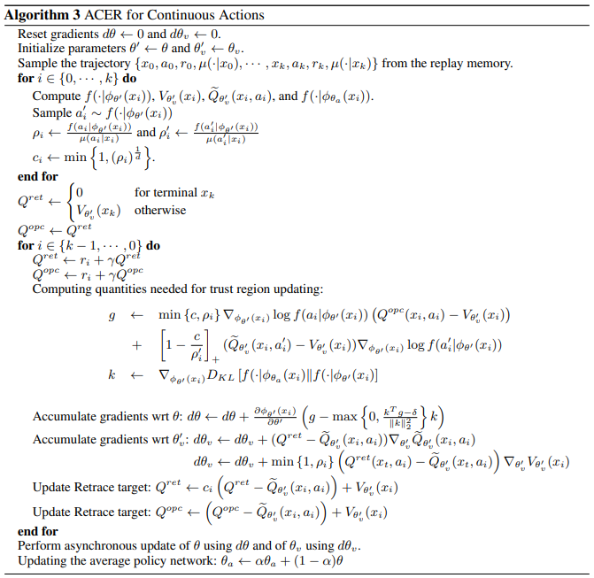

ACER
^^^^^^^

Overview
---------
ACER, short for actor-critic with experience replay, is an off-policy actor-critic model with experience replay. It greatly increase
the sample efficiency and decreasing the data correlation. ACER uses retrace Q-value estimation,  an efficient TRPO and truncates importance sample weights with
bias correction to control the stability of the off-policy estimator. You can find more details in this paper
`Sample Efficient Actor-Critic with Experience Replay <https://arxiv.org/abs/1611.01224>`_.

Quick Facts
-------------
1. ACER  is a **model-free** and **off-policy** RL algorithm.

2. ACER can support both **discrete** action spaces and **continuous** action spaces with several differences

3. ACER is a actor-critic RL algorithm, which optimizes actor network and critic network, respectively.

4. ACER decouples acting from learning. Collectors in ACER needs to record behavior probabilty distributions.

Key Equations
---------------------------
Loss used in ACER contains policy loss and value loss. They often update seperately, so it's necessary to control their relative update speed.

Retrace Q-value estimation
>>>>>>>>>>>>>>>>>>>>>>>>>>>>
Given a trajectory generated under the behavior policy :math:`\mu`,  we retrieve a trajectory :math:`\{x_0, a_0, r_0, \mu(\cdot|x_0),..., x_k, a_k, r_k, \mu(\cdot|x_k)}`
the Retrace estimator can be
expressed recursively as follows:

.. math::

    Q^{\text{ret}}(x_t,a_t)=r_t+\gamma\bar{\rho}_{t+1}[Q^{\text{ret}}(x_{t+
    1},a_{t+1})]+\gamma V(x_{t+1})

where  :math:`\bar{\rho}_t` is the truncated importance weight, :math:`\bar{\rho}_t=\min\{c,\rho\}` with :math:`\frac{\pi(a_t|x_t)}{\mu(a_t|x_t)}`. :math:`\pi` is target policy
Retrace is an off-policy, return based algorithm which has low variance and is proven to converge to the value function of the taget policy for any behavior policy
we approximate the Q value by neural network :math:`Q_{\theta}` in a mean squared error loss:

 .. math::
    L_{\text{value}}=\frac{1}{2}(Q^{\text{ret}}(x_t,a_t)-Q_{\theta}(x_t,a_t))^2.

policy gradient
>>>>>>>>>>>>>>>>>>>>>>

To safe-guard against high variance, ACER uses truncated importance weights and introduaces
correction term via the following decomposition of :math:`g^{acer}`:

.. math::
    g^{\text{acer}}=\bar{\rho_t}\nabla_\theta\log\pi_{\theta}(a_t|x_t)[Q^{\text{ret}}(x_t,a_t)-V_{\theta}(x_t)]+\mathbb{E}_{a\sim \pi}\left([\frac{\rho_t(a)-c}{\rho_t(a)}]_+\nabla_{\theta}\log\pi_{\theta}(a|x_t)[Q_\theta(x_t,a)-V_{\theta}(x_t)\right)\right].

To ensure more stability, ACER limit the per-step change to the policy by solving the following linearized KL divergence constraint:

.. math::
    \begin{split}
    &\text{minimize}_z\quad\frac{1}{2}\|g_t^{\text{acer}}-z\|_2^2\\
    &subjec\ to\quad \nabla_{\phi_{\theta}(x_t)}D_{KL}[f(\cdot|\phi_{\theta_a}(x_t))\|f(\cdot|\phi_{\theta}(x_t))]^\top\le\delta 
    \end{split}

The :math:`\phi(\theta)` is target policy network and the :math:`\phi(\theta_a)` is average policy network.
letting :math:`k=\nabla_{\phi_{\theta}(x_t)}D_{KL}[f(\cdot|\phi_{\theta_a}(x_t))\|f(\cdot|\phi_{\theta}(x_t))]`, the solution can be easily derived in closed form using the KKT condition:

.. math::
    z^*=g_{t}^{\text{acer}}-\max\{0,\frac{k^\top g_t^{\text{acer}}-\delta}{\|k\|_2^2}\}k 

Pseudocode
----------

There are several differences that using ACER on discrete action space or continuous action space.

In continuous action space, it is impossible to enumerate all actions q value. So ACER uses sample actions to replace the expectation.

Implementations
----------------
Here we show the ACER algorithm on discrete action space.
The default config is defined as follows:

.. autoclass:: ding.policy.acer.ACERPolicy

Usually, we hope to compute everything as a batch to improve efficiency. This is done in ``policy._get_train_sample``.
Once we execute this function in collector, the length of samples will equal to unroll-len in config. For details, please
refer to doc of ``ding.rl_utils.adder``.

.. code:: python

    def _get_train_sample(self, data: List[Dict[str, Any]]) -> List[Dict[str, Any]]:
        return get_train_sample(data, self._unroll_len)

    def get_train_sample(cls, data: List[Dict[str, Any]], unroll_len: int, last_fn_type: str = 'last') -> List[Dict[str, Any]]:
        """
        Overview:
            Process raw traj data by updating keys ['next_obs', 'reward', 'done'] in data's dict element.
            If ``unroll_len`` equals to 1, which means no process is needed, can directly return ``data``.
            Otherwise, ``data`` will be split according to ``self._unroll_len``, process residual part according to
            ``last_fn_type`` and call ``lists_to_dicts`` to form sampled training data.
        Arguments:
            - data (:obj:`List[Dict[str, Any]]`): transitions list, each element is a transition dict
        Returns:
            - data (:obj:`List[Dict[str, Any]]`): transitions list processed after unrolling
        """
        if unroll_len == 1:
            return data
        else:
            # cut data into pieces whose length is unroll_len
            split_data, residual = list_split(data, step=self._unroll_len)

            def null_padding():
                template = copy.deepcopy(residual[0])
                template['done'] = True
                template['reward'] = torch.zeros_like(template['reward'])
                if 'value_gamma' in template:
                    template['value_gamma'] = 0.
                null_data = [cls._get_null_transition(template) for _ in range(miss_num)]
                return null_data

            if residual is not None:
                miss_num = unroll_len - len(residual)
                if last_fn_type == 'drop':
                    # drop the residual part
                    pass
                elif last_fn_type == 'last':
                    if len(split_data) > 0:
                        # copy last datas from split_data's last element, and insert in front of residual
                        last_data = copy.deepcopy(split_data[-1][-miss_num:])
                        split_data.append(last_data + residual)
                    else:
                        # get null transitions using ``null_padding``, and insert behind residual
                        null_data = null_padding()
                        split_data.append(residual + null_data)
                elif last_fn_type == 'null_padding':
                    # same to the case of 'last' type and split_data is empty
                    null_data = null_padding()
                    split_data.append(residual + null_data)
            # collate unroll_len dicts according to keys
            if len(split_data) > 0:
                split_data = [lists_to_dicts(d, recursive=True) for d in split_data]
            return split_data

.. note::
    In ``get_train_sample``, we introduce three ways to cut trajectory data into same-length pieces (length equal
    to ``unroll_len``).

    The first one is ``drop``, this means after splitting trajectory data into small pieces, we simply throw away those
    with length smaller than ``unroll_len``. This method is kind of naive and usually is not a good choice. Since in
    Reinforcement Learning, the last few data in an episode is usually very important, we can't just throw away them.

    The second method is ``last``, which means if the total length trajectory is smaller than ``unrollen_len``,
    we will use zero padding. Else, we will use data from previous piece to pad residual piece. This method is set as
    default and recommended.

    The last method ``null_padding`` is just zero padding, which is not vert efficient since many data will be ``null``.

Now, we introduce the computation of vtrace-value.
First, we use the following functions to compute retrace Q value.

.. code:: python

    def compute_q_retraces(q_values,v_pred,rewards,actions,weights,ratio,gamma=0.9):
        """
            Overview:
                    Get Retrace Q value 
                Arguments:
                    - q_values (:obj:`torch.Tensor`): Q values
                    - v_pred (:obj:`torch.Tensor`): V values
                    - reward (:obj:`torch.Tensor`): reward values
                    - actions (:obj:`torch.Tensor`): The actions in replay buffer
                    - weights (:obj:`torch.Tensor`): setting padding postion
                    - ratio (:obj:`torch.Tensor`): ratio of new polcy with behavior policy
                Returns:
                    - q_retraces (:obj:`torch.Tensor`):  retrace Q values
        """
        rewards = rewards.unsqueeze(-1)
        actions = actions.unsqueeze(-1)
        weights = weights.unsqueeze(-1)
        q_retraces = torch.zeros_like(v_pred)
        n_len = q_retraces.size()[0]
        tmp_retraces = v_pred[-1,...]
        q_retraces[-1,...] = v_pred[-1,...]
        q_gather = torch.zeros_like(v_pred)
        q_gather[0:-1,...] = q_values[0:-1,...].gather(-1,actions)
        ratio_gather = ratio.gather(-1,actions)
        for idx in reversed(range(n_len-1)):
            q_retraces[idx,...] = rewards[idx,...]+gamma*weights[idx,...]*tmp_retraces
            tmp_retraces = ratio_gather[idx,...].clamp(max=1.0)*(q_retraces[idx,...]-q_gather[idx,...])+v_pred[idx,...]
        return q_retraces

After that, we calculate policy loss value, it will calcuate the actor loss with importance weights trunction and bias correction loss by the following function 

.. code:: python

    def acer_policy_error(q_values,q_retraces,v_pred,target_pi,actions,ratio,c_clip_ratio=10.0):
        """
            Overview:
                Get ACER policy loss 
            Arguments:
                - q_values (:obj:`torch.Tensor`): Q values
                - q_retraces (:obj:`torch.Tensor`): Q values (be calculated by retrace method)
                - v_pred (:obj:`torch.Tensor`): V values
                - target_pi (:obj:`torch.Tensor`): The new policy's probability
                - actions (:obj:`torch.Tensor`): The actions in replay buffer
                - ratio (:obj:`torch.Tensor`): ratio of new polcy with behavior policy
                - c_clip_ratio (:obj:`float`): clip value for ratio
            Returns:
                - actor_loss (:obj:`torch.Tensor`): policy loss from q_retrace
                - bc_loss (:obj:`torch.Tensor`): bias correct policy loss
        """
        actions=actions.unsqueeze(-1)
        with torch.no_grad():
            advantage_retraces = q_retraces-v_pred
            advantage_native = q_values-v_pred
        actor_loss = ratio.gather(-1,actions).clamp(max=c_clip_ratio)*advantage_retraces*(target_pi.gather(-1,actions)+EPS).log()
        bc_loss = (1.0-c_clip_ratio/(ratio+EPS)).clamp(min=0.0)*target_pi.detach()*advantage_native*(target_pi+EPS).log()
        bc_loss=bc_loss.sum(-1).unsqueeze(-1)
        return actor_loss,bc_loss

Then, we execute backward operation until target_pi. The we need to calculate the correction gradient in the trust region:

.. code:: python

    def acer_trust_region_update(actor_gradients,target_pi,avg_pi,trust_region_value):
        """
            Overview:
                calcuate gradient with trust region constrain
            Arguments:
                - actor_gradients (:obj:`list(torch.Tensor)`): gradients value's for different part
                - target_pi (:obj:`torch.Tensor`): The new policy's probability 
                - avg_pi (:obj:`torch.Tensor`): The average policy's probability
                - trust_region_value (:obj:`float`): the range of trust region
            Returns:
                - update_gradients (:obj:`torch.Tensor`): gradients under trust region constraint
            """
        with torch.no_grad():
            KL_gradients = [(avg_pi/(target_pi+EPS))]
        update_gradients = []
        for actor_gradient,KL_gradient in zip(actor_gradients,KL_gradients):
            scale = actor_gradient.mul(KL_gradient).sum(-1).unsqueeze(-1)-trust_region_value
            scale = torch.div(scale,KL_gradient.mul(KL_gradient).sum(-1).unsqueeze(-1)).clamp(min=0.0)
            update_gradients.append(actor_gradient-scale*KL_gradient)
        return update_gradients

With new gradients, we can continue to backward and then update parameters with gradients.

Finally, we should calculate the Q value loss to update Q-Network 

.. code:: python

    def acer_value_error(q_values,q_retraces,actions):
        """
            Overview:
                Get ACER critic loss 
            Arguments:
                - q_values (:obj:`torch.Tensor`): Q values
                - q_retraces (:obj:`torch.Tensor`): Q values (be calculated by retrace method)
                - actions (:obj:`torch.Tensor`): The actions in replay buffer
                - ratio (:obj:`torch.Tensor`): ratio of new polcy with behavior policy
            Returns:
                - critic_loss (:obj:`torch.Tensor`): critic loss 
            """
        actions=actions.unsqueeze(-1)
        critic_loss=0.5*(q_retraces-q_values.gather(-1,actions)).pow(2)
        return critic_loss

Reference
----------
Ziyu Wang, Victor Bapst, Nicolas Heess, Volodymyr Mnih, Remi Munos, Koray Kavukcuoglu, Nando de Freitas: "Sample Efficient Actor-Critic with Experience Replay", 2016; [https://arxiv.org/abs/1611.01224 arxiv:1611.01224].
