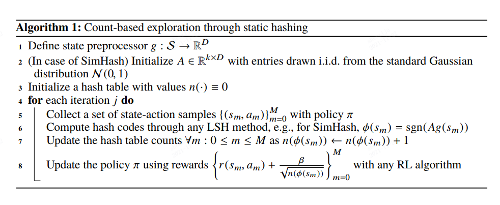
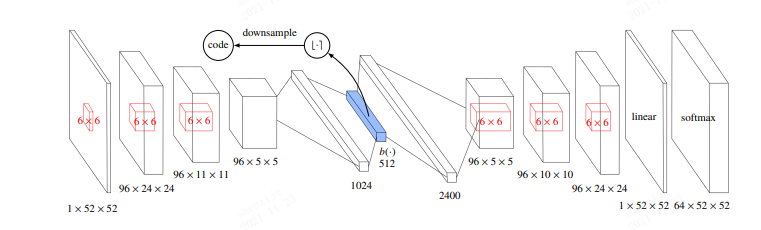
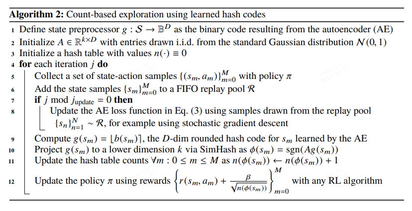

 
count-based exploration deep reinforcement learning
======================================================

综述
-----
count-based exploration 的强化学习是通过对state进行计数，对于探索次数较小的state赋予较大的bonus reward,
从而加强算法的探索能力。但很多情况下，强化学习的状态空间往往十分的巨大，无法直接进行计数。因此一种做法是对状态空间进行
压缩，使得我们能够对压缩后的状态进行计数。

对于状态空间的压缩有很多不同的方法，在本篇文章中使用了SimHash对状态空间进行压缩。SimHash是一种将具有相似
结构的状态空间通过线性变换压缩到同一个状态上，具体算法如下图所示

然而对于一些复杂的状态，比如图片，直接从像素空间进行相似度度量所得到的效果并不理想，因此原文考虑可以结合
autoencode对原状态空间进行编码，对latent space运用SimHash, 可以实现更好的探索效果。为了能够尽可能的将latent space的编码尽量的分开，采用了如下的loss 

.. math::
   L(\{s_n\}_{n=1}^{N}) = -\frac{1}{N}\sum_{n=1}^N[\log p(s_n)-\frac{\lambda}{K}\sum_{i=1}^D\min((1-b_i(s_n))^2,b_i(s_n)^2)]

上式当中的第一项使得通过autoencoder得到的结果尽量接近原始图片，第二项使得得到的编码尽量接近0和1。在此基础上，我们得到了如下算法

Reference
----------
Haoran Tang, Rein Houthooft, Davis Foote. "#Exploration: A Study of Count-Based Exploration
for Deep Reinforcement Learning" 2016; arXiv:1611.04717.