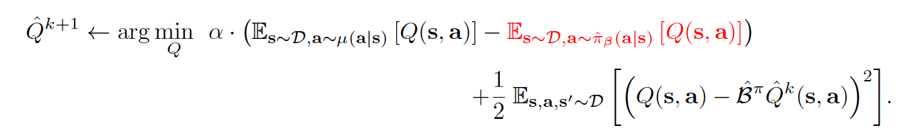
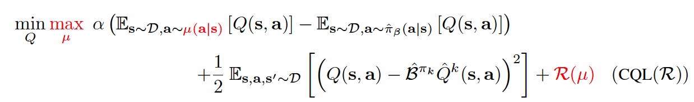
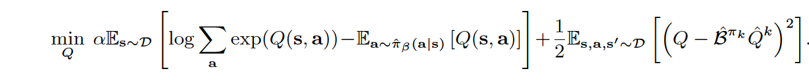
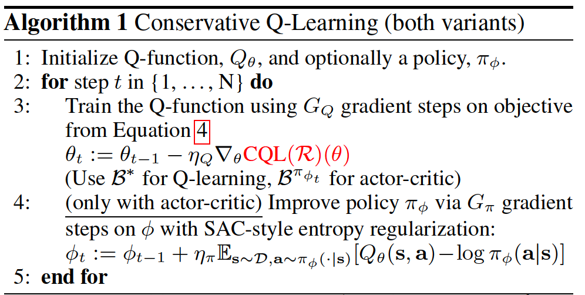
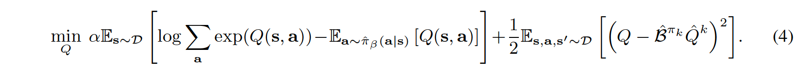

CQL
^^^^^^^

Overview
---------
Conservative Q-learning (CQL) was first proposed in `Conservative Q-Learning for Offline Reinforcement Learning <https://arxiv.org/abs/2006.04779>`_. Recent advances in reinforcement learning (RL), especially when combined with expressive deep network
function approximators, have produced promising results. However, applying RL to real-world
problems consistently poses practical challenges: in contrast to the kinds of data-driven methods
that have been successful in supervised learning, RL is classically regarded as an active
learning process, where each training run requires active interaction with the environment. Interaction
with the real world can be costly and dangerous, and the quantities of data that can be gathered
online are substantially lower than the offline datasets that are used in supervised learning,
which only need to be collected once. Offline RL algorithms instead learn from large, previously collected
datasets, without interaction.

However, directly utilizing existing value-based off-policy RL algorithms in an offline setting generally results
in poor performance, due to issues with bootstrapping from out-of-distribution actions and overfitting. Thus CQL is proposed as a novel method for learning a conservative Q functions of which the expected value is lower-bounded
via a simple modification to standard value-based RL algorithms.

Quick Facts
-------------
1. CQL is an offline RL algorithm.

2. CQL can be implemented with less than 20 lines of code on top of a
   number of standard, online RL algorithms

3. CQL supports both **discrete** and **continuous** action spaces.

Key Equations or Key Graphs
---------------------------
CQL can be implemented with less than 20 lines of code on top of a
number of standard, online RL algorithms, simply by adding the CQL regularization terms to
the Q-function update.

In general, for the conservative off-policy evaluation, the Q-function is trained via an iterative update, with a tradeoff factor alpha:

If this policy evaluation step in CQL is integrated into a complete offline RL algorithm, Q-function in general updates as follows:

where :math:`CQL(R)` is characterized by a particular choice of regularizer :math:`R(\mu)`. If :math:`R(\mu)` is chosen to be the KL-divergence against a prior distribution, :math:`\rho(a|s)`, then we get :math:`\mu(a|s)\approx \rho(a|s)exp(Q(s,a))`. Frist, if :math:`\rho(a|s)` = Unif(a), then the first term above corresponds to a soft-maximum
of the Q-values at any state s and gives rise to the following variant, called CQL(H):

Second, if :math:`\rho(a|s)` is chosen to be the previous policy :math:`\hat{\pi}^{k-1}`, the first term in Equation 4 is replaced by
an exponential weighted average of Q-values of actions from the chosen :math:`\hat{\pi}^{k-1}(a|s)`.

Pseudo-code
---------------
Pseudocode is shown in Algorithm 1, with differences from conventional actor critic algorithms (e.g., SAC) and deep Q-learning algorithms (e.g.,DQN) in red

The equation (4) in above pseudo-code is:

.. note::
   Compared with the vanilla version, DQN has been dramatically modified in both algorithm and implementation aspects. In the algorithm parts, **n-step TD-loss, PER, target network** and **dueling head** are widely used, interested users can refer to the paper `Rainbow: Combining Improvements in Deep Reinforcement Learning <https://arxiv.org/abs/1710.02298>`_ . For the implementation details, the value of epsilon anneals from a high value (e.g.: 0.95) to a low value (0.05) during the training rather than keeps constant, according to env steps (the number of policy interaction with env).

Implementations
----------------
The default config of CQLPolicy is defined as follows:

.. autoclass:: ding.policy.cql.CQLPolicy
   :noindex:

Benchmark
-----------

+---------------------+-----------------+-----------------------------------------------------+--------------------------+----------------------+
| environment         |best mean reward | evaluation results                                  | config link              | comparison           |
+=====================+=================+=====================================================+==========================+======================+
|                     |                 |                                                     |`config_link_ha <https:// |                      |
|                     |                 |                                                     |github.com/opendilab/     |                      |
|                     |                 |                                                     |DI-engine/blob/main/dizoo/| d3rlpy(1119)         |
|Halfcheetah          |  11016          |.. image:: images/benchmark/halfcheetah_cql.png      |d4rl/config/halfcheetah_  |                      |
|                     |                 |                                                     |cql_medium_expert         |                      |
|(Medium Expert)      |                 |                                                     |_config.py>`_             |                      |
+---------------------+-----------------+-----------------------------------------------------+--------------------------+----------------------+
|                     |                 |                                                     |`config_link_w <https://  |                      |
|                     |                 |                                                     |github.com/opendilab/     |                      |
|Walker2d             |                 |                                                     |DI-engine/blob/main/dizoo/| d3rlpy(3466)         |
|                     |  5029           |.. image:: images/benchmark/walker2d_cql.png         |d4rl/config/walker2d_     |                      |
|(Medium Expert)      |                 |                                                     |cql_medium_expert         |                      |
|                     |                 |                                                     |_config.py>`_             |                      |
+---------------------+-----------------+-----------------------------------------------------+--------------------------+----------------------+
|                     |                 |                                                     |`config_link_ho <https:// |                      |
|                     |                 |                                                     |github.com/opendilab/     | d3rlpy(3234)         |
|Hopper               |                 |                                                     |DI-engine/blob/main/dizoo/|                      |
|                     |  3678           |.. image:: images/benchmark/hopper_cql.png           |d4rl/config/hopper_sac_   |                      |
|(Medium Expert)      |                 |                                                     |cql_medium_expert         |                      |
|                     |                 |                                                     |_config.py>`_             |                      |
+---------------------+-----------------+-----------------------------------------------------+--------------------------+----------------------+

Specifically for each dataset:

+---------------------+-----------------+----------------+---------------+----------+----------+
| environment         |random           |medium replay   |medium expert  |medium    |expert    |
+=====================+=================+================+===============+==========+==========+
|                     |                 |                |               |          |          |
|Halfcheetah          |1426             |5478            |11016          |5707      |11609     |
|                     |                 |                |               |          |          |
+---------------------+-----------------+----------------+---------------+----------+----------+
|                     |                 |                |               |          |          |
|Walker2d             |248              |3757            |5029           |3821      |5005      |
|                     |                 |                |               |          |          |
+---------------------+-----------------+----------------+---------------+----------+----------+
|                     |                 |                |               |          |          |
|Hopper               |265              |3048            |3678           |2183      |3485      |
|                     |                 |                |               |          |          |
+---------------------+-----------------+----------------+---------------+----------+----------+

P.S.：

1. The above results are obtained by running the same configuration on four different random seeds (5, 10, 20, 30)

Reference
----------

- Kumar, Aviral, et al. "Conservative q-learning for offline reinforcement learning." arXiv preprint arXiv:2006.04779 (2020).