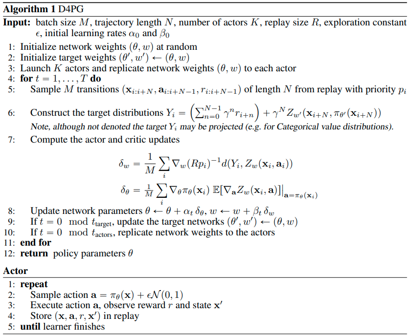

D4PG
^^^^^^^^^^^^^^^^^^^^^^^^^^^^^^^^^^^

Overview
---------
D4PG, proposed in the paper `Distributed Distributional Deterministic Policy Gradients <https://arxiv.org/abs/1804.08617v1>`_,
is an actor-critic, model-free policy gradient algorithm that extends upon `DDPG <https://arxiv.org/abs/1509.02971>`_.
Improvements over DDPG include the use of N-step returns, prioritized experience replay and distributional value function.
Moreover, training is parallelized with multiple distributed workers all writing into the same replay table.
The authors found that these simple modifications contribute to the overall performance of the algorithm with N-step
returns brining the biggest performance gain and priority buffer being the less crucial one.

Quick Facts
-----------
1. D4PG is only used for environments with **continuous action spaces**.(i.e. MuJoCo)

2. D4PG is an **off-policy** algorithm.

3. D4PG uses a **distributional** critic.

4. D4PG is a **model-free** and **actor-critic** RL algorithm, which optimizes actor network and critic network, respectively.

5. Usually, D4PG uses **Ornstein-Uhlenbeck process** or **Gaussian process** (default in our implementation) for exploration.

Key Equations or Key Graphs
---------------------------
The D4PG algorithm maintains a distributional critic :math:`Z_\pi(x, a)` and the loss used to learn the distribution parameters is defined as :math:`L(\pi) = \mathbb{E}[d(\mathcal{T}_{\mu_\theta}, Z_{pi'}(s, a), Z_\pi(s, a)]`, where :math:`\mathcal{T}_{\mu_\theta}` is the Bellman operator. The implemented distribution is usually a Categorical distribution.

The **action-value distribution** inside the actor update is done by taking the expectation with respect to the action-value distribution:

.. math::
    \begin{aligned}
    \nabla_\theta J(\theta)
    &\approx \mathbb{E}_{\rho^\mu} [\nabla_a Q_w(s, a) \nabla_\theta \mu_\theta(s) \rvert_{a=\mu_\theta(s)}] \\
    &= \mathbb{E}_{\rho^\mu} [\mathbb{E}[\nabla_a Z_w(s, a)] \nabla_\theta \mu_\theta(s) \rvert_{a=\mu_\theta(s)}]
    \end{aligned}

When calculating the TD error, **N-step** incorporate in the TD target rewards in more future steps:

.. math::
    r(s_0, a_0) + \mathbb{E}[\sum_{n=1}^{N-1} r(s_n, a_n) + \gamma^N Q(s_N, \mu_\theta(s_N)) \vert s_0, a_0 ]

D4PG samples from a **prioritized replay buffer** with a non-uniform probability :math:`p_i`.
This requires the use of importance sampling, implemented by weighting the critic update by a factor of :math:`R_{p_i}^{-1}`.

Pseudocode
----------

Implementations
----------------
The default config is defined as follows:

.. autoclass:: ding.policy.d4pg.D4PGPolicy
   :noindex:

Model
~~~~~~~~~~~~~~~~~
Here we provide examples of `QACDIST` model as default model for `D4PG`.

.. autoclass:: ding.model.template.qac_dist.QACDIST
    :members: forward, compute_actor, compute_critic

Benchmark
-----------

+---------------------+-----------------+-----------------------------------------------------+--------------------------+----------------------+
| environment         |best mean reward | evaluation results                                  | config link              | comparison           |
+=====================+=================+=====================================================+==========================+======================+
|                     |                 |                                                     |`config_link_ha <https:// |                      |
|                     |                 |                                                     |github.com/opendilab/     |                      |
|                     |                 |                                                     |DI-engine/blob/main/dizoo/|                      |
|Halfcheetah          |  13000          |.. image:: images/benchmark/halfcheetah_d4pg.png     |mujoco/config/halfcheetah_|                      |
|                     |                 |                                                     |d4pg_default_config.py>`_ |                      |
|(Halfcheetah-v3)     |                 |                                                     |                          |                      |
+---------------------+-----------------+-----------------------------------------------------+--------------------------+----------------------+
|                     |                 |                                                     |`config_link_w <https://  |                      |
|                     |                 |                                                     |github.com/opendilab/     |                      |
|Walker2d             |                 |                                                     |DI-engine/blob/main/dizoo/|                      |
|                     |  5300           |.. image:: images/benchmark/walker2d_d4pg.png        |mujoco/config/walker2d_   |                      |
|(Walker2d-v2)        |                 |                                                     |d4pg_default_config.py>`_ |                      |
|                     |                 |                                                     |                          |                      |
+---------------------+-----------------+-----------------------------------------------------+--------------------------+----------------------+
|                     |                 |                                                     |`config_link_ho <https:// |                      |
|                     |                 |                                                     |github.com/opendilab/     |                      |
|Hopper               |                 |                                                     |DI-engine/blob/main/dizoo/|                      |
|                     |  3500           |.. image:: images/benchmark/hopper_d4pg.png          |mujoco/config/hopper_d4pg_|                      |
|(Hopper-v2)          |                 |                                                     |default_config.py>`_      |                      |
+---------------------+-----------------+-----------------------------------------------------+--------------------------+----------------------+

Other Public Implementations
----------------------------

- `D4PG Pytorch`_

.. _`D4PG Pytorch`: https://github.com/schatty/d4pg-pytorch

References
-----------
Gabriel Barth-Maron, Matthew W. Hoffman, David Budden, Will Dabney, Dan Horgan, Dhruva TB, Alistair Muldal, Nicolas Heess, Timothy Lillicrap: “Distributed Distributional Deterministic Policy Gradients”, 2018; [https://arxiv.org/abs/1804.08617v1 arXiv:1804.08617v1].
