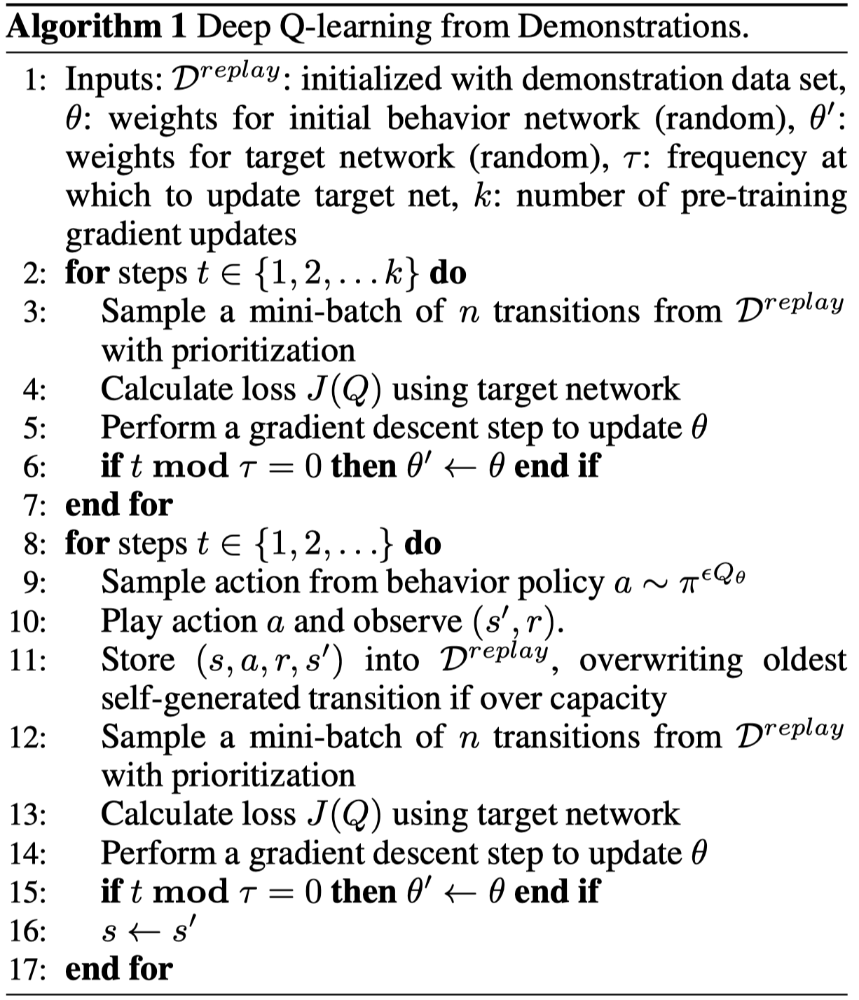

DQfD
^^^^^^^

Overview
---------

- DQfD was proposed in `Deep Q-learning from Demonstrations <https://arxiv.org/abs/1704.03732>`_ by DeepMind, which appeared at AAAI 2018.

- DQfD works by combining temporal difference updates with supervised classification of the demonstrator’s actions.

- DQfD leverages small sets of demonstration data to massively accelerate the learning process. 

- DQfD performs better than PDD DQN, RBS, HER and ADET on Atari games. 

Quick Facts
-------------
1. DQfD is an extension algorithm of DQN. 

2. Pre-train the network with expert demonstrations.

3. Store the demonstrations into an expert replay buffer.

4. Agent gathers more transitions for new replay buffer. Trains network on mixture of new replay buffer and expert replay buffer.

5. Network is trained with special loss function made up of four parts: one-step loss, n-step loss, expert large margin classification loss and L2 regularization.

6. The DI-engine implements `DQfD <https://github.com/opendilab/DI-engine/blob/main/ding/policy/dqfd.py>`_.

Key Equations or Key Graphs
---------------------------
The DQfD overall loss used to update the network is a combination of all four losses.

Overall Loss:  :math:`J(Q) = J_{DQ}(Q) + \lambda_1 J_n(Q) + \lambda_2J_E(Q) + \lambda_3 J_{L2}(Q)`

- one-step loss:  :math:`J_{DQ}(Q) = (R(s,a) + \gamma Q(s_{t+1}, a_{t+1}^{max}; \theta ^') - Q(s,a;\theta))^2`, where :math:`a_{t+1}^{max} = argmax_a Q(s_{t+1},a;\theta)`;  

- n-step loss:  :math:`J_n(Q) = r_t + \gamma r_{t+1} + ... + \gamma^{n-1} r_{t+n-1} + max_a \gamma^n Q(s_{t+n},a)`;

- large margin classification loss: :math:`J_E(Q) = max_{a \in A}[Q(s,a) + L(a_E,a)] - Q(s,a_E)`;

- L2 regularization loss: :math:`J_{L2}(Q)` help prevent from over-fitting.

Pseudo-code
---------------

.. note::

- In Phase I, the agent just uses the demonstration data, and does not do any exploration. 

- In Phase II: the agent explores in the environment to collect its own data. 

Extensions
-----------
DeepMind has extended DQfD in several ways. Upon a literature search, it seems like two relevant follow-up works are:

- `Distributed Prioritized Experience Replay <https://arxiv.org/abs/1803.00933>`_
   
   The main idea of this paper is to scale up the experience replay data by having many actors collect experience. Their framework is called **Ape-X**, and they claim that Ape-X DQN achieves a new state of the art performance on Atari games. This paper is not that particularly relevant to DQfD, but we include it here mainly because a follow-up paper (see below) used this technique with DQfD.

- `Observe and Look Further: Achieving Consistent Performance on Atari <https://arxiv.org/abs/1805.11593>`_

   This paper proposes the **Ape-X DQfD** algorithm, which as one might expect combines DQfD with the distributed prioritized experience replay algorithm.

Implementations
----------------
The default config of DQfD Policy is defined as follows:

.. autoclass:: ding.policy.dqfd.DQFDPolicy
   :noindex:

The network interface DQfD used is defined as follows:

.. autoclass:: ding.model.template.q_learning.DQN
   :members: __init__, forward
   :noindex:

Benchmark
----------
+---------------------+-----------------+-----------------------------------------------------+--------------------------+----------------------+
| environment         |best mean reward |              evaluation results                     |       config link        |     comparison       |
+=====================+=================+=====================================================+==========================+======================+
|Pong                 |       20        |                                                     |`config_link_p <https://  |     Tianshou(20)     |
|(PongNoFrameskip-v4) |                 |                                                     |github.com/opendilab/     |        Sb3(20)       |
|                     |                 |                                                     |DI-engine/blob/main/dizoo/|                      |
|                     |                 |.. image:: images/benchmark/dqfd_pong.png            |atari/config/serial/pong/p|                      |
|                     |                 |                                                     |ong_dqfd_config.py>`_     |                      |
+---------------------+-----------------+-----------------------------------------------------+--------------------------+----------------------+
|Qbert                |      2356       |                                                     |`config_link_q <https://  |    Tianshou(7307)    |
|(QbertNoFrameskip-v4)|                 |                                                     |github.com/opendilab/     |       Sb3(9496)      |
|                     |                 |                                                     |DI-engine/blob/main/dizoo/|                      |
|                     |                 |.. image:: images/benchmark/dqfd_qbert.png           |atari/config/serial/qbert/|                      |
|                     |                 |                                                     |qbert_dqfd_config.py>`_   |                      |
+---------------------+-----------------+-----------------------------------------------------+--------------------------+----------------------+
|SpaceInvaders        |      1371       |                                                     |`config_link_s <https://  |    Tianshou(812.2)   |
|(SpaceInvadersNoFrame|                 |                                                     |github.com/opendilab/     |        Sb3(622)      |
|skip-v4)             |                 |                                                     |DI-engine/blob/main/dizoo/|                      |
|                     |                 |.. image:: images/benchmark/dqfd_spaceinvaders.png   |atari/config/serial/spacei|                      |
|                     |                 |                                                     |nvaders/spaceinvaders_dqfd|                      |
|                     |                 |                                                     |_config.py>`_             |                      |
+---------------------+-----------------+-----------------------------------------------------+--------------------------+----------------------+

Reference
----------

- Hester T, Vecerik M, Pietquin O, et al. Deep q-learning from demonstrations[C]//Thirty-second AAAI conference on artificial intelligence. 2018.

- Blog:  `Combining Imitation Learning and Reinforcement Learning Using DQfD <https://danieltakeshi.github.io/2019/04/30/il-and-rl/>`_ 

