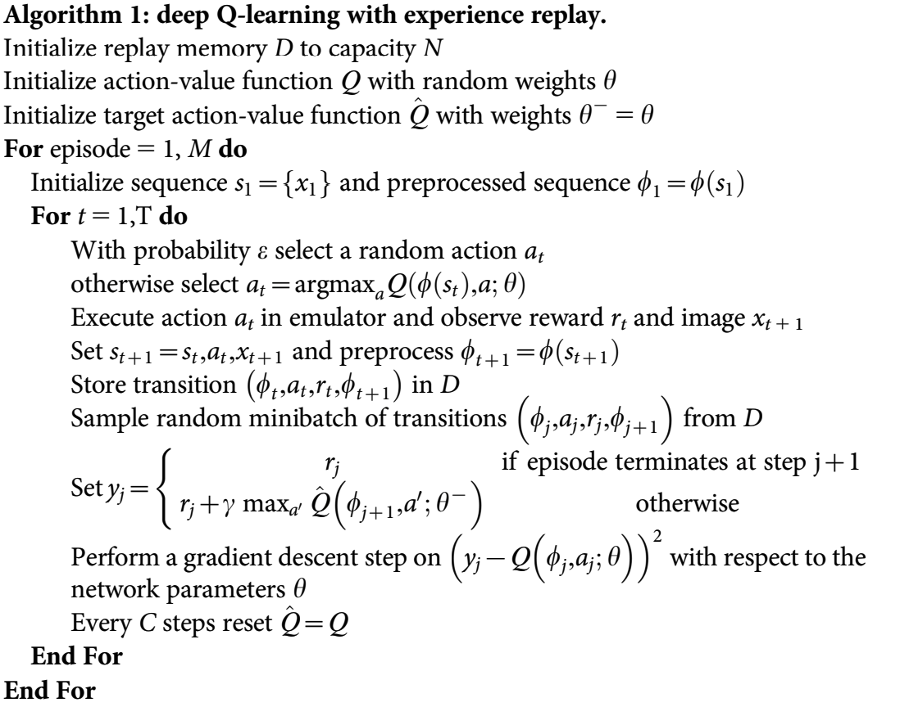

DQN
^^^^^^^

综述
---------
DQN最初在论文 `Playing Atari with Deep Reinforcement Learning <https://arxiv.org/abs/1312.5602>`_ 中被提出, 它将 Q-learning 与深度神经网络相结合。与以前的传统强化学习方法不同，DQN 使用深度神经网络来估计 Q 值，并通过计算时序差分（TD, Temporal-Difference） 损失，利用梯度下降算法进行更新。

快速了解
-------------
1. DQN 是一个 **model-free** （无模型） 且 **value-based** （基于值函数） 的强化学习算法。

2. DQN 只支持 **离散** 动作空间。

3. DQN 是一个 **off-policy** （异策略） 算法.

4. 通常，DQN 使用 **eps-greedy** （epsilon贪心） 或 **multinomial sample** （多项分布采样） 来做 exploration（探索）。

5. DQN + RNN = DRQN

6. DI-engine 中实现的 DQN 支持 **多维度离散（Multi-Discrete）** 动作空间（多个离散动作）。

重要公示/重要图示
---------------------------
DQN 中的 TD-loss 是：

.. math::

   L(w)=\mathbb{E}\left[(\underbrace{r+\gamma \max _{a^{\prime}} Q\left(s^{\prime}, a^{\prime}, w\right)}_{\text {Target }}-Q(s, a, w))^{2}\right]

伪代码
---------------

.. note::
   与原始版本相比，现代的 DQN 在算法和实现方面都得到了显著改进。在算法部分，**n-step TD-loss, PER, target network and dueling head** 等技巧被广泛使用。而对于实现细节部分，根据环境步数（envstep，策略与环境的交互次数），在训练期间，探索所用的 epsilon 从一个较高的初始值（0.95）退火到一个较低值（0.05），而不是保持不变。

扩展
-----------
DQN 可以和以下方法相结合：

    - PER (Prioritized Experience Replay，带优先级的经验回放池)

        `PRIORITIZED EXPERIENCE REPLAY <https://arxiv.org/abs/1511.05952>`_ 用一种特殊定义的“优先级”来代替经验回放池中的均匀采样，该优先级可由各种指标定义，如绝对TD误差、观察的新颖性等。通过优先采样，DQN的收敛速度和性能可以得到很大的提高。

        PER 的一种实现可以这样描述：

        .. image:: images/PERDQN.png
           :align: center
           :scale: 60%

    - 多步（Multi-step） TD-loss

        .. note::
           在单步 TD-loss 中，Q-learning 通过贝尔曼更新 :math:`r(s,a)+\gamma \mathop{max}\limits_{a^*}Q(s',a^*)` 学习 :math:`Q(s,a)` 。而在 n步 TD-loss 中，方程是 :math:`\sum_{t=0}^{n-1}\gamma^t r(s_t,a_t) + \gamma^n \mathop{max}\limits_{a^*}Q(s_n,a^*)` 。关于 n-step Q-learning 的问题是， 当采用 epsilon 贪心时， q 值估计值是有偏的， 因为 :math:`r(s_t,a_t)` 中 t >= 1 时是在 epsilon-greedy 下采样的，而不是策略本身。然而，实际上multi-step TD-loss 与 epsilon-greedy 结合使用，一般可以提升 DQN 效果。

    - 目标网络（target network）/ Double DQN

      Double DQN, 在 `Deep Reinforcement Learning with Double Q-learning <https://arxiv.org/abs/1509.06461>`_ 中被提出，是 DQN 的一种常见变种。此方法维护另一个 Q 网络，称为目标网络，该网络由当前网络按固定频率（一定的神经网络更新次数）更新。

      Double DQN 不会选择当前网络中离散动作空间中的最大q值，而是 **首先查找当前网络中q值最大的动作，然后根据该动作从目标网络获取q值**。该变种可以解决q值过高估计的问题，减少过高估计的偏差。

        .. note::
            过高估计可能是由函数近似误差（近似Q值的神经网络）、环境噪声、数值不稳定等原因造成的。

    - Dueling head

      Dueling head 结构用于实现每个动作的状态-价值和优势的分解，并利用这两个部分构建最终的q值，从而更好地评估一些与动作选择无关的状态的价值。下图进行了示意：

        .. image:: images/Dueling_DQN.png
           :align: center
           :height: 300

    - RNN (DRQN, R2D2) 
      
      与RNN的部分可以参考本系列文档中的R2D2部分

实现
----------------
DQNPolicy 的默认 config 如下所示：

.. autoclass:: ding.policy.dqn.DQNPolicy
   :noindex:

其中使用的神经网络接口如下所示：

.. autoclass:: ding.model.template.q_learning.DQN
   :members: __init__, forward
   :noindex:

Benchmark
------------------

+------------------+-----------------+-----------------------------------------------------+--------------------------+----------------------+
| environment      |best mean reward | evaluation results                                  | config link              | comparison           |
+==================+=================+=====================================================+==========================+======================+
|                  |                 |                                                     |`config link <https://    |                      |
|                  |                 |                                                     |github.com/opendilab/     |  Tianshou(20)        |
|                  |                 |                                                     |DI-engine/tree/main/dizoo/|                      |
| pong             |  20             |.. image:: images/benchmark/pong_dqn.png             |atari/config/serial/      |                      |
|                  |                 |                                                     |pong/pong_dqn_config      |  Sb3(20)             |
|                  |                 |                                                     |.py>`_                    |                      |
+------------------+-----------------+-----------------------------------------------------+--------------------------+----------------------+
|                  |                 |                                                     |`config link <https://    |                      |
|                  |                 |                                                     |github.com/opendilab/     |  Tianshou(7307)      |
|                  |                 |                                                     |DI-engine/tree/main/dizoo/|                      |
| qbert            |  17966          |.. image:: images/benchmark/qbert_dqn.png            |atari/config/serial/      |  Rllib(7968)         |
|                  |                 |                                                     |qbert/qbert_dqn_config    |                      |
|                  |                 |                                                     |.py>`_                    |  Sb3(9496)           |
+------------------+-----------------+-----------------------------------------------------+--------------------------+----------------------+
|                  |                 |                                                     |`config link <https://    |                      |
|                  |                 |                                                     |github.com/opendilab/     |  Tianshou(812)       |
|                  |                 |                                                     |DI-engine/tree/main/dizoo/|                      |
| spaceinvaders    |  2403           |.. image:: images/benchmark/spaceinvaders_dqn.png    |atari/config/serial/      |  Rllib(1001)         |
|                  |                 |                                                     |spaceinvaders/space       |                      |
|                  |                 |                                                     |invaders_dqn_config.py>`_ |  Sb3(622)            |
+------------------+-----------------+-----------------------------------------------------+--------------------------+----------------------+

注：

1. 以上结果是在5个不同的随机种子运行相同的配置得到
2. 对于DQN这样的离散动作空间算法，一般选择Atari环境集进行测试（其中包括子环境Pong等），而Atari环境，一般是通过训练10M个env_step下所得的最高平均奖励来进行评价，详细的环境信息可以查看 `Atari环境的介绍文档 <../env_tutorial/atari_zh.html>`_

参考文献
----------

Volodymyr Mnih, Koray Kavukcuoglu, David Silver, Alex Graves, Ioannis Antonoglou, Daan Wierstra, Martin Riedmiller: “Playing Atari with Deep Reinforcement Learning”, 2013; arXiv:1312.5602. https://arxiv.org/abs/1312.5602
