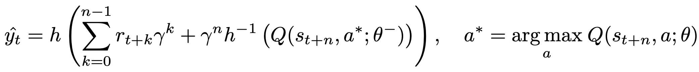
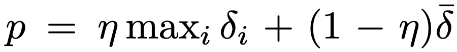

R2D2
^^^^^^^

Overview
---------
R2D2 was first proposed in `Recurrent experience replay in distributed reinforcement learning <https://openreview.net/pdf?id=r1lyTjAqYX>`_.
In RNN training with experience replay, the RL algorithms usually face the problem of representational drift and recurrent state staleness.
R2D2 utilize two approaches: stored states and burn-in to mitigate the aforementioned effects.
R2D2 agent integrates these findings to achieve significant advances in the state of the art on Atari-57 and matches the state of the art on DMLab-30.
They claims that, Recurrent Replay Distributed DQN (R2D2), is the first agent to achieve this using a single network architecture and fixed set of hyper-parameters.

Quick Facts
-------------
1. R2D2 is a **off-policy**, **model-free** and **value-based** RL algorithm, essentially a DQN-based algorithm using distributed framework, double q Networks, dueling architecture,
   n-step TD loss, and prioritized experience replay.

2. R2D2 now only support **discrete** action spaces and uses **eps-greedy** for exploration same as DQN.

3. R2D2 uses the **stored state** and **burn_in** techniques to mitigate the effects of representational drift and recurrent state staleness.

4. The DI-engine implementation of R2D2 provide **res_link** key to support residual link in recurrent Q network.

Key Equations or Key Graphs
---------------------------
The n-step targets used in R2D2 is:

In R2D2, we use the mixture of max and mean absolute n-step TD-errors as prioritization metrics:

.. note::
   Now in our DI-engine implementation, we don't use the reward and one-hot action as the input of LSTM q network.

For the more details about how to use RNN in DI-engine, you can refer to `How to use RNN <https://di-engine-docs.readthedocs.io/en/latest/best_practice/rnn.html>`_. For
Data Arrangement process in r2d2, users can refer to `data-arrangement <https://di-engine-docs.readthedocs.io/en/latest/best_practice/rnn.html#data-arrangement>`_,
for the burn-in technique in R2D2, users can refer to `burn-in-in-r2d2 <https://di-engine-docs.readthedocs.io/en/latest/best_practice/rnn.html#burn-in-in-r2d2>`_.

..
    .. math::

       L(w)=\mathbb{E}\left[(\underbrace{r+\gamma \max _{a^{\prime}} Q\left(s^{\prime}, a^{\prime}, w\right)}_{\text {Target }}-Q(s, a, w))^{2}\right]

Extensions
-----------
R2D2 can be combined with:

    - learning from demonstrations

      you can refer to `R2D3 paper <https://arxiv.org/abs/1909.01387>`_ and `R2D3 doc <https://di-engine-docs.readthedocs.io/zh_CN/latest/hands_on/r2d3_zh.html>`_ of our `implementation <https://github.com/opendilab/DI-engine/blob/main/ding/policy/r2d3.py>`_.
      R2D3 is an agent that makes efficient use of demonstrations to solve hard exploration problems in partially observable environments with highly variable initial conditions.

    - transformers

      you can refer to `GTrXL paper <https://arxiv.org/abs/1910.06764>`_ and `r2d2_gtrxl doc <https://di-engine-docs.readthedocs.io/zh_CN/latest/hands_on/r2d2_gtrxl.html>`_ of our `implementation <https://github.com/opendilab/DI-engine/blob/main/ding/policy/r2d2_gtrxl.py>`_.

Implementations
----------------
The default config of R2D2Policy is defined as follows:

.. autoclass:: ding.policy.r2d2.R2D2Policy
   :noindex:

The network interface R2D2 used is defined as follows:

.. autoclass:: ding.model.template.q_learning.DRQN
   :members: forward
   :noindex:

Benchmark
-----------

+---------------------+-----------------+-----------------------------------------------------+--------------------------+----------------------+
| environment         |best mean reward | evaluation results                                  | config link              | comparison           |
+=====================+=================+=====================================================+==========================+======================+
|                     |                 |                                                     |`config_link_p <https://  |                      |
|                     |                 |                                                     |github.com/opendilab/     |  Tianshou(20)        |
|                     |                 |                                                     |DI-engine/tree/main/dizoo/|                      |
|Pong                 |  20             |.. image:: images/benchmark/pong_r2d2.png            |atari/config/serial/      |                      |
|                     |                 |                                                     |pong/pong_r2d2_config     |  Sb3(20)             |
|(PongNoFrameskip-v4) |                 |                                                     |.py>`_                    |                      |
+---------------------+-----------------+-----------------------------------------------------+--------------------------+----------------------+
|                     |                 |                                                     |`config_link_q <https://  |                      |
|                     |                 |                                                     |github.com/opendilab/     |  Tianshou(7307)      |
|Qbert                |                 |                                                     |DI-engine/tree/main/dizoo/|                      |
|                     |  17966          |.. image:: images/benchmark/qbert_r2d2.png            |atari/config/serial/      |  Rllib(7968)         |
|(QbertNoFrameskip-v4)|                 |                                                     |qbert/qbert_r2d2_config   |                      |
|                     |                 |                                                     |_2.py>`_                  |  Sb3(9496)           |
+---------------------+-----------------+-----------------------------------------------------+--------------------------+----------------------+
|                     |                 |                                                     |`config_link_s <https://  |                      |
|                     |                 |                                                     |github.com/opendilab/     |  Tianshou(812)       |
|SpaceInvaders        |                 |                                                     |DI-engine/tree/main/dizoo/|                      |
|                     |  2403           |.. image:: images/benchmark/spaceinvaders_r2d2.png   |atari/config/serial/space |  Rllib(1001)         |
|(SpaceInvadersNoFrame|                 |                                                     |invaders/spaceinvaders    |                      |
|skip-v4)             |                 |                                                     |_r2d2_config.py>`_        |  Sb3(622)            |
+---------------------+-----------------+-----------------------------------------------------+--------------------------+----------------------+

P.S.：

1. The above results are obtained by running the same configuration on five different random seeds (0, 1, 2, 3, 4)
2. For the discrete action space algorithm like DQN, the Atari environment set is generally used for testing (including sub-environments Pong), and Atari environment is generally evaluated by the highest mean reward training 10M ``env_step``. For more details about Atari, please refer to `Atari Env Tutorial <../env_tutorial/atari.html>`_ .

Reference
----------

- Kapturowski S, Ostrovski G, Quan J, et al. Recurrent experience replay in distributed reinforcement learning[C]//International conference on learning representations. 2018.

- Volodymyr Mnih, Koray Kavukcuoglu, David Silver, Alex Graves, Ioannis Antonoglou, Daan Wierstra, Martin Riedmiller: “Playing Atari with Deep Reinforcement Learning”, 2013; arXiv:1312.5602.

- Schaul, T., Quan, J., Antonoglou, I., & Silver, D. (2015). Prioritized experience replay. arXiv preprint arXiv:1511.05952.

- Van Hasselt, H., Guez, A., & Silver, D. (2016, March). Deep reinforcement learning with double q-learning. In Proceedings of the AAAI conference on artificial intelligence (Vol. 30, No. 1).

- Wang, Z., Schaul, T., Hessel, M., Hasselt, H., Lanctot, M., & Freitas, N. (2016, June). Dueling network architectures for deep reinforcement learning. In International conference on machine learning (pp. 1995-2003). PMLR.

