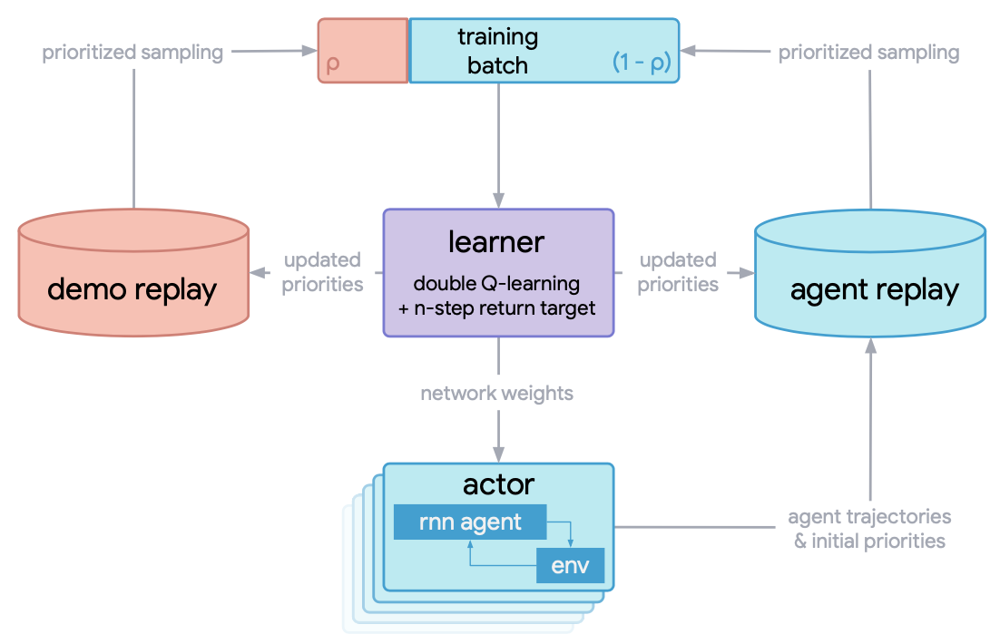
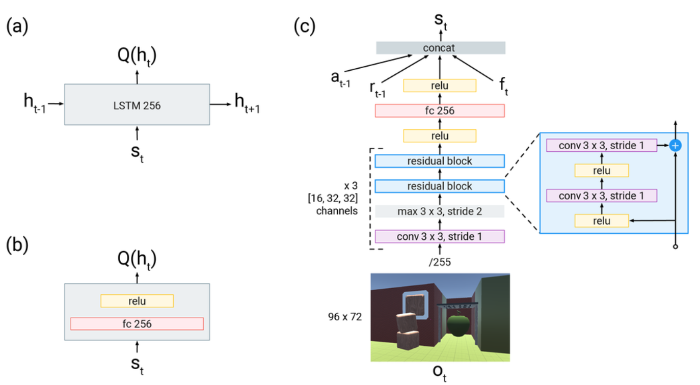
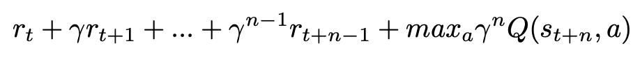
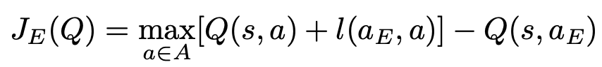
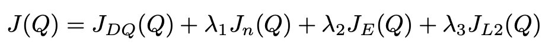
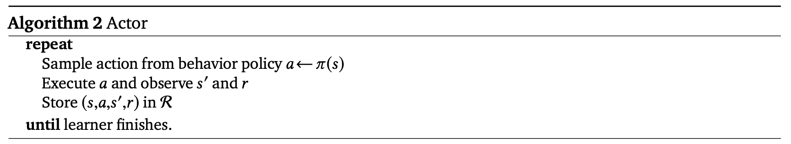
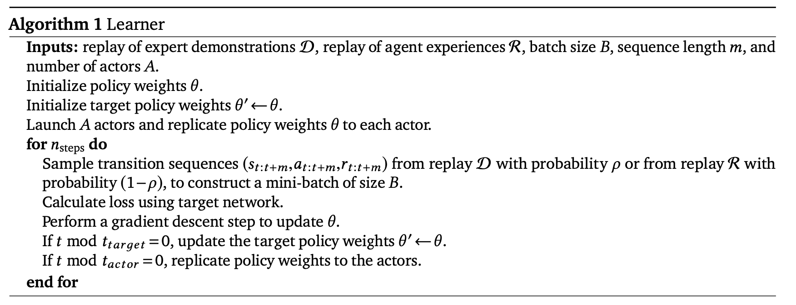

R2D3
^^^^^^^

概述
---------
R2D3 (Recurrent Replay Distributed DQN from Demonstrations) 首次在论文
`Making Efficient Use of Demonstrations to Solve Hard Exploration Problems <https://arxiv.org/abs/1909.01387>`_ 中提出, 它可以有效地利用专家演示来解决初始条件高度可变、部分可观察环境中的困难探索问题。
此外他们还介绍了一组结合这三个属性的八个任务，并表明 R2D3可以解决像这样的任务，注意的是在这些任务上，其他一些最先进的方法，无论有还是没有专家演示，在数百亿次的探索步骤之后甚至可能
仍然无法看到一条成功轨迹。r2d3本质上是有效利用了r2d2算法的分布式框架和循环神经结构以及DQfD的为从专家轨迹中学习而特别设计的损失函数。

核心要点
-------------

1.R2D3的基线强化学习算法是 `R2D2 <https://github.com/opendilab/DI-engine/blob/main/ding/policy/r2d2.py>`_
,可以参考我们的实现 `r2d2 <https://github.com/opendilab/DI-engine/blob/main/ding/policy/r2d2.py>`_ ,
它本质上是一个基于分布式框架，采用了双Q网络, dueling结构，n-step td的DQN算法。

2.R2D3利用了DQfD的损失函数，包括一步和n步的TD损失，网络参数的L2正则化损失，监督大边际分类损失(supervised large margin classification loss),区别在于R2D3的所有值都是在序列样本上从循环神经网络中计算得到的。

3.由于基线算法R2D2是在样本序列上进行运算的，所以我们的专家轨迹也应该以样本序列的方式给出，在实现中，往往我们是用另一个基线强化学习算法(如ppo)收敛后得到的专家模型来
产生对应的专家演示，为此我们专门写了对应的策略函数来从像ppo这样的专家模型中产生专家演示,
参见 `ppo_offpolicy_collect_traj.py <https://github.com/opendilab/DI-engine/blob/main/ding/policy/ppo_offpolicy_collect_traj.py>`_ .

4.用于训练Q网络的mini-batch里以pho的概率是专家演示序列，1-pho的概率是智能体与环境交互的经验序列。

5.r2d3e的提出是为了解决初始条件高度可变、部分可观察环境中的困难探索问题，其他探索相关的论文，读者可以参考 `NGU <https://arxiv.org/abs/2002.06038>`_ ，它是融合了
`ICM <https://arxiv.org/pdf/1705.05363.pdf>`_ 和 `RND <https://arxiv.org/abs/1810.12894v1>`_ 等多种探索方法的一个综合体。

关键方程或关键框图
==================

R2D3算法的整体分布式训练流程如下：

其中learner用于训练的mini_batch包含了2部分: 1. 专家演示轨迹, 2. 智能体在训练过程中与环境交互产生的经验轨迹。
演示和智能体经验验之间的比率是一个关键的超参数, 必须仔细调整以实现良好的性能。

R2D3算法的整Q网络结构图如下：

(a) R2D3智能体使用的recurrent head。 (b) DQfD智能体使用的feedforward head。（c）表示输入为大小为 96x72的图像帧，
接着通过一个ResNet，然后将前一时刻的动作，前一时刻的奖励和当前时刻的其他本体感受特征 :math:`f_{t}` （包括加速度、avatar是否握住物体以及手与avatar的相对距离等辅助信息
连接(concat)为一个新的输入向量，传入a)和b)中的head，用于计算Q值。

下面描述r2d3的损失函数设置，和DQfD一样，不过这里所有的Q值都是通过上面所述的循环神经网络结构计算得到。
除了通常的1-step turn, r2d3还增加n-step return，有助于将专家轨迹的值传播到所有的早期状态，从而获得更好的预训练效果。
n步return为：

监督损失对于预训练的效果至关重要。由于演示数据可能只是覆盖状态空间的一小部分并且在某一个状态并没有采取所有可能的动作，
因此许多状态动作对从未被专家采取。 如果我们仅使用 Q-learning朝着下一个状态的最大Q值来更新预训练网络，网络将倾向于朝着那些不准确的变量中的最高值方向更新，
并且网络将在整个过程中通过Q函数传播这些值。

监督大边际分类损失(supervised large margin classification loss)公式：

其中a_E表示专家执行的动作。

我们在DI-engine中的具体实现如下所示：

.. code::

   l = margin_function * torch.ones_like(q)
   l.scatter_(1, torch.LongTensor(action.unsqueeze(1)), torch.zeros_like(q))
   JE = is_expert * (torch.max(q + l.to(device), dim=1)[0] - q_s_a)

r2d3还添加了应用于网络权重和偏差的 L2正则化损失，以帮助防止它在相对数量较小的演示数据集上过度拟合。
最终用于更新网络的整体损失是所有四种损失的组合：

伪代码
======

下面是包含R2D3智能体learner和actor的伪代码。智能体由单个学习器进程(learner process)组成，从专家演示缓冲区和智能体经验缓冲区中采样以更新其策略参数。
智能体还包含A个并行的行动者进程(actor process)，这些进程与环境的副本交互以获得数据，然后将数据放入智能体经验缓冲区。
智能体会定期更新其网络参数以匹配学习器上正在更新的参数。

重要的实现细节
==============

1. 训练所用的minibatch中有pho的概率为专家演示轨迹。其具体实现方式如下，通过从batch_size大小个的[0，1]均匀分分布中采样，如果采样值大于pho则选择一个专家演示轨迹
这batch_size个采样值中大于pho的采样值的个数即为本次这个batch中专家演示所占的个数。

.. code::

   # The hyperparameter pho, the demo ratio, control the propotion of data coming
   # from expert demonstrations versus from the agent's own experience.
   expert_batch_size = int(
       np.float32(np.random.rand(learner.policy.get_attribute('batch_size')) < cfg.policy.collect.pho
                  ).sum()
   )
   agent_batch_size = (learner.policy.get_attribute('batch_size')) - expert_batch_size
   train_data_agent = replay_buffer.sample(agent_batch_size, learner.train_iter)
   train_data_expert = expert_buffer.sample(expert_batch_size, learner.train_iter)

2.由于基线算法r2d2是有优先级的采样，对于一个sequence样本，我们使用TD error(1步和n步的和)绝对值，在这个序列经历的所有时刻中的平均值和最大值的加权和
作为整个序列样本的优先级。 在r2d3中我们有2个replay_buffer, 专家演示的 ``expert_buffer`` ，和智能体经验的 ``replay_buffer`` ，为简单明了，我们是分开进行优先级采样和相关参数的更新.

.. code::

   # using the mixture of max and mean absolute n-step TD-errors as the priority of the sequence
   td_error_per_sample = 0.9 * torch.max(
       torch.stack(td_error), dim=0
   )[0] + (1 - 0.9) * (torch.sum(torch.stack(td_error), dim=0) / (len(td_error) + 1e-8))
   # td_error shape list(<self._unroll_len_add_burnin_step-self._burnin_step-self._nstep>, B), for example, (75,64)
   # torch.sum(torch.stack(td_error), dim=0) can also be replaced with sum(td_error)
   ...
   if learner.policy.get_attribute('priority'):
       # When collector, set replay_buffer_idx and replay_unique_id for each data item, priority = 1.\
       # When learner, assign priority for each data item according their loss
       learner.priority_info_agent = deepcopy(learner.priority_info)
       learner.priority_info_expert = deepcopy(learner.priority_info)
       learner.priority_info_agent['priority'] = learner.priority_info['priority'][0:agent_batch_size]
       learner.priority_info_agent['replay_buffer_idx'] = learner.priority_info['replay_buffer_idx'][
           0:agent_batch_size]
       learner.priority_info_agent['replay_unique_id'] = learner.priority_info['replay_unique_id'][
           0:agent_batch_size]

       learner.priority_info_expert['priority'] = learner.priority_info['priority'][agent_batch_size:]
       learner.priority_info_expert['replay_buffer_idx'] = learner.priority_info['replay_buffer_idx'][
           agent_batch_size:]
       learner.priority_info_expert['replay_unique_id'] = learner.priority_info['replay_unique_id'][
           agent_batch_size:]

       # Expert data and demo data update their priority separately.
       replay_buffer.update(learner.priority_info_agent)
       expert_buffer.update(learner.priority_info_expert)

3.对于专家演示样本和智能体经验样本，我们分别对原数据增加一个键 ``is_expert`` 加以区分,如果是专家演示样本，此键值为1，
如果是智能体经验样本，此键值为0，

.. code::

   # 如果是专家演示样本，此键值为1，
   for i in range(len(expert_data)):
       # for rnn/sequence-based alg.
       expert_data[i]['is_expert'] = [1] * expert_cfg.policy.collect.unroll_len
   ...
   # 如果是智能体经验样本，此键值为0
   for i in range(len(new_data)):
       new_data[i]['is_expert'] = [0] * expert_cfg.policy.collect.unroll_len

4. 预训练，在智能体与环境交互之前，我们可以先利用专家演示样本训练Q网络，期望能得到一个好的初始参数，加速后续的训练进程。

实现
====

r2d3的策略 ``R2D3Policy`` 的接口定义如下：

.. autoclass:: ding.policy.r2d3.R2D3Policy
   :members: __init__, _forward_learn
   :noindex:

..
    dqfd的损失函数 ``nstep_td_error_with_rescale`` 的接口定义如下：

    .. autoclass:: ding.ding.rl_utils.td.dqfd_nstep_td_error_with_rescale
       :noindex:

.. note::
    我们目前的r2d3策略实现中网络的输入只是时刻t的状态观测，不包含时刻t-1的动作和奖励,也不包括额外的信息向量 :math:`f_{t}` .

..
 注意： ``...`` 表示省略的代码片段。

基准算法性能
============

我们在PongNoFrameskip-v4环境上，做了一系列对比实验，以验证：1.用于训练的一个mini-batch中专家样本的占比pho，2.专家演示所占比例，3.是否利用预训练与l2正则化
等不同参数设置对r2d3算法最终性能的影响。注意，我们的专家数据通过 `ppo_offpolicy_collect_traj.py <https://github.com/opendilab/DI-engine/blob/main/ding/policy/ppo_offpolicy_collect_traj.py>`_ 产生,
其专家模型来自于r2d2算法在该环境上训练到收敛后得到的专家模型。以下所有实验seed=0。其中r2d2基线算法设置记为r2d2_n5_bs2_ul40_upc8_tut0.001_ed1e5_rbs1e5_bs64, n表示nstep, bs表示burnin_step, ul表示unroll_len, upc表示update_per_collect, tut表示target_update_theta,
ed表示eps_decay, rbs表示replay_buffer_size, bs表示batch_size, 具体参见 `r2d2 pong config <https://github.com/opendilab/DI-engine/blob/main/dizoo/atari/config/serial/pong/pong_r2d2_config.py>`_ .

..
    +---------------------+-----------------+-----------------------------------------------------+---------------------------------------------------------+
    | environment         |best mean reward | evaluation results                                  | 图例与分析                                                |
    +=====================+=================+=====================================================+=========================================================+
    |                     |                 |                                                     |观测1: pho需要适中，取1/4                                   |
    |                     |                 |                                                     |蓝线 pong_r2d2_rbs1e4                                     |
    |                     |                 |                                                     |橙线 pong_r2d3_r2d2expert_k0_pho1-4_rbs1e4_1td_l2_ds5e3   |
    |Pong                 |  20             |.. image:: images/r2d3_pong_pho.png                  |灰线 pong_r2d3_r2d2expert_k0_pho1-16_rbs1e4_1td_l2_ds5e3  |
    |                     |                 |                                                     |红线 pong_r2d3_r2d2expert_k0_pho1-2_rbs1e4_1td_l2_ds5e3   |
    |(PongNoFrameskip-v4) |                 |                                                     |                                                         |
    +---------------------+-----------------+-----------------------------------------------------+---------------------------------------------------------+
    |                     |                 |                                                     |观测2：demo size需要适中，取5e3                             |
    |                     |                 |                                                     |                                                         |
    |                     |                 |                                                     |橙线 pong_r2d2_rbs2e4                                     |
    |Pong                 |  20             |.. image:: images/r2d3_pong_demosize.png             |天蓝线 pong_r2d3_r2d2expert_k0_pho1-4_rbs2e4_1td_l2_ds5e3 |
    |                     |                 |                                                     |蓝线 pong_r2d3_r2d2expert_k0_pho1-4_rbs2e4_1td_l2_ds1e3   |
    |(PongNoFrameskip-v4) |                 |                                                     |绿线 pong_r2d3_r2d2expert_k0_pho1-4_rbs2e4_1td_l2_ds1e4   |
    +---------------------+-----------------+-----------------------------------------------------+---------------------------------------------------------+
    |                     |                 |                                                     |观测3：预训练和l2正则化影响不大  demo size 1e3 seed0          |
    |                     |                 |                                                     |橙线 r2d2_rbs2e4_rbs2e4                                   |
    |                     |                 |                                                     |蓝线 pong_r2d3_r2d2expert_k0_pho1-4_rbs2e4_1td_l2         |
    |Pong                 |  20             |.. image:: images/r2d3_pong_l2_pretrain.png          |粉红线 pong_r2d3_r2d2expert_k0_pho1-4_rbs2e4_1td_nol2     |
    |                     |                 |                                                     |深红线 pong_r2d3_r2d2expert_k100_pho1-4_rbs2e4_1td_l2     |
    |(PongNoFrameskip-v4) |                 |                                                     |绿线 pong_r2d3_r2d2expert_k100_pho1-4_rbs2e4_1td_nol2     |
    +---------------------+-----------------+-----------------------------------------------------+---------------------------------------------------------+

-  测试在用于训练的一个mini-batch中专家样本的占比的影响。观测1: pho需要适中，取1/4
    - 蓝线 pong_r2d2_rbs1e4
    - 橙线 pong_r2d3_r2d2expert_k0_pho1-4_rbs1e4_1td_l2_ds5e3
    - 灰线 pong_r2d3_r2d2expert_k0_pho1-16_rbs1e4_1td_l2_ds5e3
    - 红线 pong_r2d3_r2d2expert_k0_pho1-2_rbs1e4_1td_l2_ds5e3

   .. image:: images/r2d3_pong_pho.png
     :align: center
     :scale: 50%

-  测试总的专家样本库的大小的影响。观测2：demo size需要适中，取5e3
    - 橙线 pong_r2d2_rbs2e4
    - 天蓝线 pong_r2d3_r2d2expert_k0_pho1-4_rbs2e4_1td_l2_ds5e3
    - 蓝线 pong_r2d3_r2d2expert_k0_pho1-4_rbs2e4_1td_l2_ds1e3
    - 绿线 pong_r2d3_r2d2expert_k0_pho1-4_rbs2e4_1td_l2_ds1e4

   .. image:: images/r2d3_pong_demosize.png
     :align: center
     :scale: 50%

-  测试是否预训练以及L2正则化的影响。观测3：预训练和L2正则化影响不大
    - 橙线 r2d2_rbs2e4_rbs2e4
    - 蓝线 pong_r2d3_r2d2expert_k0_pho1-4_rbs2e4_1td_l2
    - 粉红线 pong_r2d3_r2d2expert_k0_pho1-4_rbs2e4_1td_nol2
    - 深红线 pong_r2d3_r2d2expert_k100_pho1-4_rbs2e4_1td_l2
    - 绿线 pong_r2d3_r2d2expert_k100_pho1-4_rbs2e4_1td_nol2

   .. image:: images/r2d3_pong_l2_pretrain.png
     :align: center
     :scale: 50%

参考资料
========

- Paine T L, Gulcehre C, Shahriari B, et al. Making efficient use of demonstrations to solve hard exploration problems[J]. arXiv preprint arXiv:1909.01387, 2019.

- Kapturowski S, Ostrovski G, Quan J, et al. Recurrent experience replay in distributed reinforcement learning[C]//International conference on learning representations. 2018.

- Badia A P, Sprechmann P, Vitvitskyi A, et al. Never give up: Learning directed exploration strategies[J]. arXiv preprint arXiv:2002.06038, 2020.

- Burda Y, Edwards H, Storkey A, et al. Exploration by random network distillation[J]. https://arxiv.org/abs/1810.12894v1. arXiv:1810.12894, 2018.

- Pathak D, Agrawal P, Efros A A, et al. Curiosity-driven exploration by self-supervised prediction[C]//International conference on machine learning. PMLR, 2017: 2778-2787.
