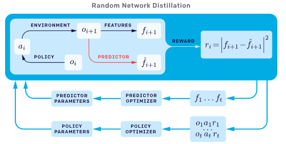
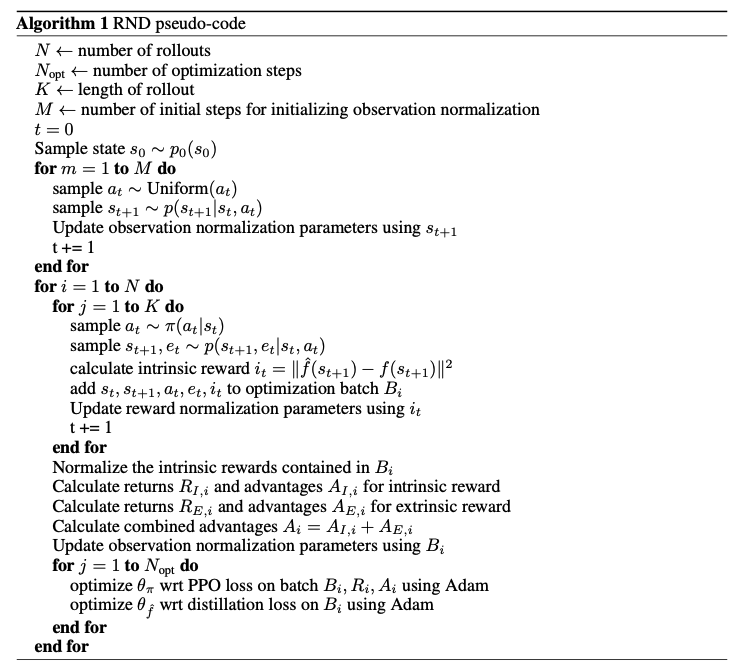

RND
====

Overview
--------

RND (Random Network Distillation) was first proposed in
`Exploration by Random Network Distillation <https://arxiv.org/abs/1810.12894v1>`__, which introduces
an exploration bonus for deep reinforcement learning methods that is easy to implement and adds minimal
overhead to the computation performed. The exploration bonus is the error of a neural network predicting features
of the observations given by a fixed randomly initialized neural network. RND claims that it is the first method that achieves
better than average human performance on Montezuma’s Revenge without using demonstrations or having access to the underlying state of the game.

Quick Facts
-----------

1. The insight behind exploration approaches is that we first establish a methodology of measuring the **novelty of states**, then we assign a exploration
   reward in proportional to the novelty of the state.
   If the visited state is more novel, it will matching a bigger intrinsic reward, on the contrary,
   if the state is more familiar to the agent, it will matching a smaller intrinsic reward.

2. RND is a **prediction-error-based** exploration approach that can be applied in non-tabular cases.
   The main idea of prediction-error-based approaches is that defining the intrinsic reward as the prediction error
   for a problem related to the agent’s transitions, such as learning forward dynamics model, learning
   inverse dynamics model, or even a randomly generated problem, which is the case in RND algorithm.

3. RND involves **two neural networks**: a fixed and randomly initialized target network which sets the prediction problem,
   and a predictor network trained on data collected by the agent.

4. In RND paper, though the underlying base RL algorithm is off-policy PPO, RND intrinsic reward generation model can be combined with different RL algorithms conveniently.

Key Equations or Key Graphs
---------------------------

The overall sketch of RND is as follows:

The overall sketch of next_sate_prediction exploration method is as follows:

.. figure:: images/RND_next_state_prediction.png
   :align: center
   :scale: 85%
   :alt:

In RND paper, the authors point out that prediction errors can be attributed to the following factors:

 1.Amount of training data. Prediction error is high where few similar examples were seen by the predictor.

 2.Stochasticity. Prediction error is high because the target function is stochastic.
 Stochastic transitions are a source of such error for forward dynamics prediction.

 3.Model misspecification. Prediction error is high because information necessary for the prediction is missing,
 or the model class of predictors is too limited to fit the complexity of the target function.

Factor 1 is a useful source of error since it quantifies the novelty of experience, whereas factors 2 and 3 cause the noisy-TV problem, that is
serious in the next_sate_prediction based exploration method.
RND obviates factors 2 and 3 since the target network is chosen to be deterministic and has the identical network structure with
the model-class of the predictor network.

In RND, the target network takes an observation to an embedding :math:`f: O → R^k` and the predictor neural network :math:`\hat{f}: O → R^k` is trained by
gradient descent to minimize the expected MSE :math:`|f (x; θ) − f (x)|` with respect to its parameters :math:`θ_\hat{f}`.
In unfamiliar states it’s hard to predict the output of the fixed randomly initialized neural network, and hence the prediction error is higher, so RND can consider
the prediction error as a measure of the novelty of visited states.

But RND is still facing some problems, one of which is that the RND bonus reward could gradually disappear over time, because with the training progresses advancing,
the predictor network can fit the output of the randomly initialized neural network better and better.
Interested readers can refer to the follow-up improvement work `Never Give Up: Learning Directed Exploration Strategies <https://arxiv.org/abs/2002.06038>`__
and `Agent57: Outperforming the Atari Human Benchmark <https://arxiv.org/abs/2003.13350>`__.

The implementation details that matters
~~~~~~~~~~~~~~~~~

1.  ``reward normalization``. Normalized the intrinsic reward by dividing it by a running estimate
of the standard deviations of the intrinsic returns.

2. ``observation normalization``.
Whiten each dimension by subtracting the running mean and then dividing by the running standard deviation.
Then clip the normalized observations to be between -5 and 5.
Initialize the normalization parameters by stepping a random agent in the environment for a small number of steps before beginning optimization.
Use the same observation normalization for both predictor and target networks but not the policy network.

3. ``Non-episodic intrinsic reward``.
Non-episodic setting (it means the return is not truncated at “game over”) resulted in more exploration than the episodic setting when exploring without any extrinsic rewards.
In order to combine episodic and non-episodic reward streams we require two value heads.
When combing the episodic and non-episodic returns, a higher discount factor for the extrinsic rewards leads to better performance,
while for intrinsic rewards it hurts exploration. So we set discount factor as 0.999 for extrinsic rewards and 0.99 for intrinsic rewards.

To understand the reasons behind these operations, it is recommended to read the original paper.

Pseudo-Code
-----------

Implementation
---------------

The interface of RND reward model is defined as follows:

.. autoclass:: ding.reward_model.rnd_reward_model.RndRewardModel
   :members: __init__, estimate
   :noindex:

The interface of on policy PPO is defined as follows:

.. autoclass:: ding.policy.ppo.PPOPolicy
   :noindex:

Note: ``...`` indicates the omitted code snippet. For the complete code, please refer to our
`implementation <https://github.com/opendilab/DI-engine/blob/main/ding/reward_model/rnd_reward_model.py>`__ in DI-engine.

RndNetwork
~~~~~~~~~~~~~~~~~
First, we define the class ``RndNetwork`` involves two neural networks: the fixed and randomly initialized target network ``self.target``,
and the predictor network ``self.predictor`` trained on data collected by the agent.

        .. code-block:: python

         class RndNetwork(nn.Module):

            def __init__(self, obs_shape: Union[int, SequenceType], hidden_size_list: SequenceType) -> None:
                super(RndNetwork, self).__init__()
                if isinstance(obs_shape, int) or len(obs_shape) == 1:
                    self.target = FCEncoder(obs_shape, hidden_size_list)
                    self.predictor = FCEncoder(obs_shape, hidden_size_list)
                elif len(obs_shape) == 3:
                    self.target = ConvEncoder(obs_shape, hidden_size_list)
                    self.predictor = ConvEncoder(obs_shape, hidden_size_list)
                else:
                    raise KeyError(
                        "not support obs_shape for pre-defined encoder: {}, please customize your own RND model".
                        format(obs_shape)
                    )
                for param in self.target.parameters():
                    param.requires_grad = False

            def forward(self, obs: torch.Tensor) -> Tuple[torch.Tensor, torch.Tensor]:
                predict_feature = self.predictor(obs)
                with torch.no_grad():
                    target_feature = self.target(obs)
                return predict_feature, target_feature

RndRewardModel
~~~~~~~~~~~~~~~~~
Then, we initialize reward model, optimizer and self._running_mean_std_rnd in ``_init_`` of class ``RndRewardModel``.

        .. code-block:: python

         class RndRewardModel(BaseRewardModel):
             ...
             def __init__(self, config: EasyDict, device: str, tb_logger: 'SummaryWriter') -> None:  # noqa
                ...
                self.reward_model = RndNetwork(config.obs_shape, config.hidden_size_list)
                ...
                self.opt = optim.Adam(self.reward_model.predictor.parameters(), config.learning_rate)
                ...
                self._running_mean_std_rnd = RunningMeanStd(epsilon=1e-4)

Train RndRewardModel
~~~~~~~~~~~~~~~~~
Afterwards, we calculate the reward model loss and update the RND predictor network: ``self.reward_model.predictor``.  Note that, according to the
original paper, we adopt the observation normalization trick that is transforming the original observations to mean 0, std 1, and clip the normalized observations
to be between -5 and 5, which is empirically important especially when using a random network as a target, for the detailed explanation, please refer the chapter 2.4 in the RND paper.

        .. code-block:: python

         def _train(self) -> None:
                train_data: list = random.sample(self.train_data, self.cfg.batch_size)
                train_data: torch.Tensor = torch.stack(train_data).to(self.device)

                # observation normalization:  transform to mean 0, std 1
                self._running_mean_std_rnd_obs.update(train_data.cpu().numpy())
                train_data = (train_data - to_tensor(self._running_mean_std_rnd_obs.mean)) / to_tensor(self._running_mean_std_rnd_obs.std)
                train_data = torch.clamp(train_data, min=-5, max=5)

                predict_feature, target_feature = self.reward_model(train_data)
                loss = F.mse_loss(predict_feature, target_feature.detach())
                self.opt.zero_grad()
                loss.backward()
                self.opt.step()

Calculate RND Reward
~~~~~~~~~~~~~~~~~
Finally, we calculate MSE loss according to the RND reward model and do the necessary subsequent processing
and rewrite the reward key in the data in ``estimate`` method of class ``RndRewardModel``. And note that
we adapt the reward normalization trick that is transforming the original RND reward to (mean 0, std 1), empirically we found this normalization way works well
than only dividing the self._running_mean_std_rnd.std in some sparse reward environment, such as minigrid.

    1. ``calculate the RND pseudo reward``

        .. code-block:: python

         obs = collect_states(data)
         obs = torch.stack(obs).to(self.device)

         # observation normalization:  transform to mean 0, std 1
         obs = (obs - to_tensor(self._running_mean_std_rnd_obs.mean)) / to_tensor(self._running_mean_std_rnd_obs.std)
         obs = torch.clamp(obs, min=-5, max=5)

         with torch.no_grad():
             predict_feature, target_feature = self.reward_model(obs)
             reward = F.mse_loss(predict_feature, target_feature, reduction='none').mean(dim=1)
             self._running_mean_std_rnd.update(reward.cpu().numpy())
             # reward normalization: transform to (mean 0, std 1), empirically we found this normalization way works well
             # than only dividing the self._running_mean_std_rnd.std
             reward = (reward - self._running_mean_std_rnd.mean) / (self._running_mean_std_rnd.std + 1e-11)
             # reward = reward / self._running_mean_std_rnd.std

    2. ``combine the RND pseudo reward with the original reward``. Here, we may also use some weighting factor to control the
    balance of exploration and exploitation.

        .. code-block:: python

         for item, rew in zip(data, reward):
            if self.intrinsic_reward_type == 'add':
                item['reward'] += rew
            elif self.intrinsic_reward_type == 'new':
                item['intrinsic_reward'] = rew
            elif self.intrinsic_reward_type == 'assign':
                item['reward'] = rew

Author's Tensorflow Implementation
----------------------------

- RND_

.. _RND: https://github.com/openai/random-network-distillation.

Reference
---------

1. Burda Y, Edwards H, Storkey A, et al. Exploration by random network distillation[J]. https://arxiv.org/abs/1810.12894v1. arXiv:1810.12894, 2018.

2. https://openai.com/blog/reinforcement-learning-with-prediction-based-rewards/

3. https://lilianweng.github.io/lil-log/2020/06/07/exploration-strategies-in-deep-reinforcement-learning.html#prediction-based-exploration
