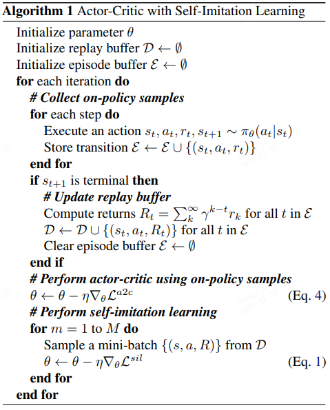

Self-Imitation Learning
======================================================

在强化学习当中，如何平衡探索和利用是其中的一个挑战。智能体需要在不断探索从而寻找潜在的更好的策略，而另一方面又需要对已知的策略进行使用。

在Self-Imitation Learning(SIL)当中，通过对过去数据当中具有较好表现部分的数据进行运用，从而间接地引导探索。

在论文当中引入了如下loss：考虑收集到的数据有 :math:`\mathcal{D}=\{(s_t,a_t,R)\}`。其中R代表累计reward值。loss可以写为

.. math::
    \mathcal{L}^{\text{sil}}=E_{s,a,R\in \mathcal{D}}[\mathcal{L}^{\text{sil}}_{\text{policy}}+\beta^{\text{sil}}\mathcal{L}^{\text{sil}}_{\text{policy}}]

.. math::
    \mathcal{L}_{\text{policy}} = -\log\pi_\theta(a|s)(R-V(s))_{+}

.. math::
    \mathcal{L}_{\text{value}} = \frac{1}{2}\|(R-V)_+\|^2

对于上述loss可以理解为对于历史数据，我们对其高于平均值的行为进行鼓励，对于低于平均值的部分不进行额外的惩罚，
使得其对于高于平均值的部分进行更多的探索，强化学习部分采用了A2C算法进行优化，于是得到如下算法流程：

Reference
---------
1.Junhyuk Oh, Yijie Guo, et al. "Self-Imitation Learning" *arXiv preprint arXiv:1806.05635*
