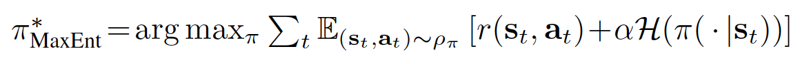
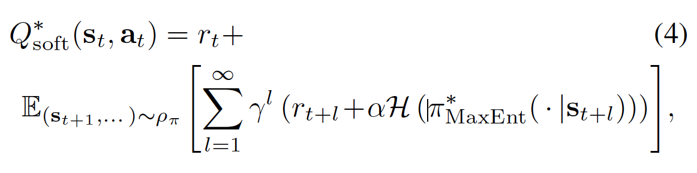
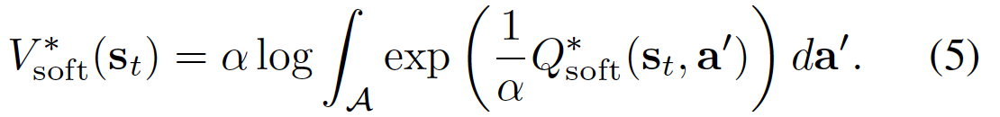
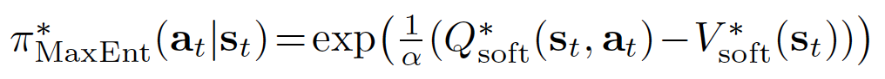
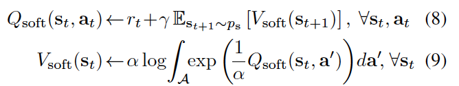
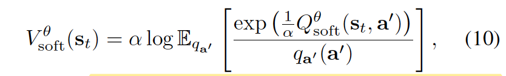
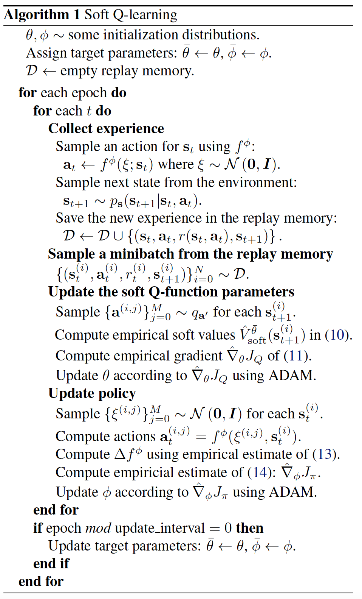

SQL
^^^^^^^

Overview
---------
Soft Q Learning (SQL) is an off-policy maximum entropy Q learning algorithm that first proposed in `Reinforcement Learning with Deep Energy-Based Policies <https://arxiv.org/abs/1702.08165>`_. This purpose of this algorithm is to learn
maximum entropy policies and the optimal policy is expressed via a Boltzmann distribution. The amortized
Stein variational gradient descent (SVGD) has been utilized to learn
a stochastic sampling network that approximates
samples from this distribution. The benefits of
the algorithm include improved exploration via the maximum entropy formulation
and compositionality that allows transferring
skills between tasks.

Quick Facts
-------------
1. SQL is a **model-free** and **value-based** RL algorithm.

2. SQL is an **off-policy** algorithm.

3. SQL supports both **discrete** and **continuous** action spaces.

4. SVGD has been adopted for sampling from the soft Q-function for environments with **continuous** action spaces.

Key Equations or Key Graphs
---------------------------
SQL considers a more general maximum entropy policy, such that the optimal policy aims to maximize its entropy at each visited state:

where :math:`{\alpha}`   is an optional but convenient parameter that can be used to determine the relative importance of entropy and reward. In practice, :math:`{\alpha}`  is a hyperparameter that has to be tuned (not one to be learned during training).

By defining the soft Q function and soft V functions in equations 4 and 5 below respectively:

The optimal policy to the above maximum entropy formulation of the policy can be proved to be:

The proof can be found in the appendix or from the paper `Modeling purposeful adaptive behavior with the principle of maximum causal entropy <https://www.cs.cmu.edu/~bziebart/publications/thesis-bziebart.pdf>`

The soft Q iteration for training expressive energy-based models is given by the following theorem (`Theorem 3` in the paper):

Theorem: Let :math:`Q_{\text{soft}(\cdot, \cdot))` and :math:`V_{\text{soft}(\cdot))` be bounded and assume that :math:`\int_{\mathcal{A}} exp(\frac{1}{\alpha} Q_{\text{soft}}(\cdot, a^{'}) ) \,da^{'} < \infty` and that :math:`Q^{*}_{\text{soft}} < \infty` exist. Then the fixed-point iteration

converges to :math:`Q^{*}_{\text{soft}} and V^{*}_{\text{soft}}` respectively.

However, there are several practicalities
that need to be considered in order to make use of the algorithm to solve real world problems.
First, the soft Bellman backup cannot be performed
exactly in continuous or large state and action spaces, and
second, sampling from the energy-based model in (6) is intractable
in general.

To convert the above theorem into a stochastic optimization
problem, we first express the soft value function in terms
of an expectation via importance sampling:

where :math:`q_{a'}` can be an arbitrary distribution over the action
space.

Pseudo-code
---------------
The pseudo code is as follows:

Where the equation 10, 11, 13, 14 can be referred from the above section.

Extensions
-----------
SQL can be combined with:

    - Exploration techniques such as epsilon-greedy or OU Noise (implemented in the original paper; Please refer to `Continuous control with deep reinforcement learning <https://arxiv.org/abs/1509.02971>`_ and `On the theory of the Brownian motion <https://link.aps.org/pdf/10.1103/PhysRev.36.823?casa_token=yFMSHBrxJoMAAAAA:5nFSMwUrqcdlUoobFDYOP0Y58r5jmNogkpHqFgMhzv0Md-4EcIkofMHHCkgsjEJFO10yqsmrhmNk_4dL>`_) to enchance explorations.

    - Some analysts draw connection between Soft Q-learning and Policy
      Gradient algorithms such as `Equivalence Between Policy Gradients and
      Soft Q-Learning <https://arxiv.org/abs/1704.06440>`__.
    
    - SQL can be combined with demonstration data to propose an imitation learning algorithm: SQIL proposed in `SQIL: Imitation Learning via Reinforcement Learning with Sparse Rewards <https://arxiv.org/abs/1905.11108>`_.  Please also refer to `SQIL code <https://github.com/opendilab/DI-engine/blob/main/ding/policy/sqil.py>` for a DI-engine implementation.

Implementations
----------------
The default config is defined as follows:

.. autoclass:: ding.policy.sql.SQLPolicy

Benchmark
-----------

The table below shows a benchmark of the performance of DQN, SQL (in discrete action spaces), and SQIL in Lunarlander and Pong environments.

+-------------+---------------------------------+-----------------------------------+------------------------------------+--------+
| env / method| DQN                             |SQL                                | SQIL                               | alpha  |
+=============+=================================+===================================+====================================+========+
| LunarLander | 153392 / 277 / 23900 (both off) | 693664 / 1017 / 32436 (both off)  | 35856   / 238  / 1683   (both off) |        |
|             | 83016  / 155 / 12950 (both on)  | 1149592 / 1388/ 53805 (both on)   | 31376   / 197  / 1479   (both on)  |  0.08  |
+-------------+---------------------------------+-----------------------------------+------------------------------------+--------+
| Pong        | 765848 / 482 / 80000 (both on)  | 2682144 / 1750 / 278250 (both on) | 2390608 / 1665 / 247700 (both on)  |  0.12  |
+-------------+---------------------------------+-----------------------------------+------------------------------------+--------+

.. note::

 - The stopping values for Lunarlander and Pong are 200 and 20 respectively.

 - both on：cuda = True； base env manger = subprocess

 - both off：cuda = False； base env manager = base

References
-----------
- Haarnoja, Tuomas, et al. "Reinforcement learning with deep energy-based policies." International Conference on Machine Learning. PMLR, 2017.

- Uhlenbeck, G. E. and Ornstein, L. S. On the theory of the brownian motion. Physical review, 36(5):823, 1930.

- Lillicrap, T. P., Hunt, J. J., Pritzel, A., Heess, N., Erez,
  T., Tassa, Y., Silver, D., and Wierstra, D. Continuous
  control with deep reinforcement learning. arXiv preprint
  arXiv:1509.02971, 2015.

- Schulman, John, Xi Chen, and Pieter Abbeel. "Equivalence between policy gradients and soft q-learning." arXiv preprint arXiv:1704.06440 (2017).

- Siddharth Reddy, Anca D. Dragan, Sergey Levine: “SQIL: Imitation Learning via Reinforcement Learning with Sparse Rewards”, 2019.

- Ziebart, B. D. Modeling purposeful adaptive behavior with
  the principle of maximum causal entropy. PhD thesis,
  2010.