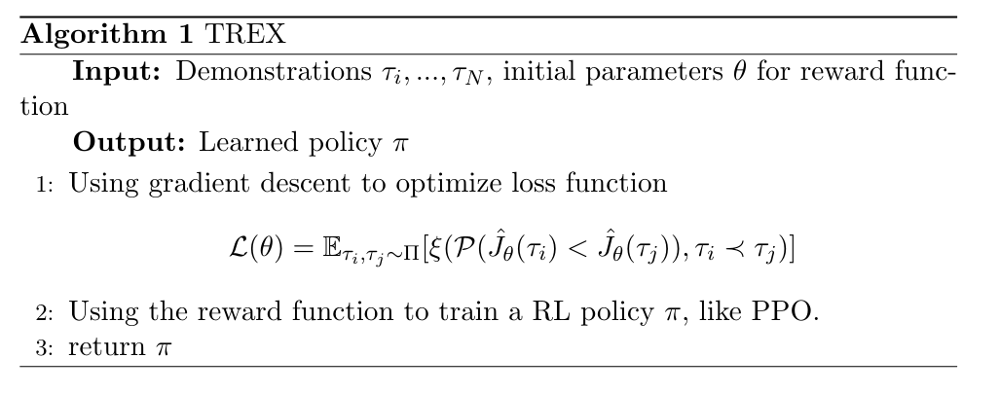

TREX
^^^^^^^

Overview
---------
TREX (Trajectory-ranked Reward Extrapolation) was first proposed in `Extrapolating Beyond Suboptimal Demonstrations via Inverse Reinforcement Learning from Observations <https://arxiv.org/abs/1904.06387>`_, which uses ranked demonstrations to inference reward function. Different from previous methods, TREX seeks a reward function that explains the ranking over demonstrations, rather than justifying the demonstrations. Hence, this algorithm can learn good policies from highly suboptimal demostrations.

Quick Facts
-------------
1. Demonstrations used in TREX require **ranking** information.

2. The reward function optimization can be viewed as a simple binary classification problem.

3. Usually, multiple data augmentation methods should be applied to prevent reward network from over-fitting.

Key Equations or Key Graphs
---------------------------
The loss for reward function:

.. math::

   \mathcal{L}(\theta)=\mathbb{E}_{\tau_i, \tau_j \sim \Pi}[\xi(\mathcal{P}(\hat J_\theta(\tau_i) < \hat J_\theta(\tau_j)),\tau_i \prec \tau_j)]

The function P is defined as follow:

.. math::

   \mathcal{P}(\hat J_\theta(\tau_i) < \hat J_\theta(\tau_j)) \approx \frac {exp \sum_{s \in \tau_j} \hat r_\theta(s)} {exp \sum_{s \in \tau_i} \hat r_\theta(s) + exp \sum_{s \in \tau_j} \hat r_\theta(s)}

The final loss function is in cross entropy form:

.. math::
   \mathcal{L}(\theta) = - \sum_{\tau_i \prec \tau_j} log \frac {exp \sum_{s \in \tau_j} \hat r_\theta(s)} {exp \sum_{s \in \tau_i} \hat r_\theta(s) + exp \sum_{s \in \tau_j} \hat r_\theta(s)}

Pseudo-code
---------------

Implementations
----------------
The default reward model is defined as follows:

.. autoclass:: ding.reward_model.trex_reward_model
   :noindex:

Reference
----------

Daniel S. Brown, Wonjoon Goo, Prabhat Nagarajan, Scott Niekum: “Extrapolating Beyond Suboptimal Demonstrations via Inverse Reinforcement Learning from Observations”, 2019; arXiv:1509.06461. https://arxiv.org/abs/1509.06461
