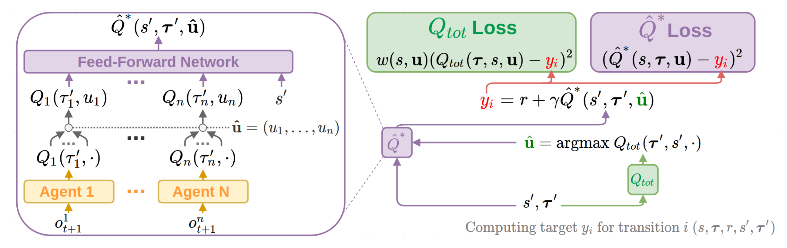
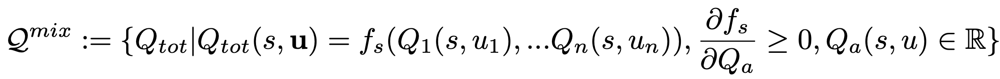
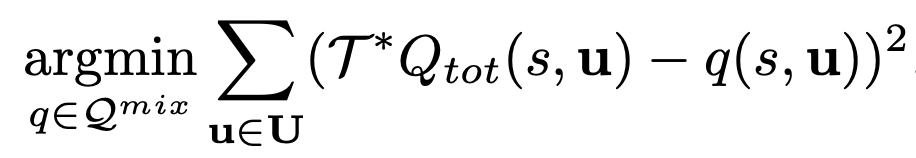
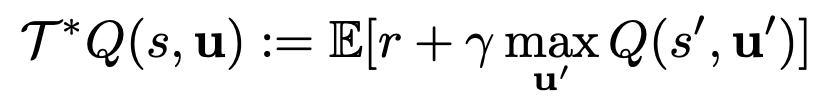
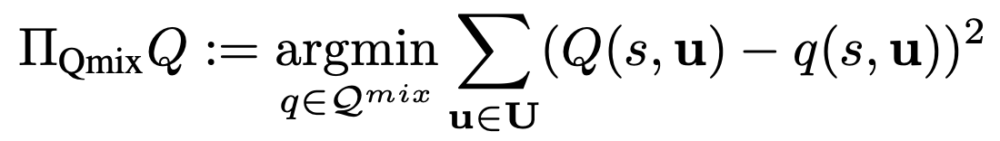
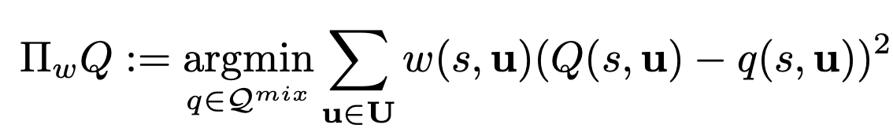
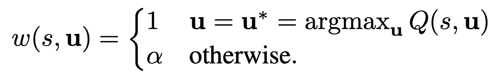
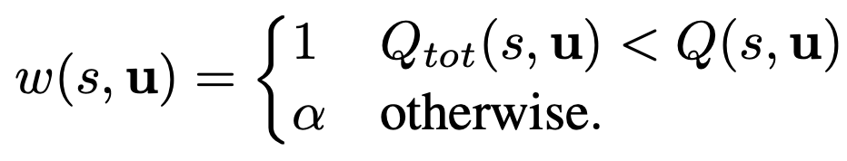

WQMIX
^^^^^^^

Overview
---------
WQMIX was first proposed in `Weighted QMIX: Expanding Monotonic Value Function Factorisation for Deep Multi-Agent Reinforcement Learning <https://arxiv.org/abs/2006.10800>`_.
Their focus of study is the unique properties of the particular function space represented by monotonic structure of Q functions in Qmix,
and the tradeoffs in representation quality across different joint actions induced by projection into that space.
They show that the projection in QMIX can fail to recover the optimal policy,
which primarily stems from the equal weighting placed on each joint action.
WQMIX rectify this by introducing a weighting into the projection, in order to place more importance on the better joint actions.
WQMIX propose two weighting schemes and prove that they recover the correct maximal action for any joint action Q-values.
WQMIX introduce two scalable versions,
Centrally-Weighted (CW) QMIX and Optimistically-Weighted (OW) QMIX and demonstrate improved performance on both predator-prey and challenging multi-agent StarCraft benchmark tasks.

Quick Facts
-------------
1. WQMIX is an **off-policy model-free value-based multi-agent** RL algorithm using the paradigm of **centralized training with decentralized execution**.
   and only support **discrete** action spaces.

2. WQMIX considers a **partially observable** scenario in which each agent only obtains individual observations.

3. WQMIX accepts **DRQN** as individual value network.

4. WQMIX represents the joint value function using an architecture consisting of agent networks, a **mixing network**.
The mixing network is a feed-forward neural network that takes the agent network outputs as input and mixes them monotonically, producing joint action values.

Key Equations or Key Graphs
---------------------------
The overall WQMIX architecture including individual agent networks and the mixing network structure:

First, wqmix examine an operator that represents an idealised version of QMIX in a tabular setting.
The purpose of this analysis is primarily to understand the fundamental limitations of QMIX that stem from its training objective and the restricted function class it uses.
This is the space of all :math:`Q_{tot}` that can be represented by monotonic funtions of tabular :math:`Q_{a}(s,u)` :

At each iteration of our idealised QMIX algorithm, we constrain :math:`Q_{tot}` to lie in the above space by solving the following optimisation problem:

where, the Bellman optimality operator is defined by:

Then define the corresponding projection operator :math:`T^{Qmix}`as follows:

Properties of :math:`T_{*}^{Qmix}` :

- :math:`T_{*}^{Qmix}` is not a contraction.
- QMIX’s argmax is not always correct.
- QMIX can underestimate the value of the optimal joint action

The WQMIX paper argue that this equal weighting over joint actions when performing the optimisation in qmix
is responsible for the possibly incorrect argmax of the objective minimising solution.
To prioritise estimating :math:`T_{tot}(u^{*)` well, while still anchoring down the value estimates for other joint actions,
we can add a suitable weighting function w into the projection operator of QMIX:

The choice of weighting is crucial to ensure that WQMIX can overcome the limitations of QMIX.
WQMIX consider two different weightings and proved that
these choices of w ensure that the :math:`Q_{tot}` returned from the projection has the correct argmax.

Idealised Central Weighting:
imply down-weight every suboptimal action. However, this weighting requires computing the maximum across the joint action space, which is often infeasible.
In implementation WQMIX takes an approximation to this weighting in the deep RL setting.

Optimistic Weighting:
This weighting assigns a higher weighting to those joint actions that are underestimated relative to Q,
and hence could be the true optimal actions (in an optimistic outlook).

For the details analysis, please refer to the  `WQMIX paper <https://arxiv.org/abs/2006.10800>`_.

Implementations
----------------
The default config is defined as follows:

    .. autoclass:: ding.policy.wqmix.WQMIXPolicy
        :noindex:

The network interface WQMIX used is defined as follows:
    .. autoclass:: ding.model.template.WQMix
        :members: forward
        :noindex:

Benchmark
-----------

The Benchmark result of WQMIX in SMAC (Samvelyan et al. 2019), for StarCraft micromanagement problems, implemented in DI-engine is shown.

+---------------------+-----------------+-----------------------------------------------------+--------------------------+----------------------+
| environment         |best mean reward | evaluation results                                  | config link              | comparison           |
+=====================+=================+=====================================================+==========================+======================+
|                     |                 |                                                     |`config_link_p <https://  |                      |
|                     |                 |                                                     |github.com/opendilab/     |  Tianshou(20)        |
|                     |                 |                                                     |DI-engine/tree/main/dizoo/|                      |
|MMM                 |  20             |.. image:: images/benchmark/wqmix_MMM.png             |atari/config/serial/      |                      |
|                     |                 |                                                     |pong/pong_dqn_config      |  Sb3(20)             |
|                     |                 |                                                     |.py>`_                    |                      |
+---------------------+-----------------+-----------------------------------------------------+--------------------------+----------------------+
|                     |                 |                                                     |`config_link_q <https://  |                      |
|                     |                 |                                                     |github.com/opendilab/     |  Tianshou(7307)      |
|3s5z               |                 |                                                     |DI-engine/tree/main/dizoo/|                      |
|                     |  17966          |.. image:: images/benchmark/wqmix_3s5z.png            |atari/config/serial/      |  Rllib(7968)         |
|                    |                 |                                                     |qbert/qbert_dqn_config    |                      |
|                     |                 |                                                     |.py>`_                    |  Sb3(9496)           |
+---------------------+-----------------+-----------------------------------------------------+--------------------------+----------------------+
|                     |                 |                                                     |`config_link_s <https://  |                      |
|                     |                 |                                                     |github.com/opendilab/     |  Tianshou(812)       |
|5m6m       |                 |                                                     |DI-engine/tree/main/dizoo/|                      |
|                     |  2403           |.. image:: images/benchmark/wqmix_5m6m.png    |atari/config/serial/      |  Rllib(1001)         |
|                 |                 |                                                     |spaceinvaders/space       |                      |
|         |                 |                                                     |invaders_dqn_config.py>`_ |  Sb3(622)            |
+---------------------+-----------------+-----------------------------------------------------+--------------------------+----------------------+

Author's PyTorch Implementation
-------------------------------------

- WQMIX_

.. _WQMIX: https://github.com/oxwhirl/wqmix.

References
----------------
- Rashid, Tabish, et al. "Weighted qmix: Expanding monotonic value function factorisation for deep multi-agent reinforcement learning." arXiv preprint arXiv:2006.10800 (2020).

- Tabish Rashid, Mikayel Samvelyan, Christian Schroeder de Witt, Gregory Farquhar, Jakob Foerster, Shimon Whiteson. Qmix: Monotonic value function factorisation for deep multi-agent reinforcement learning. International Conference on Machine Learning. PMLR, 2018.

- Peter Sunehag, Guy Lever, Audrunas Gruslys, Wojciech Marian Czarnecki, Vinicius Zambaldi, Max Jaderberg, Marc Lanctot, Nicolas Sonnerat, Joel Z. Leibo, Karl Tuyls, Thore Graepel. Value-decomposition networks for cooperative multi-agent learning. arXiv preprint arXiv:1706.05296, 2017.

- Kyunghwan Son, Daewoo Kim, Wan Ju Kang, David Earl Hostallero, Yung Yi. QTRAN: Learning to Factorize with Transformation for Cooperative Multi-Agent Reinforcement Learning. International Conference on Machine Learning. PMLR, 2019.

- Mikayel Samvelyan, Tabish Rashid, Christian Schroeder de Witt, Gregory Farquhar, Nantas Nardelli, Tim G. J. Rudner, Chia-Man Hung, Philip H. S. Torr, Jakob Foerster, Shimon Whiteson. The StarCraft Multi-Agent Challenge. arXiv preprint arXiv:1902.04043, 2019.

